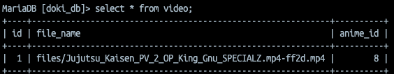
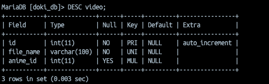
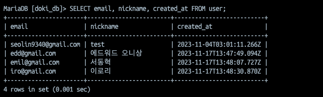
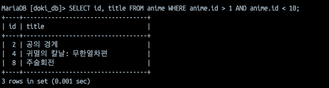
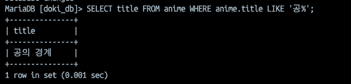

## SQL 설치 이후
```sql
mysql -u root -p 
// mariadb는 mariadb -uroot -p를 입력하셔야 됩니다.

CREATE SCHEMA `doki_db` DEFAULT CHARACTER SET utf8;
show databases;
MariaDB [(none)]> show databases;
+--------------------+
| Database           |
+--------------------+
| doki_db            |
| information_schema |
| mysql              |
| performance_schema |
+--------------------+
4 rows in set (0.003 sec)

use doki_db;
```

## SELECT * FROM 테이블명

sql에서는 스페이스와 세미콜론을 주의해야합니다.

```sql
SELECT * FROM 테이블;
```

`SELECT`는 DML에 속하는 SQL 명령어로 데이터를 읽어오는 역할입니다.

데이터를 읽어오면 열과 행으로 이루어진 데이터(`VIEW`)로 가져오는데 `*`(에스터리스크)의 자리는 열에 들어갈 데이터를 의미합니다. *을 사용할 시 모든 열로 바뀝니다.

`FROM` 은 처리 대상 테이블을 지정하는 키워드입니다.

RDBMS는 데이터베이스 객체들로 이름을 붙여 관리합니다. 테이블의 경우 동일한 이름으로 새로운 테이블을 만들 수 없습니다. 또한 예약어와 동일한 이름으로 테이블을 만들 수 없습니다.

- 모든 쿼리문 끝에는 ;(세미콜론)이 붙어야 합니다.
- SQL은 대문자와 소문자를 구분하지 않지만 가독성 또는 DBMS 소프트웨어마다의 차이때문에 대문자를 권장하는 편입니다.
- 세미콜론이 붙지않는 한 쿼리문이 실행되지 않으니 엔터나 탭으로 들여쓰기를 권장합니다.



SELECT 명령을 실행하면 다음과 같은 표 형식의 데이터가 출력됩니다.

데이터에서 명칭은 다음과 같습니다.

- 행 : record
- 열 : column/field
- 행과 열이 만나는 지점 : cell

각 열들은 하나의 자료형만을 가질 수 있으며 DBMS에 따라 더 다양한 자료형들이 존재합니다.

- id 열처럼 숫자로만 구성된 데이터 ⇒ 수치형 데이터
- file_name 열처럼 문자로만 구성된 데이터 ⇒ 문자열형 데이터
- 날짜와 시각을 나타내는 데이터 ⇒ 날짜시간형 데이터
- 기타등등
- Cell에 어떠한 데이터도 들어있지 않을 때 ⇒ NULL

## 테이블 구조 참조하기



```sql
DESC 테이블명;
```

`DESC`(SQL명령은 아님)은 테이블에 어떤 열이 정의되어 있는지 알 수 있습니다.

- Type : 해당 열의 자료형. 괄호 안의 숫자는 최대 길이를 의미
    - ex. int(11) - 최대 11자리의 정수값을 저장
- Null : NULL 값을 허용할 것인지 아닌지 제약사항
- Key : 해당 열이 키로 지정되어 있는지
- Default : 생략했을 경우 열에 주어지는 기본값

자료형(Type)은 크게 수치형, 문자열형, 날짜시간형으로 분류됩니다. 각 형마다 다양한 타입들이 존재합니다. [MariaDB의 Data Types](https://mariadb.com/kb/en/data-types/)에서 더 자세한 내용을 확인할 수 있습니다.

- INTEGER : 수치형의 하나로 정수값을 의미
- CHAR : 문자열형의 하나로 문자열을 저장할 수 있는 자료형이며 언제나 주어진 고정된 길이로 저장.
- VARCHAR : 저장할 문자열의 길이에 맞춰 저정공간을 가변적으로 저장.
- DATE : 연월일의 날짜값 데이터.
- TIME : 시간을 저장할 수 있는 데이터


## 검색 조건 지정하기



```sql
SELECT 열1, 열2 FROM 테이블명 WHERE 조건식;
```

통상적인 데이터베이스라면 많은 열과 행이 존재합니다. 화면에 표시하는데 필요한 데이터는 전체가 아닌 한정적일 것입니다. 또한 항상 전체를 조회하는 것이 효율적이지 않을 것을 직감적으로 알 수 있습니다.

데이터를 읽어올 때 행은 `WHERE`구로 선택하며 열은 `SELECT` 구를 사용하여 데이터베이스에서 `검색`합니다.

### SELECT 구에서 Column 지정하기

- 테이블에 존재하지 않는 열은 지정할 수 없다.
- ,(쉼표)로 구분
- 결과(`VIEW`)는 지정한 열의 순서대로 표시
- `AS` 를 사용하면 Column의 별칭을 붙여 표시할 수 있다.

    ```sql
    SELECT email AS id FROM user;
    ```


### WHERE 구에서 행 지정하기

많은 행 속에서 필요한 데이터만 검색하기 위해서는 `WHERE` 구를 사용합니다.

- SELECT ⇒ FROM ⇒ WHERE 순으로 사용해야 한다.
- 생략할 시 모든 행이 검색 대상이 된다.
- 조건식
    - 좌변 = 우변 : 좌변과 우변의 값이 같을 때 참
    - 좌변 `>` 우변 : 좌변이 우변의 값보다 클 때 참
    - 좌변 ≥ 우변 : 좌변이 우변의 값보다 크거나 같을 때 참
    - 좌변 `<>` 우변 : 좌변과 우변의 값이 다를 때 참
    - 문자열과 날짜형의 경우 ‘’(싱글 쿼트)를 이용하여 비교한다.
        - title = ‘제목’
        - date = ‘2023-11-30’
            - -(하이픈)으로 구분
        - time = ‘12:00:30’
            - :(콜론)으로 구분
    - NULL 값의 경우 `IS NULL` 연산자를 사용한다.
        - title IS NULL

## 조건 조합하기




조건식을 조합할 때는 `AND`, `OR`, `NOT` 세가지의 논리 연산자를 사용합니다.

- `AND` : 좌우의 식이 모두 참일 때 참
    - 교집합
- `OR` : 좌우의 식 중 하나라도 참일 때 참
    - 합집합
- AND OR를 같이 사용할 경우 주의할 점
    - AND 쪽이 우선순위가 높기 때문에 괄호를 씌워 조건식을 명확하게 해줘야합니다.

    ```sql
    WHERE a = 1 OR a = 2 AND b = 1 OR b = 2; // X
    // a = 2거나 b = 1인 것이 제일 먼저 연산됨
    WHERE (a = 1 OR a = 2) AND (b = 1 OR b = 2); // O
    ```

- `NOT` : 오른쪽에만 항목을 지정하는 단항 연산자. 조건식의 반대값 반환

    ```sql
    WHERE NOT(a = 1);
    // a = 1이 아닌 모든 record 조회
    ```


### 패턴 매칭에 의한 검색



특정문자나 문자열이 포함되어 있는지를 검색하고 싶은 경우에 패턴 매칭(또는 부분 검색)을 사용합니다.

- `LIKE` : 열 값이 부분적으로 일치하는 경우에 참

    ```sql
    열명 LIKE '패턴';
    
    // column 값의 맨 앞에만 체크 (전방 일치)
    LIKE '공%';
    
    // column 값의 중간 포함해서 체크 (중간 일치)
    LIKE '%공%';
    
    // column 값의 후방만 체크 (후방 일치)
    LIKE '%공';
    
    // 두가지 이상의 값 체크
    LIKE 'a%c'; // a로 시작하고 c로 끝나는 문자열 탐색
    ```

    - 수치형 상수는 사용불가
    - 정의할 때는 메타 문자(%, _) 사용
        - 둘 중에 뭘 사용해도 상관없음
    - 찾으려는 문자가 메타문자와 동일할 때는 \(이스케이프) 활용
        - ‘%\%%’
        - ‘%\_%’
    - ‘(싱글 쿼트)의 경우에는 ‘’라고 기술하면 된다.
        - ‘it’s’ ⇒ ‘%it’’s’
    - 정규표현식 또한 지원하여 복잡한 문자열 매칭이 필요할 땐 정규표현식 권장