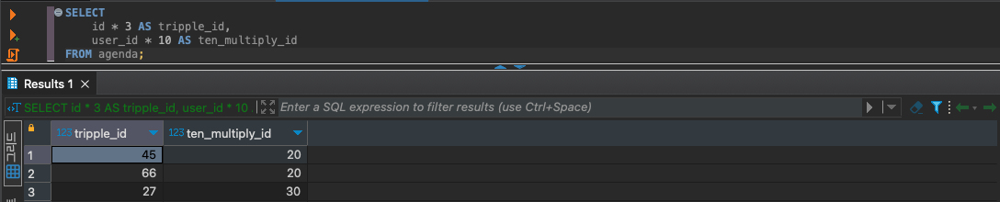
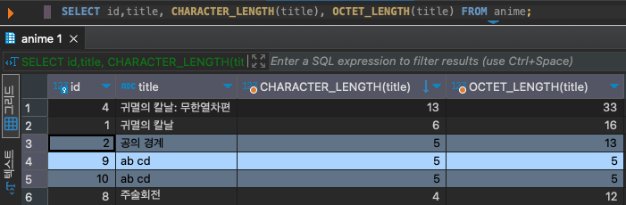
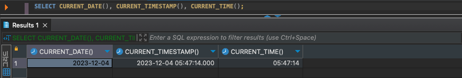

## 정렬 - ORDER BY

```sql
SELECT * FROM 테이블명 WHERE 조건식 ORDER BY 열명
```

ORDER BY 구를 지정하면 원하는 컬럼을 기준으로 검색 결과의 행 순서를 바꿀 수 있습니다.

- 항상 WHERE 절 뒤에 위치하거나 WHERE절이 없다면 FROM 절 뒤에 지정해야합니다.

열명 뒤에 정렬 방법을 지정할 수 있습니다. 생략할 시 오름차순(ASC)으로 정렬합니다.

```sql
SELECT * FROM 테이블명 WHERE 조건식 ORDER BY 열명 DESC
```

- DESC : descendant 하강
- ASC : ascendant 상승

ORDER BY로 정렬할 때는 값의 대소관계가 중요합니다.

- 수치형과 날짜시간형 데이터는 숫자 크기로 판별
- 문자열형 데이터는 사전식 순서(유니코드)로 결정됨
    - 숫자가 들어가는 문자열형의 경우 예상과 다르게 정렬될 수 있음
    - `COLLATE` 키워드를 사용하면 기준할 유니코드를 지정할 수 있음

    ```sql
    ORDER BY 열명 COLLATE utf8_unicode_ci;
    ```


<br/>

## 복수의 열을 지정해 정렬하기

```sql
SELECT * FROM 테이블명 
	WHERE 조건식 
	ORDER BY column1, column2;
```

먼저 선언된 column1로 정렬한 뒤, 값이 같아서 더 이상 정렬할 수 없다면 column2로 정렬하는 방식입니다.

- 열마다 정렬방법을 지정할 수 있음

    ```sql
    ORDER BY column1 DESC, column2 ASC;
    ```

- NULL값의 경우 DBMS마다 기준이 각자 다릅니다. MySQL의 경우 NULL값은 가장 작은 값으로 취급합니다. ASC의 경우로 본다면 가장 먼저 정렬됩니다.

<br/>

## 결과 행 제한하기

```sql
SELECT 열명 FROM 테이블명 LIMIT 행수 [OFFSET 시작행]
```

흔히 볼 수 있는 게시판의 경우 게시글을 한번에 100개 이상을 보여주지 않고 페이지로 나눠 조회하는 것을 볼 수 있습니다. `LIMIT` 구를 사용하여 표시할 행 수를 제한할 수 있습니다.

`LIMIT` 는 최대 행수를 수치로 지정합니다. 실제 Record가 0개든 1개든 상관없이 조회합니다.

WHERE 구, ORDER BY 등 구문과 같이 사용할 때 동작하는 방식은 이렇습니다.

WHERE 구로 검색 ⇒ ORDER BY로 정렬 ⇒ LIMIT 반환할 행수를 제한 처리

LIMIT는 표준 SQL이 아니기 때문에 DBMS마다 다른 키워드를 사용할 수 있습니다.

- Oracle : ROWNUM
- SQL Server: TOP

```sql
// 0번째 행부터 5개 => 1 페이지
LIMIT 5 OFFSET 0;
// 5번째 행부터 5개 => 2 페이지
LIMIT 5 OFFSET 5;
```

LIMIT가 최대 행을 지정한다면 OFFSET은 몇번째 행부터 반환할지 지정할 수 있습니다. 페이지 처리 기능을 구현할 때 자주 볼 수 있습니다.

- OFFSET은 배열처럼 몇번째 행을 계산할 때 0부터 셉니다.

<br/>

## 수치 연산

```sql
SELECT * FROM agenda WHERE id = 3 * 6; // 18
```

SQL에서는 다른 프로그래밍 언어와 마찬가지로 산술연산이 가능합니다.

- +/- : 더하기 / 나누기
- / : 나누기
- *: 곱하기
- % : 나머지



SELECT 구에서는 열명 말고도 여러가지 식 또한 기술할 수 있습니다.

### AS(alias)

```sql
SELECT price * quantity as total FROM product;
SELECT price * quantity total FROM product;
SELECT price * quantity "금액" FROM product;
```

`AS` 예약어를 사용해 열의 별칭을 붙여줄 수 있습니다. 한글로 별칭을 줄 경우 에러가 날수 있기 때문에 ASCII 문자 이외의 것을 포함할 때는 더블쿼트로 둘러싸서 지정합니다. 또한 생략 가능합니다.

- 데이터베이스 객체, 별칭 - 백틱(`) 또는 더블쿼트(”)
- 예약어와 겹치는 이름 또한 더블쿼트 또는 백틱으로 사용가능

    ```sql
    SELECT 열명 AS "SELECT" FROM 테이블명
    ```

- 버전에 따라 다를 수 있지만 숫자로만 구성되는 객체명 또한 현재는 더블쿼트로 사용가능합니다.

### 언제 싱글쿼트, 더블쿼트, 백틱을 사용하는가

```
Backtick (`)
table & column ───────┬─────┬──┬──┬──┬────┬──┬────┬──┬────┬──┬───────┐
                      ↓     ↓  ↓  ↓  ↓    ↓  ↓    ↓  ↓    ↓  ↓       ↓
$query = "INSERT INTO `table` (`id`, `col1`, `col2`, `date`, `updated`)
                       VALUES (NULL, 'val1', 'val2', '2001-01-01', NOW())";
                               ↑↑↑↑  ↑    ↑  ↑    ↑  ↑          ↑  ↑↑↑↑↑
Unquoted keyword          ─────┴┴┴┘  │    │  │    │  │          │  │││││
Single-quoted (') strings ───────────┴────┴──┴────┘  │          │  │││││
Single-quoted (') DATE    ───────────────────────────┴──────────┘  │││││
Unquoted function         ─────────────────────────────────────────┴┴┴┴┘
```

[스택오버플로우 - When to use single quotes, double quotes, and backticks in MySQL](https://stackoverflow.com/questions/11321491/when-to-use-single-quotes-double-quotes-and-backticks-in-mysql)
다음 링크에서는 여러 권장사항들이 있습니다.

- 싱글쿼트(’)
    - 문자열 리터럴, 날짜시간형(SQL standard 권장사항)
- 백틱(`) 또는 더블쿼트(”)
    - 테이블이나 컬럼명
    - 공백이 들어가는 객체, 변수명
- **예약어에는 사용하지 않아야 함**

### WHERE 구에서 연산하기

```sql
SELECT * FROM products 
	WHERE price * quantity > 1000; // O

SELECT *, price * quantiy AS amount 
	WHERE amount > 1000; // X
```

WHERE 구에서도 다음과 같은 연산식을 조건식으로 사용할 수 있습니다. 다만 오해하지말아야할 점은 SELECT와 WHERE가 처리되는 순서입니다. 데이터베이스 서버 내부에서 WHERE 구 ⇒ SELECT 구 순으로 처리되기 때문에 SELECT 절에서 선언한 열 또는 별칭은 WHERE 절에서 사용할 수 없습니다.

### NULL 값 연산

NULL + 1은 C나 PHP에서는 1로 연산되기도 하지만 SQL에서는 모두 NULL로 처리됩니다.

- NULL + 1 = NULL
- NULL * 2 = NULL
- NULL / 2 = NULL

### ORDER BY 구에서 연산하기

```sql
SELECT * FROM products 
	ORDER BY price * quantity DESC; // O

SELECT price * quantity AS amount FROM products 
	ORDER BY amount DESC; // O
```

데이터베이스에서는 WHERE 구 ⇒ SELECT 구 ⇒ ORDER BY 구로 처리하기 때문에 ORDER BY에서는 SELECT의 별칭을 사용할 수 있습니다.

### 함수

```sql
SELECT 함수명(인수1, 인수2, ...) AS 열명 FROM 테이블명;

// MariaDB의 CONCAT 
SELECT CONCAT('Ma', 'ria', 'DB') AS db_name;
+---------------------------+
| db_name                   |
+---------------------------+
| MariaDB                   |
+---------------------------+
```

함수에는 주어진 인자(parameter)를 연산하고 반환할 수 있습니다. DBMS에서는 크게 산술 함수와 집계, 서브쿼리 등에서 쓰이는 것으로 나뉩니다. [MariaDB의 Built-in Function 모음집](https://mariadb.com/kb/en/built-in-functions/)에서는 DBMS에서 지원하는 여러 함수를 확인할 수 있습니다.

- 연산자 또한 표기방법만 같을 뿐 함수라 같은 것이라 볼 수 있습니다.


- 주의할 점으로 프로그래밍 언어가 그렇듯 인자의 타입, 컬럼의 타입이 틀리다면 예상하지 못한 결과값이 나올 수 있습니다.
<br/><br/>

## 문자열 연산

```sql
SELECT CONCAT('Ma', 'ria', 'DB') AS db_name;
```

문자열 결합(`CONCAT`), 문자열 일부 추출(`SUBSTRING`), 문자열 공백 제거(`TRIM`) 등 여러 함수를 지원합니다. 다만 DBMS마다 구현한 케이스가 다를 수 있습니다.

아래 나열된 항목들은 ‘ABC1234’라는 값을 각자 다르게 구현한 것을 확인할 수 있습니다.

- `ORACLE` : 'ABC' || '1234'
- `MySQL` : CONCAT('ABC', '1234')
- `SQL Server` : ‘ABC’ + ‘1234’

### CHARACTER_LENGTH



문자열의 길이를 계산하여 반환하는 함수입니다. 주의할 점은 CHAR_LENGTH는 순수 문자열의 길이를 반환하고 OCTET_LENGTH는 문자 수가 아닌 바이트 단위로 길이를 계산하고 반환합니다. character-set에 따라 ASCII 문자와 바이트 크기 차이가 날 수 있습니다.

위 사진은 UTF-8로 인코딩한 DB의 조회 사진입니다. “공의 경계”, “ab cd”의 문자열 길이는 같게 나오나 byte크기는 다른 것을 확인할 수 있습니다.

<br/>

## 날짜 연산




날짜, 시간 데이터를 저장하는 방법은 DBMS에 따라 크게 달라집니다. DATE형, TIME형, DATETIME 형, INTERVAL 형(기간형)과 같이 세분화해 지원하기도 합니다.

컴퓨터에서는 네트워크나 주변 기기와 데이터 통신을 위해서 시계를 내장하고 있습니다. 시스템에서의 날짜는 이 하드웨어 상의 시계로부터 실시간으로 얻는 데이터일 뿐입니다.

- **SELECT** **CURRENT_DATE**, **CURRENT_TIMESTAMP**, **CURRENT_TIME**;  
  다음 함수들은 인수가 필요하지 않아 괄호를 사용하지 않아도 괜찮습니다.

```sql
CREATE TABLE your_table (
  id INT PRIMARY KEY,
  your_date_column TIMESTAMP
);

SELECT 
	id, 
	DATE_FORMAT(your_date_column, '%Y-%m-%d') AS formatted_date 
FROM your_table;
```

국가마다 날짜 서식이 다를 수 있기 때문에 공통적으로 쓸 수 있는 DATETIME 또는 TIMESTAMP 데이터 형식으로 저장하고 조회할 때 국적에 맞춰 변환해주기도 합니다. `DATE_FORMAT` 함수를 이용하면 위와 같이 손쉽게 변환할 수 있습니다.

- 2014/01/25
- 2014-01-25
- 25 Jan 2014

```sql
SELECT CURRENT_DATE + INTERVAL 1 DAY;
```

날짜시간형 데이터는 기간형 수치 데이터와 덧셈, 뺄셈을 할 수 있습니다.

<br/>

## CASE 문으로 데이터 변환하기

```sql
CASE 
	WHEN 조건식1 THEN 식1
	// WHEN 조건식2 THEN 식2 
	// ... 
	ELSE 식2
END;

SELECT 
	id, 
	CASE 
		// anime_parent_id 값이 NULL이면 TRUE를 반환
		WHEN anime_parent_id IS NULL THEN TRUE 
		// NULL이 아니면 FALSE 반환
		ELSE FALSE 
	END AS `isNull` 
FROM anime;
```

`WHEN` 절에는 참과 거짓을 반환하는 조건식을 기술합니다. 조건을 만족하여 참이 될 때는 `THEN` 의 식을 처리합니다.  `CASE` 로 시작하여 `END` 로 구를 끝내고 `AS` 를 활용하여 별칭을 붙일 수 있습니다. `CASE` 구문은 WHERE 구, SELECT 구, ORDER BY 구 등에서 사용할 수 있습니다.

```sql
SELECT 
	id, 
	COALESCE(anime_parent_id, 0) 
FROM anime;
```

NULL 값을 처리할 때는 COLLAESCE 함수를 사용하기도 합니다. 첫 인자가 NULL이 아니면 인자를 리턴하고 NULL이면  두번째 인자를 리턴합니다.

### 검색 CASE, 단순 CASE

```sql
// 검색 케이스 
CASE 
	WHEN a = 1 THEN '값'
	WHEN a = 2 THEN '값2' 
	// ... 
	ELSE '값3' 
END;

// 단순 케이스 
CASE 열명
	WHEN 1 THEN '값'
	WHEN 2 THEN '값2' 
	// ... 
	// ELSE 식2 생략가능
END;
```

검색 케이스처럼 조건문을 적어줘도 되고 단순케이스처럼 처음 CASE앞에 열명을 지정해서 값을 체크할 수도 있습니다.

### 주의해야할 점

- `ELSE` 가 생략이 가능하지만 NULL을 리턴하기때문에 생략하지 않아야 한다.
- `WHEN NULL` 처럼 값이 NULL인지 체크하려면 IS NULL을 활용해야한다.

    ```sql
    CASE a 
    	WHEN a IS NULL THEN '미지정';
    ```