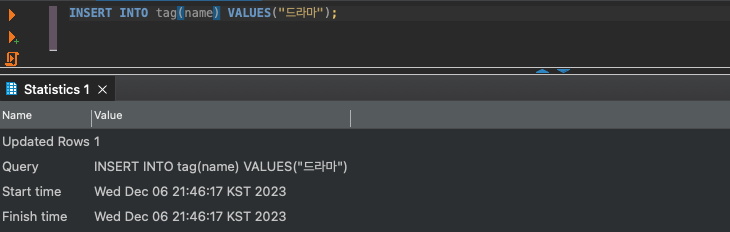
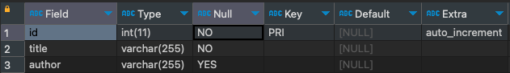
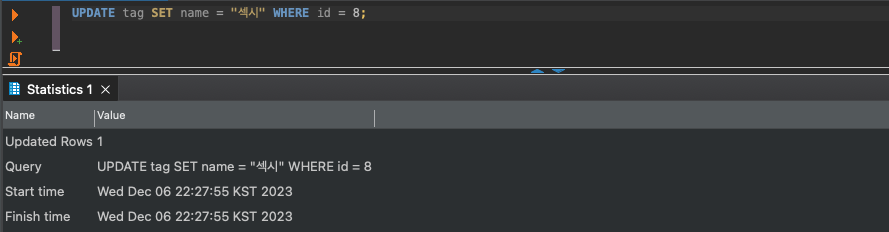

## 행 추가하기 - INSERT


```sql
INSERT INTO 테이블명 VALUES (값 1, 값 2, ...);
```

`INSERT` 명령어를 사용하면 테이블에 행을 추가할 수 있습니다. `VALUES` 구 뒤에 괄호를 씌워 값을 나열하면 새 행을 생성할 때 각 컬럼에 맞춰 할당됩니다. 주의할 점은 컬럼의 타입에 맞춰 작성해줘야합니다.



```sql
INSERT INTO 테이블명 (열1, 열2) VALUES(값1, 값2);
```

꼭 DESC로 나오는 컬럼의 순서로 작성하지 않아도 됩니다. 테이블명 뒤에 괄호를 열어 컬럼 이름들을 나열하면 VALUES의 값들이 각 컬럼에 맞춰 행을 생성합니다.

별도의 값을 지정하지 않았던 컬럼들에는 기본값(없다면 NULL)이 들어갑니다.



```sql
INSERT INTO 테이블명 (열1, 열2) VALUES(NULL, NULL);
```

위 쿼리문처럼 NULL을 삽입하는 경우도 있습니다. 컬럼에 `NOT NULL` 제약이 걸려있다면 다음 쿼리는 실패합니다. 다만 NOT NULL 제약이 있음에도 삽입이 성공하는 경우도 있습니다.  auto_increment같은 옵션은 자동으로 다음 마지막 행의 컬럼보다 1을 더해서 제약없이 삽입합니다.

NULL의 경우 조건식에서 `IS NULL` 을 이용해야하기 때문에 컬럼에 NOT NULL 제약을 해둘 것을 권장합니다.

```sql
INSERT INTO 테이블명(열명1,..) VALUES(값1, DEFAULT);
```

`DEFAULT` 를 사용하면 컬럼의 기본 값이 삽입됩니다.

<br/>

<br/>

## 삭제하기 - DELETE

> 실무에서는 DELETE의 존재를 잊으라는 이야기가 있다.
>

```sql
DELETE FROM 테이블명 WHERE 조건식;
```

테이블의 행을 삭제하고 싶을 때는 `DELETE` 를 사용합니다. WHERE 절이 생략되면 모든 행이 삭제될 수 있습니다. 열명은 생략하며 ORDER BY 구와 LIMIT 구를 사용해서 삭제할 행의 수량을 조절하거나 지정할 수도 있습니다.

<br/>

## 데이터 갱신하기 - UPDATE



```sql
UPDATE 테이블명 
	SET 
		열1 = 값1, 
		열2 = 2 * 12,
		name = CONCAT(열명, "테스트") 
		... 
WHERE 조건식;
```

`UPDATE` 명령을 사용하면 원하는 행의 셀을 갱신할 수 있습니다. WHERE 절을 생략하면 마찬가지로 모든 행에 적용이 됩니다. 수정하려는 값은 컬럼의 타입 형식에 맞춰 작성해야합니다.

- `SET` 뒤에 붙은 식은 연산자가 사용가능하며 기존 컬럼 값에도 접근가능합니다.
- 복수 열을 업데이트할 때는 쉼표를 붙입니다.
- NULL 값이 삽입 가능하며 `NOT NULL` 제약이 걸려있을 시 실패합니다.

```sql
UPDATE product SET 
	price = price + 1000, 
	total = price * quantity
WHERE id = 8;
```

다음 쿼리문은 DBMS에 따라 값이 달라질 수 있어 주의할 필요가 있습니다.

MySQL(MariaDB 포함)은 순서대로 진행됩니다.

- price 가격 갱신 ⇒ total에 갱신된 price와 quantity를 곱한 값으로 갱신

Oracle의 경우 다음 쿼리는 이렇게 진행됩니다.

- price 가격 갱신 ⇒ total에는 갱신되기전(UPDATE 명령이 실행되기 전) price와 quantity를 곱한 값이 갱신

<br/>

## 물리삭제와 논리삭제

데이터베이스에서는 데이터를 삭제할 때 물리삭제와 논리삭제의 두 가지 방법을 고려할 수 있습니다.

물리삭제는 `DELETE` 명령어를 사용하여 실제로 Record를 테이블에서 지워버리는 것입니다.

논리삭제는 삭제 플래그용으로 컬럼을 하나 추가하여 true/false를 줘서 SELECT를 할 때 삭제 플래그가 true인 행들을 제외해버리고 조회하는 것입니다. 논리 삭제를 씀으로서 대처할 수 있는 상황이 많이 있습니다.

- 상황 1 : 회원 탈퇴 이후 1년안에 복구 신청을 하면 기존 데이터를 살려줘야될 때(흔히 있는 회사 정책때문에)
- 상황 2 : 로그성으로 남겨야 통계, 집계성 데이터로 활용될 때

다만 그만큼 데이터가 쌓이고 저장공간을 사용하는 것이 단점입니다.