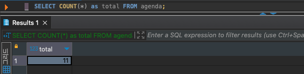
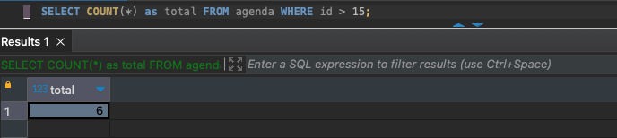
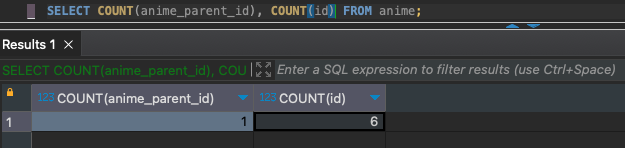
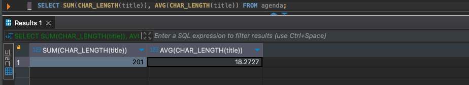
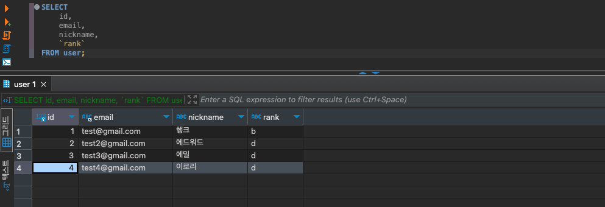
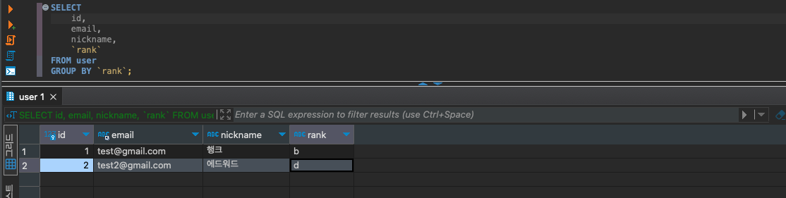
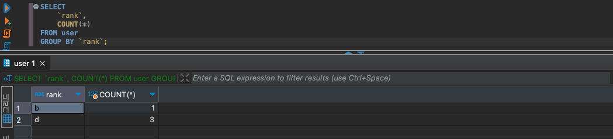

## 행 개수 구하기 - COUNT

```sql
SELECT COUNT(열명) FROM 테이블명;
```

SQL은 데이터베이스라 불리는 “데이터 집합”을 다루는 언어입니다. 또한 집합의 개수나 합계를 다루는 집계함수들을 제공합니다. 일반적인 함수가 인수가 값이라면 집계함수는 인수가 집합입니다.



*은 모든 컬럼을 의미합니다만 `COUNT`에서는 테이블 전체라는 의미가 됩니다. 테이블의 모든 레코드가 담겨있는 집합이 인수가 되었고 `COUNT` 는 그 집합의 총 개수를 반환합니다. 집합에 들어있는 레코드들의 개수와 상관없이 하나의 값을 반환하기 때문에 결괏값은 하나의 행만 반환됩니다.



WHERE 구로 집계될 집합의 조건을 작성할 수 있습니다. 이또한 마찬가지로 결괏값은 하나의 행만 반환됩니다.



COUNT에서는 다음과 같이 *뿐만 아니라 특정 컬럼 또한 집계가 가능합니다. 모든 열을 카운트할 때는 NULL인 값이 존재하더라도 집계되지만 컬럼을 지정해 집계한다면 값이 `NULL`인 경우에는 무시됩니다.

### SELECT DISTINCT

```sql
SELECT DISTINCT 열명 FROM 테이블명;
SELECT ALL 열명 FROM 테이블명;
```

`SELECT` 명령어 뒤에 사용되는 `DISTINCT` 는 집합 안에 중복된 값을 제거하는 함수입니다. 반대로 `ALL` 은 전체를 가져오는 함수이며 생략할 시 ALL이 적용됩니다.

- `NULL` 도 예외없이 중복으로 제거되고 한개의 레코드만 남습니다.

<br/>


### DISTINCT과 COUNT를 같이 사용할 때

```sql
SELECT DISTINCT COUNT(열명) FROM 테이블; // X
SELECT COUNT(DISTINCT 열명) FROM 테이블; // O
```

`SELECT DISTINCT`와 COUNT는 같이 사용되지 못합니다. 위 쿼리문에서 첫번째 쿼리는 COUNT가 먼저 계산되어 DISTINCT가 적용되지 않은 상태로 모든 열을 집계해버립니다.

다행히 집계함수의 인수에 DISTINCT를 수식자로 사용할 수 있습니다. 집합에서 중복을 제거하고 집계를 하려면 아래 쿼리문의 방법으로 사용해야 합니다.


<br/>


## COUNT 이외의 집계함수

```sql
SELECT SUM(열명) FROM 테이블명;
```

`SUM`은 집합에서 합계를 구하는 집계함수입니다.

- 문자열형, 날짜시간형은 계산 불가
- NULL은 무시


<br/>


```sql
SELECT AVG(열명) FROM 테이블명;
SELECT AVG(
	CASE 
		WHEN 열명 IS NULL 
		THEN 0
		ELSE 열명 
	END
);
```

`AVG` 은 집합에서 평균을 내는 집계함수입니다. SUM / COUNT를 하지 않더라도 AVG만으로 평균을 계산할 수 있습니다.

- AVG에서 NULL을 무시하기 때문에 NULL을 0으로 치환하는 CASE를 사용하기도 함.


<br/>


```sql
SELECT MIN(열명1), MAX(열명2) FROM 테이블명;
```


`MIN`과 `MAX` 를 사용하면 최솟값과 최댓값을 구할 수 있습니다.

- 문자열형과 날짜시간형 또한 사용가능
- 문자열형은 유니코드의 순서대로 계산됩니다.


<br/>




문자열, 날짜시간형은 지원안되는 함수 또한 집계할 수 있는 타입으로 인자를 넣는 것도 방법이 될 수 있습니다.


<br />

## 그룹화 - GROUP BY

```sql
SELECT * FROM 테이블명 GROUP BY 열1, 열2, ...;
```

`GROUP BY`는 행들의 컬럼 값이 같은 그룹끼리 묶어 그룹화한 집합을 집계함수로 넘겨줄 수 있습니다.

지금까지는 COUNT, SUM 등 집계함수가 테이블에게 집합을 인자로 받았다면 GROUP BY는 집계함수로 넘겨줄 집합을 그룹으로 나눠 집계함수의 활용범위를 더 넓혀줄 수 있습니다.



예시로 다음 테이블에서 각 랭크별로 몇명이 있는지 집계해보고자 합니다.

먼저 rank 컬럼을 기준으로 그룹화해보겠습니다.



b와 d 랭크의 유저 각 1명만 남아있는 집합이 반환되었습니다. GROUP BY 구에서 열을 지정하면 지정된 열의 값이 같은 레코드들이 하나의 그룹으로 묶입니다. 하나의 그룹은 하나의 레코드로 반환되어 DISTINCT처럼 중복을 제거한 결과가 나옵니다.

- 집계함수와 같이 쓰지 않으면 큰 의미가 없음



집계함수를 적용하면 해당 그룹의 집계를 반환해줄 수 있습니다. “b” 그룹의 전체 레코드 개수와 “d” rank 그룹의 전체 레코드 개수가 각자 반환된 모습을 확인할 수 있습니다.

- COUNT에는 *(에스터리스크)말고도 그룹된 컬럼명(위 사진에서는 rank)을 사용해도 똑같은 결과를 얻을 수 있습니다.


<br />


### Having 구로 조건 지정

```sql
SELECT 
	열명1, 
	COUNT(열명1),
FROM 테이블명
GROUP BY 열명1
	HAVING COUNT(열명1) = 1; 
```

`WHERE` → `GROUP BY` → `HAVING` → `SELECT` → `ORDER BY`

집계한 결과에서 조건에 맞는 값을 따로 필터링하려면 `HAVING` 구를 사용해야합니다.

- HAVING 구는 GROUP BY 뒤에서 사용할 수 있다.
- 조건식이 참인 그룹값만 클라이언트에 반환됨


```sql
SELECT 
	열명1, 
	COUNT(열명1),
FROM 테이블명
WHERE 
	COUNT(열명1) = 1 // ??
GROUP BY 열명1; 
// error
```


집계함수는 `WHERE` 구에서 사용할 수 없습니다. DB에서는 아래 순서로 처리하기 때문에 제약사항들이 있습니다.

`WHERE` → `GROUP BY` → `SELECT` → `ORDER BY`

- SELECT에서 선언한 별칭은 WHERE에서 사용 못함
- 마찬가지로 SELECT에서 집계하는 것 또한 WHERE에서 사용 못함
- ORDER BY의 경우 가장 마지막에 처리되기 때문에 SELECT의 별칭이나 집계함수 사용 가능

:::info

DB의 처리순서에 따라 제약되는 동작들이 있지만 RDBMS마다 융퉁성있게 처리하기도 합니다. MySQL같은 제품에서는 SELECT보다 먼저 실행되는 GROUP BY나 HAVING 구에서도 별칭을 사용할 수 있습니다.

:::


<br />


### 복수열의 그룹화

```sql
SELECT 
	열명1, 
	열명2, // error가 날 수도  
	열명3  // error가 날 수도 
FROM 테이블명 
GROUP BY 열명1;
```

GROUP BY를 사용할 때는 집계함수를 사용하지 않은 열은 SELECT 구에 기술하지 않는 것이 좋습니다. RDBMS 제품에 따라 에러로 처리하는 경우가 있습니다. MySQL과 MariaDB는 에러는 나지 않지만 각 그룹의 첫번째 레코드로 반환해버리고 DISTINCT와 같은 결과를 줍니다.

```sql
SELECT 
	집계함수(열명1), 
	집계함수(열명2)
FROM 테이블명 
GROUP BY 열명1, 열명2;
```

복수로 그룹화하고 싶을 땐 쉼표를 사용해 컬럼명을 나열하면 됩니다.


<br />


### 결괏값 정렬

```sql
SELECT 
	열명1,
	집계함수(열명1)
FROM 테이블명 
GROUP BY 열명1
ORDER BY 집계함수(열명1) DESC;
```

`GROUP BY` 구 뒤에서도 다음과 같이 `ORDER BY`로 정렬할 수 있습니다.