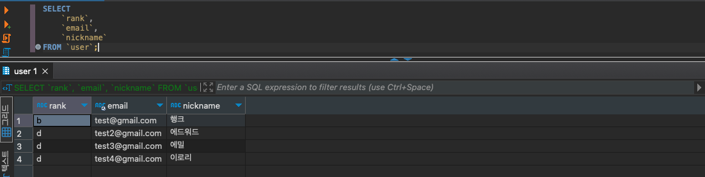
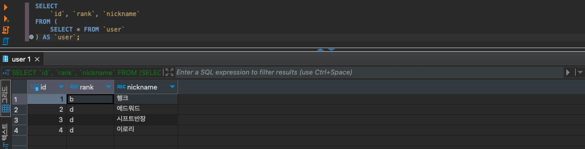
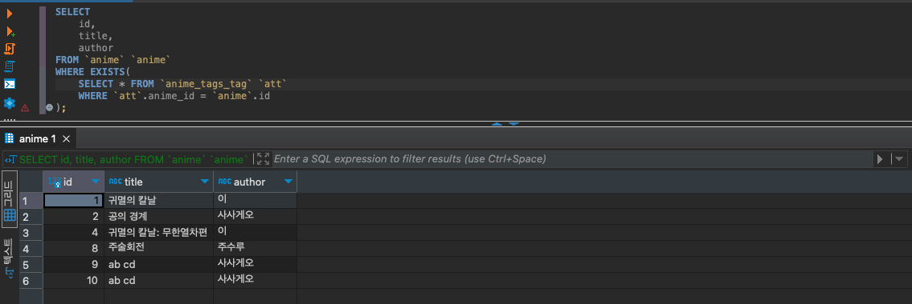
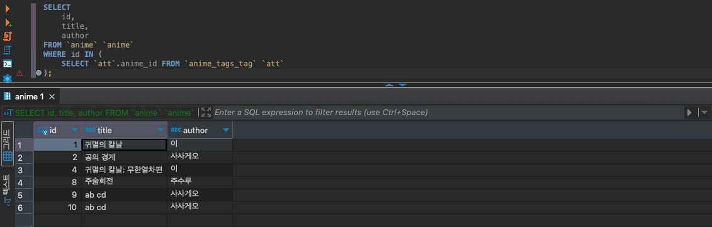

## 서브쿼리

```sql
// main query
SELECT 열명1 
FROM (
	// sub query
	SELECT 열명1 FROM 테이블명 WHERE 열명1 = "값"
) AS 테이블별칭; 
```

하나의 쿼리에서 SELECT 문 안에서 괄호로 또 다른 SELECT 문이 있을 때 이 괄호 안의 SELECT 문을 **서브쿼리(sub query)**라고 합니다. 서브쿼리를 감싼 쿼리를 **메인 쿼리(main query)** 또는 외부 쿼리라고 부릅니다.

- 서브쿼리는 메인 쿼리를 위한 하부 테이블을 생성합니다.
- 특정 값을 반환하기도 하고 테이블로 쓰이거나 조건을 확인할 때 사용됩니다.



상황을 가정해보겠습니다. 다음 테이블에서 nickname 문자열의 길이가 가장 짧은 레코드를 조회해보겠습니다.

```sql
// 가장 짧은 길이를 먼저 찾아봅니다.
SELECT MIN(CHARACTER_LENGTH(`nickname`)) FROM `user`;

// 가장 짧은 길이를 구했으면 WHERE 구로 조건문을 작성합니다.
SELECT * FROM `user` WHERE CHARACTER_LENGTH(`nickname`) = 2;

// 서브쿼리를 활용하면 위 두 쿼리를 한 쿼리로 결합시킬 수 잇습니다.
SELECT * FROM `user` 
WHERE CHARACTER_LENGTH(`nickname`) = (
	SELECT MIN(CHARACTER_LENGTH(`nickname`)) FROM `user`
);
```

서브쿼리를 활용하면 SELECT, WHERE, FROM 등등에서 원하는 테이블을 외부에서 생성하여 결과를 비교할 수 있습니다.

<br/>

### 스칼라 값(Scalar Subquery)

> scalar : 한번에 한가지만 처리하는
>

```sql
// 복수의 레코드가 포함된 테이블 반환 
SELECT 열명1 FROM 테이블명;

// 하나의 레코드만 포함된 테이블 반환 => 단일값으로 지정됨
SELECT COUNT(열명1) FROM 테이블명;

SELECT * FROM `user` 
WHERE CHARACTER_LENGTH(`nickname`) = (
	// 이 서브쿼리 또한 단일값을 리턴합니다.
	SELECT MIN(CHARACTER_LENGTH(`nickname`)) FROM `user` 
);
```

보통 SELECT 문들은 테이블을 반환합니다. 반면에 집계함수를 사용하면서 단일 컬럼만 선언한 케이스들이 컬럼이 한 개인 하나의 레코드만 포함된 테이블이기 때문에 이 테이블은 사용처에 따라 단일값으로 반환됩니다. 이때 하나의 값만 반환하는 것을 **스칼라 값**, 단일 값, 스칼라 서브쿼리라고 부릅니다.

그럼으로서 위와 같이 WHERE절에서 연산자에 값으로 비교할 수 있는 행위가 가능해집니다.

- 서브쿼리가 복수 열을 선언하거나 그룹화를 사용하면 값으로 비교할 때 바로 에러를 만날 수 있습니다.
- WHERE 절뿐만 아니라 SELECT, UPDATE SET 등 단일값으로 다양한 곳에서 사용할 수 있습니다.

<br/>

### FROM 구에서 서브쿼리 사용하기




서브쿼리 또한 테이블을 생성하기 때문에 다음과 같이 FROM 뒤에서 사용할 수 있습니다. 다만 주의할 점은 MySQL의 경우에는 서브쿼리로 생성된 테이블은 별칭을 붙여줘야 합니다.

<br/>

### INSERT 명령과 서브쿼리

```sql
INSERT INTO 테이블명1 VALUES(
	(SELECT COUNT(*) FROM 테이블명1),
	(SELECT COUNT(*) FROM 테이블명2)
);
```

컬럼에 들어갈 값으로 스칼라 서브쿼리를 활용할 수도 있습니다.

```sql
// 테이블의 행 복사하기
INSERT INTO 테이블명1
	SELECT * FROM 테이블명2;
```

INSERT에서는 또한 SELECT가 반환하는 열수와 자료형이 테이블과 일치하기만 해도 바로 서브쿼리를 활용할 수 있습니다. 같은 테이블에서는 보통 unique해야되는 primary key때문에 실행할 수 없습니다.

<br/>

## 상관 서브쿼리

### EXISTS

```sql
UPDATE 테이블명 SET 열명1 = "값" 
WHERE EXISTS(
	SELECT * FROM 테이블명2 WHERE 열명2 = 열명1
);
```

EXISTS 술어를 사용하면 서브쿼리가 반환하는 결괏값이 있는지를 조사할 수 있습니다. EXISTS 술어 안에서 서브쿼리가 행을 반환하면 참 또는 거짓으로 돌려줍니다.



다음 쿼리는 `WHERE` 절에서 anime_tags_tag라는 테이블의 anime_id가 anime 테이블의 id와 일치하는 것만 true를 반환합니다. true인 레코드들만 조회된 것을 확인할 수 있습니다.

<br/>

### NOT EXISTS

```sql
UPDATE 테이블명 SET 열명1 = "값" 
WHERE NOT EXISTS(
	SELECT * FROM 테이블명2 WHERE 열명2 = 열명1
);
```

`NOT`을 붙이면 `EXISTS`와 반대로 존재하지 않는 레코드만 참으로 반환합니다.

<br/>

### 상관 서브쿼리

EXIST에서 두 테이블을 비교한 것처럼 서브쿼리의 테이블이 부모(메인 쿼리)의 테이블과 비교하고 특정 관계를 맺는 것을 **상관 서브쿼리**라고 합니다.

```sql
SELECT * FROM `테이블명` `a`
WHERE EXISTS(
	SELECT * FROM `테이블명2` `b` 
	WHERE `b`.열명 = `a`.열명
);
```

상관 서브쿼리에서 별칭의 중요성을 볼 수 있습니다. 테이블끼리 컬럼의 이름이 겹칠 수 있기 때문에 어느 테이블의 어느 컬럼이라고 명시해줄 필요가 있습니다.

<br/>

### IN



스칼라 값끼리는 연산자로 비교할 수 있지만 집합과 집합을 비교할 때는 IN을 주로 사용합니다. 주어진 열명을 IN 안의 서브쿼리에서 비교하고 참 또는 거짓을 반환하게 할 수 있습니다.

- NOT을 붙이면 반대로 작용합니다.
    - IN 안에 집합이 NULL 값이 존재한다면
- NULL 값을 무시하진 않지만 비교도 할 수 없기 때문에 NULL로 찾아야 될 경우 IS NULL을 사용해야합니다.

<br/>

## 서브쿼리의 단점

주로 언급되는 이유로 성능 저하 또는 비효율이 있습니다. 서브쿼리가 메인 쿼리에서 즉석으로 테이블을 생성하는 점이 포인트입니다.

- 서브쿼리 안에서 `LEFT JOIN` 을 하는 경우도 많은데 서브쿼리 자체는 그 자리에서 생성하는 테이블이기 때문에 인덱스가 작동하지 않습니다.
- DB는 메인쿼리의 경우에 SELECT를 한다고 매번 새로 조회하지 않고 자체적으로 캐싱합니다. 서브쿼리는 즉석으로 테이블을 생성하고 사라지기 때문에 캐싱이 되지 않고 DB에서 매번 새로 조회하게 됩니다.
- 휘발성이기 때문에 최적화 또한 어려운 부분이 있습니다.

두번째로는 가독성이 안좋아지고 계층이 생기면서 복잡도가 올라간다는 점이 있습니다.

<br/>

# reference

- https://thebook.io/080268/0351/
- https://medium.com/@connect2yh/%EC%84%9C%EB%B8%8C%EC%BF%BC%EB%A6%AC-%EC%8D%A8-%EB%A7%90%EC%95%84-6301d250e98a