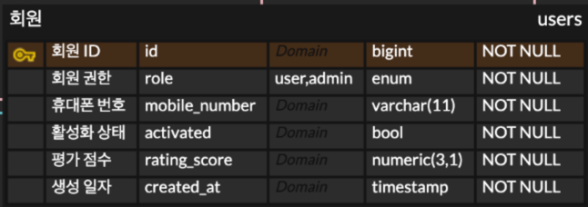
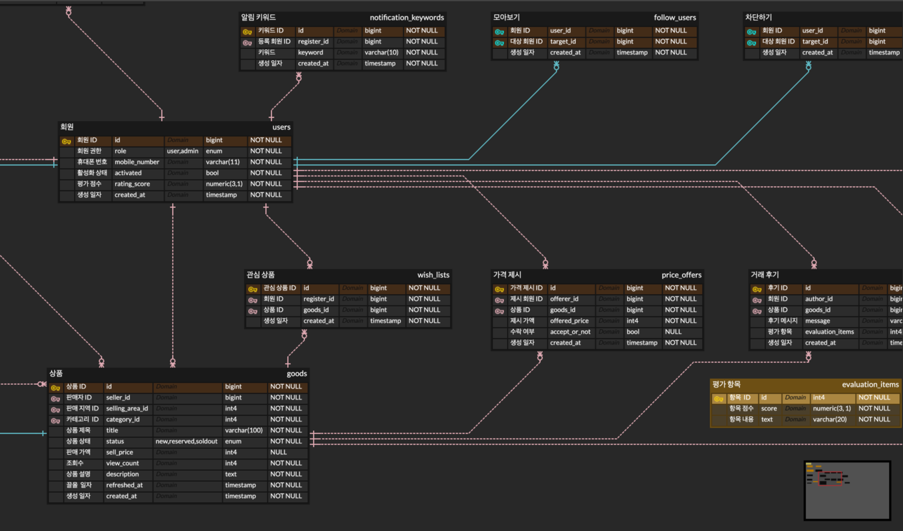

## 데이터베이스 설계

데이터베이스를 설계한다는 것은 데이터베이스의 스키마 내에 테이블, 인덱스, 뷰 등의 데이터베이스 객체를 정의하는 것입니다. 
기획에 맞춰 테이블의 이름이나 열, 자료형을 결정하고 테이블 간의 관계를 생각하면서 여러 테이블을 정의합니다.

테이블의 이름을 지을 때는 설계할 때의 이름(논리명)과 실제로 데이터베이스에서 사용될 물리명이 존재합니다.(ex. 논리명 - 회원, 물리명 - users)
물리명은 공백문자가 없거나 길이에 제한이 있는 등 RDBMS에 영향을 받습니다. 따라서 물리명은 생략되거나 약자를 사용하는 일이 많기 때문에
의미를 전달하기 힘들어 설계도에는 논리명도 기입하는 편입니다. 

## 열의 자료형

:::tip [인덱스 지정할 때 고려사항](./sql-first-step-08) 
1. Column Size

데이터베이스 서버가 검색하거나 인덱싱해야 하는 데이터가 적을수록 속도가 빨라지고 디스크에서 사용하는 스토리지가 줄어들기 때문에 인덱싱하는 열의 크기를 고려해야 합니다. 테이블을 생성할 때부터 열 사이즈를 항상 의식해주는 것이 좋습니다.

- 사람의 나이의 경우 INT보다 0~255 범위의 TINYINT UNSIGNED가 더 효율적일 수 있다.
- 문자열이 고정될 경우 VARCHAR보다 ENUM(””…) 1byte가 더 좋을 수 있다.
- **`PROCEDURE ANALYSE`** 키워드를 사용하면 할당되고 있는 메모리 정보를 얻을 수 있습니다.
:::

- 제조번호처럼 알파벳도 다루어야하는 데이터는 문자열형이 낫습니다. 
- 데이터에 따라서는 Enum 타입이 있을 수 있습니다. 그럴 때는 CHECK 제약으로 데이터베이스 자체에서 정합성 체크로 관리하는 것이 편합니다.
- 조금 큰 파일을 저장할 때는 LOB 형을 사용합니다. 다만 인덱스로 지정할 수 없습니다.
- 유일성이 보장되는 컬럼이 없다면 AUTO_INCREMENT를 통해 PRIMARY KEY 열을 만드는 것도 괜찮습니다.

## ER다이아그램

E는 개체를 뜻하는 Entity의 약자이며 R은 Releationship의 약자입니다. 테이블을 설계할 때 많이 쓰이는 도식이며
약속된 도형으로 개체와 관계를 표현할 수 있습니다.

- [ERDcloud 무료 툴](https://www.erdcloud.com/library)

