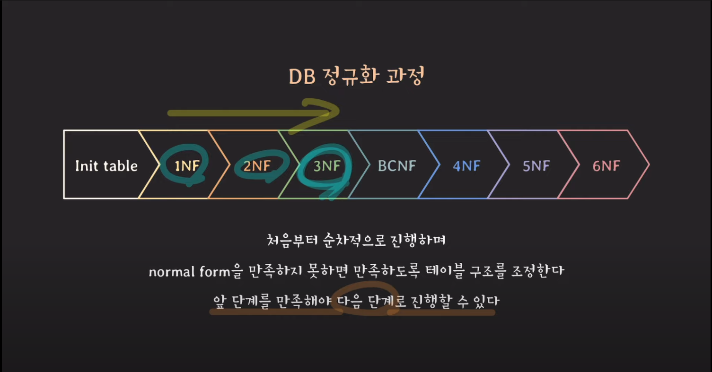
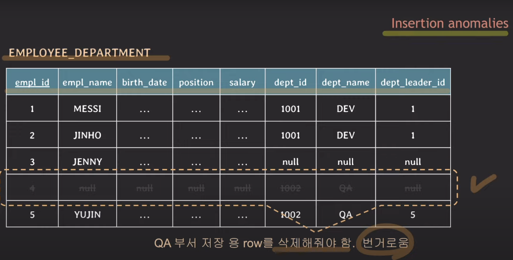
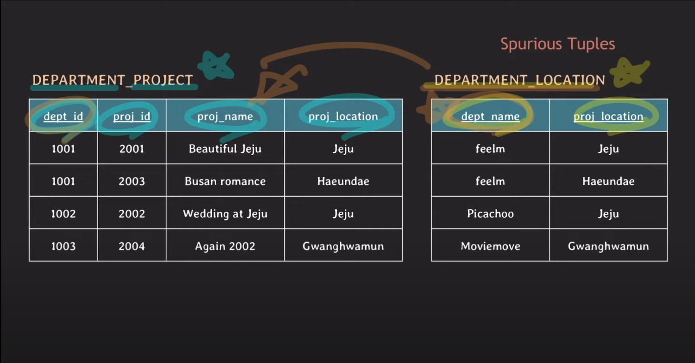
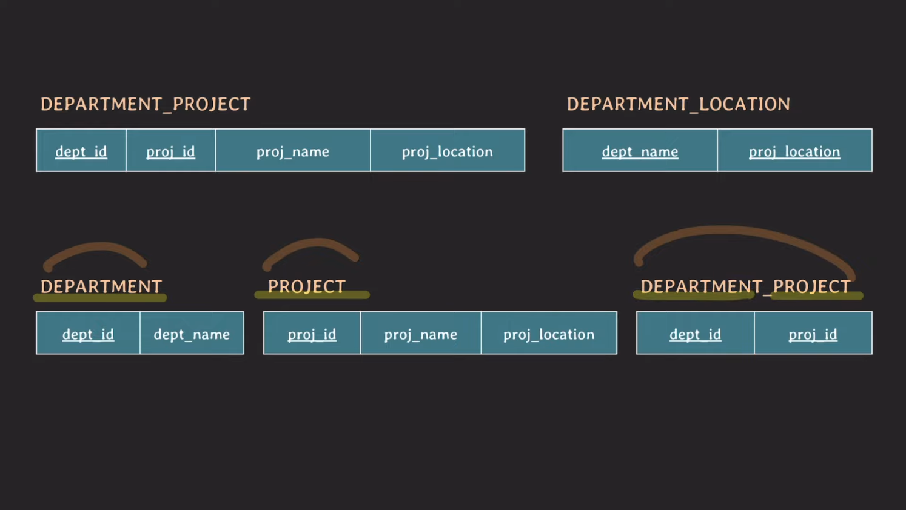
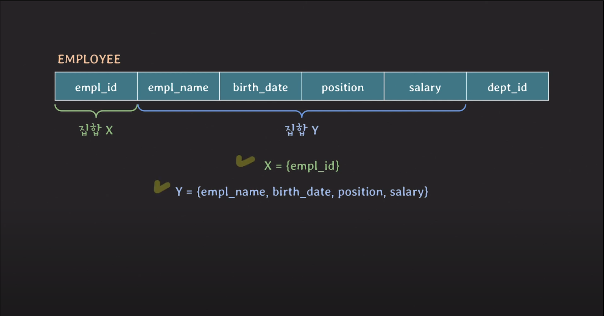
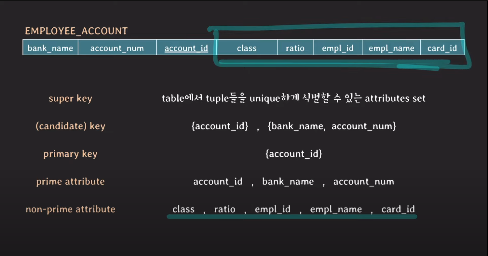
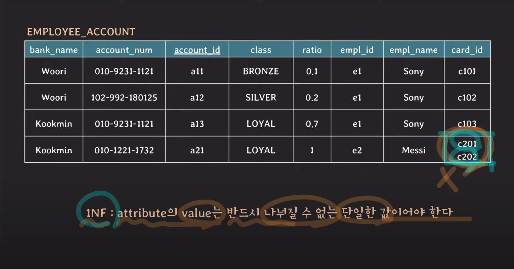
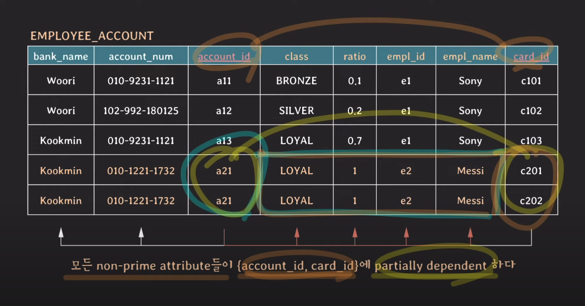
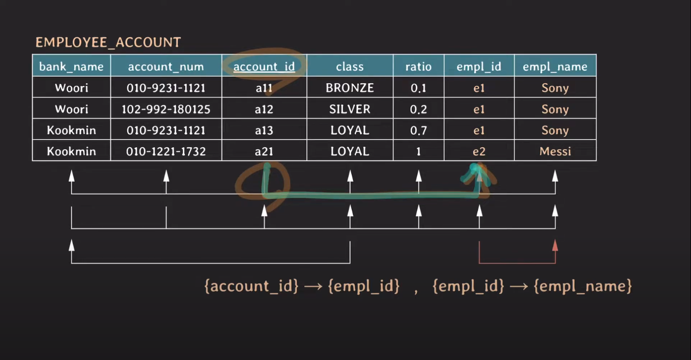
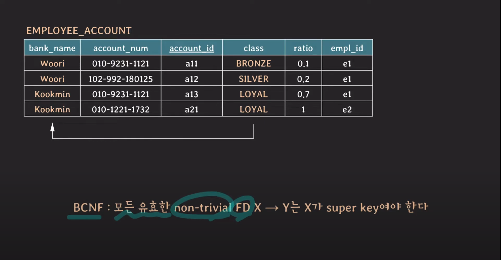

## DB 정규화 (Normalization)



데이터 중복과 이상현상(insertion, update, deletion anomaly)를 최소화하기 위해 일련의 normal forms(NF)에 따라 DB를 구성하는 과정입니다.

-   보통 실무에서는 3NF 혹은 BCNF까지 진행되면 정규화됐다고 말합니다.

그렇다면 정규화의 룰을 먼저 언급하기전에 이상현상에 대해 작성해보겠습니다.

## 이상현상 - 두 개의 관심사를 한 테이블에서 관리할 때 문제가 생길 수 있다.

### 1. Insertion anomalies



삽입 이상은 데이터베이스에 새 레코드를 추가할 때 발생할 수 있는 문제를 의미합니다.

-   Data를 write 작업할 때 중복되는 데이터가 있으면 한번에 업데이트 불가
-   저장 공간 낭비
-   데이터를 잘못 입력하면 중복되는 데이터간의 불일치 가능성이 존재한다.
-   NULL값이 늘어날 수 밖에 없다.
-   한 객체가 없는 레코드를 추가하고 싶으면 그 객체 값은 모두 NULL로 추가해야된다.
-   임시 정보가 생길때는 업데이트가 아니라 삭제를 해줘야 한다.

### 2. Deletion anomalies

데이터베이스의 레코드를 삭제할 때 발생할 수 있는 문제를 의미합니다.

-   한 객체를 삭제하기 위해 기존 다른 객체의 유일한 정보도 같이 삭제당할 수 있다.

### 3. Update anomalies

데이터베이스의 레코드를 업데이트할 때 발생할 수 있는 문제를 의미합니다.

-   데이터가 중복되기 때문에 업데이트를 한번에 할 수가 없고 데이터 불일치가 일어날 수 있다.

### Spurious Tuples

가짜 튜플. 테이블 설계를 잘못하면서 **Join을 할 때 원래는 없던 가짜 레코드(정보)가 발생하면 Spurious Tuples라고 부른다.**



위 테이블을 natural join하면 proj_location 어트리뷰트로 조인하게 된다. 예상과 다르게 위 레코드는 총 6개가 된다. dept_id에 의존하는 proj_location에 jeju라는 값이 두개가 존재하면서 중복되는 레코드가 2개 더 생긴다.



해결방법은 올바른 분할이다.

### Null 값이 많아짐으로 인한 문제점들

-   null 값이 있는 컬럼으로 join하는 경우 예상과 다른 결과 발생
-   null 값이 있는 컬럼에 aggregate function(집계함수 같은 것들)을 사용했을 때 값이 무시되면서 예상치 못한 결과가 나올 수 있음.

### 바른 DB schema 설계

-   의미적으로 관련 있는 속성들끼리 테이블을 구성
    -   여러 관심사를 한 테이블에 넣지 말자.
-   중복 데이터를 최대한 허용하지 않도록 설계
-   JOIN 수행 시 가짜 데이터가 생기지 않도록 설계
    -   PRIMARY KEY나 FOREIGN KEY 활용을 하자
-   되도록이면 NULL 값을 줄일 수 있는 방향으로 설계
-   때로는 성능 향상을 위해 일부러 테이블을 나누지 않는 경우도 있습니다.

## Functional dependency



한 테이블에 있는 두개의 attribute 집합 사이의 제약을 의미합니다.

X값에 따라 Y값이 유일하게 결정될 때 “X가 Y를 함수적으로 결정한다. “ “Y가 X에 함수적으로 의존한다.”

**X → Y**

FD를 파악할 때는 테이블의 스키마를 보고 의미적으로 판단해야 합니다. 구축하려는 DB의 attribute가 관계적으로 어떤 의미를 지닐지에 따라 FD들이 달라집니다.

-   state를 보고 결정하면 안된다. ⇒ **특정 순간의 특정 상태가 중요한 것이 아니라 기획이 중요함**
-   ex) empl_name → birth_date 는 일시적으로는 결정하는 것 같지만 겹치는 empl_name이 얼마든 생길 수 있다.
-   empl_id가 하나이상의 부서에 결정할 수 있다면?

```sql
stu_id -> {stu_name, birth_date, address}
class_id -> {class_name, year, semester, credit}
stu_id,class_id -> {grade}
```

논리적으로 좌항이 없이는 우항의 유니크함을 증명할 수 없다고 생각하면 간단하다. 우항의 값이 좌항이 없다면 언제든 겹칠 수 있는 값들의 집합이라면 좌항이 있어야만 유니크한 레코드라고 판단할 수 있다. 그럴 때 Y는 X에 의존한다고 할 수 있다.

주의 사항

-   X → Y라고 해서 X ← Y인 것은 아니다.
-   \{\} → Y
    -   특정 attribute에 따라 값이 바뀌는 것이 아니라 항상 고정값이다라고 하면 좌항을 공집합으로 표시한다.

### Trivial functional dependency

X → Y 에서 X가 Y의 부분집합이면 Trivial FD라고 표현한다.

-   \{a, b, c\} → \{c\}
-   \{a, b, c\} → \{ a, c \}

### Non-Trivial functional dependency

X → Y 에서 X가 Y의 부분집합이 아니면 Non-Trivial FD라고 표현한다.

-   \{a, b, c\} → \{b, c, d\}
-   \{ a, b, c \} → \{ d, e \}
    -   공통된 attribute가 없으면 completely non-trival FD라고 부른다.

### Parital functional dependency

X → Y 에서 X의 부분 집합이 Y를 결정할 수 있다면 partial FD 라고 부른다.

-   Partial의 경우엔 최소한 한 개의 attribute라도 제거되어야만 부분집합이라 할 수 있음
    -   \{ a, b, c \} - \{a, c\}, \{a\}, \{\}

\{ empl_id, empl_name \} → \{ birth_date \}

위 레코드에서 꼭 두 어트리뷰트가 아니더라도 empl_id만으로도 결정지을 수 있다.

### Full functional dependency

X → Y에서 X의 어떤 부분 집합도 Y를 결정지을 수 없다면 full FD라고 부른다.

\{ stu_id, class_id \} → \{ grade \}

-   어떤 어트리뷰트도 개별로 성적을 특정지을 수 없다.

## 정규화의 NF

### Key



tuple - 각 attribute의 값으로 이루어진 리스트

1. super key : table에서 tuple들을 unique하게 식별할 수 있는 attributes set
2. (canidate) key : 어느 한 attribute라도 제거하면 unique하게 tuples를 식별할 수 없는 super key
    1. ex) \{ bank_name, account_num \} 에서 한가지 attribute라도 빠지면 튜플 값을 결정할 수 없을 때
       = Full functional dependency
3. primary key : table에서 tuple들을 unique하게 식별하려고 선택된 (canidate) key
4. prime attribute : 임의의 key에 속하는 attribute
5. non-prime attribute : 어떤 key에도 속하지 않는 attribute

### 1NF



모든 attribute의 value는 반드시 나눠질 수 없는 단일한 값이어야 한다.

### 2NF



모든 non-prime attribute들은 모든 key에 fully functionally dependent해야한다.

-   2NF는 Key가 composite key(두개의 어트리뷰트)가 아니라면 2NF는 자동적으로 만족한다.
    -   예외케이스: non-prime attribute하나가 항상 고정값이라면 공집합으로 결정된다고 볼수 있고 non-prime attribute가 key에 partially dependent한 상황이 된다. (규칙위반)

### 3NF



**모든 non-prime attribute는 어떤 key에도 transitively dependent하면 안된다.**

-   non-prime attribute 사이에 FD가 있으면 안된다.
-   X → Y, Y → Z 의 의존관계가 생길 때 연결연결되어 X → Z를 transitive FD라고 부른다.
    -   조건: Y, Z는 어떤 키의 부분집합이 아니어야 한다.

### BNCF



모든 유효한 non-trivial FD X → Y 관계에서는 반드시 X가 super key여야 한다.!

## reference

-   [쉬운코드 - 정규화 시리즈](https://youtu.be/JwfQ8ouhAzA?si=kJt8Eno7hEQu6kP3)
