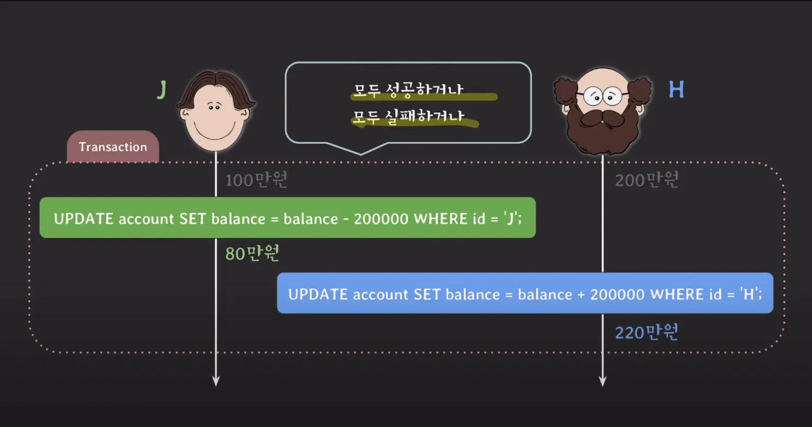
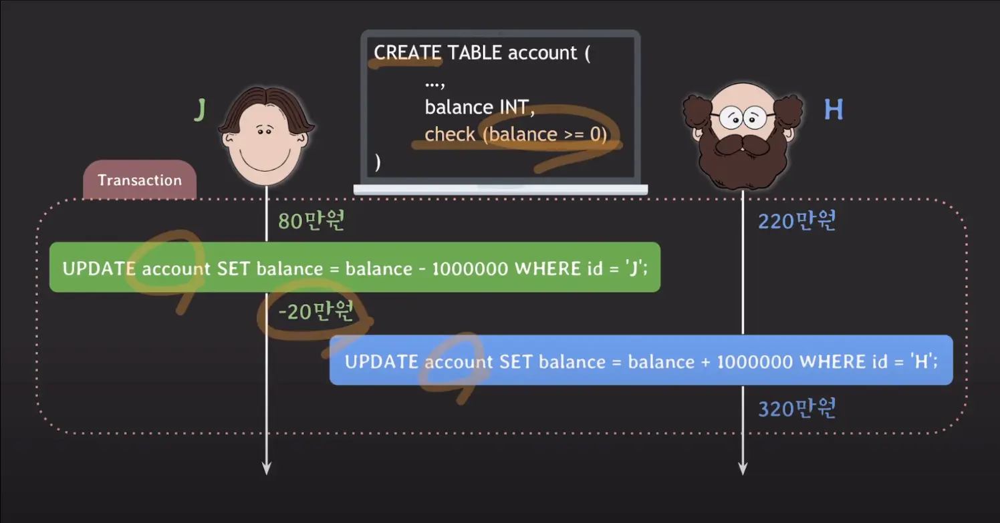
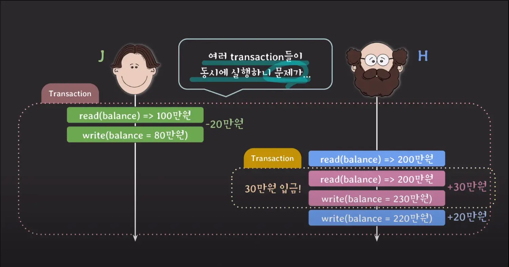
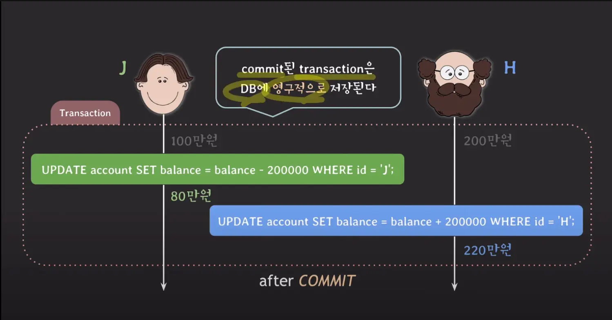

## 트랜잭션

```sql
// id 1인 레코드가 2인 레코드에게 2만원 전송
UPDATE account SET balance = balance - 20000 WHERE id = 1;
UPDATE account SET balance = balance + 20000 WHERE id = 2;
```

RDBMS에서는 둘다 성공해야만 하는 단일 작업을 트랜잭션이라고 부릅니다.  일부만 성공해서는 DB에 반영되지 않게 합니다.

```sql
START TRANSACTION;

UPDATE account SET balance = balance - 20000 WHERE id = 1;
UPDATE account SET balance = balance + 20000 WHERE id = 2;

COMMIT;
```

트랜잭션을 시작 → 로직 수행(데이터를 읽거나 쓰는 등의 SQL문) → 문제없이 동작했다면 COMMIT → 문제가 발생했다면 ROLLBACK

- COMMIT : DB에 지금까지 작업한 내용을 영구적으로 저장. 트랜잭션 종료.
- ROLLBACK: 지금까지 커밑들을 모두 취소하고 트랜잭션 이전 상태로 되돌린다.

```sql
SELECT @@AUTOCOMMIT; // 활성화 여부 체크
```

각각의 쿼리문에 자동으로 트랜잭션 처리를 해주는 것을 autocommit이라고 합니다. MySQL에서 또한 autocommit이 기본으로 활성화되어있으며 SELECT 문으로 활성여부를 확인할 수 있습니다.

- 쿼리문이 실행되면 자동으로 COMMIT처리를 해주어 DB에 영구적으로 반영됩니다.

```sql
SET autocommit = 0; // autocommit을 비활성화
DELETE FROM account WHERE balance <= 1000000;

SELECT * FROM account; // 반영되어있음

ROLLBACK;

SELECT * FROM account; // 삭제전으로 돌아가있음
```

COMMIT 기능을 비활성화하면 어떤 작업을 하던 언제든 ROLLBACK으로 돌아갈 수 있습니다. `START TRANSACTION` 또한 실행과 동시에 autocommit을 off합니다.

## ACID

> A: Atomicity
>
>
> C: Consistency
>
> I: Isolation
>
> D: Durablility
>

데이터베이스 트랜잭션의 네 가지 핵심 속성을 나타내는 약어입니다. DBMS에서 자체적으로 해주는 것이 많지만 모든 걸 알아서 해주진 않기 때문에 개발자가 필요에 따라 튜닝할 필요가 있습니다.

### Atomicity (원자성)



> ALL or Nothing
트랜잭션은 원자 단위로 수행되어야 합니다.
>

트랜잭션은 논리적으로 쪼개질 수 없는 작업 단위이기 때문에 내부의 SQL문이 모두 성공하면 COMMIT하거나 하나라도 실패하면 롤백하여 데이터베이스를 일관성있게 관리하는 것을 Atomicity라고 합니다.

- 개발자가 챙겨줘야 하는 부분은 어느 시점에 COMMIT을 할지 ROLLBACK할지입니다.

### Consistency(일관성)



> 트랜잭션은 DB의 일관성을 깨트리지 않아야 합니다.
>

트랜잭션이 DB에 정의된 rule(constraints, trigger) 등을 위반했는지 COMMIT 전에 확인해야합니다. 위반한다면 트랜잭션을 거부하거나 ROLLBACK을 하는 등 DBMS를 일관성있게 관리하는 것을 Consistency라고 합니다.

### Isolation(격리)



> 여러 트랜잭션들이 동시에 실행될 때도 혼자 실행되는 것처럼 동작하게 만들어야합니다.
>

DBMS는 엄격하게 isolation을 관리하면 퍼포먼스에 영향을 받기 때문에 여러 종류의 isolation level을 제공합니다. 개발자는 isolation level중에 어떤 level로 트랜잭션을 동작시킬지 튜닝시킬 줄 알아야합니다.

### Durability(영존성)



> DBMS에 문제가 생겨도 COMMIT된 트랜잭션은 DB에 영구적으로 저장되어야 합니다.
>

기본적으로 DBMS에서 비휘발성 메모리에 저장하는 것을 보장해줍니다.