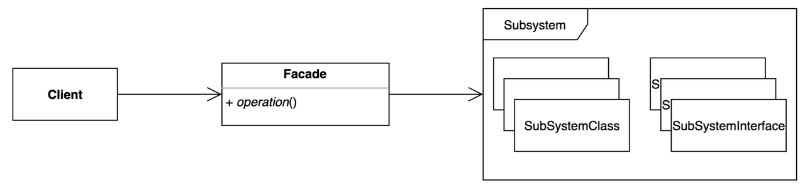

<head>
  <link rel="canonical" href="https://blog.nirohack.xyz/post/2021/0112-facade-pattern/" />
</head>

# 퍼사드 패턴(Facade Pattern)
퍼사드 패턴(Facade Pattern)에 대해서 알아봅시다.

## 개요
퍼사드 패턴을 적용하면 클라이언트(사용자) 에게 복잡한 서브 시스템들을 숨기고 퍼사드에 대한 의존만 줌으로써 클라이언트에게 편리를 제공합니다.
퍼사드가 적용된 부분에는 서브 시스템들의 의존이 그대로 모두 포함됩니다만, 이렇게 래핑함으로써 **클라이언트가 포장된 API 만 알아도** 간단히 사용할 수 있게됩니다.

:::tip 한 줄 요약
클라이언트에게 구체적인 부분을 숨기자. 클라이언트의 코드에서 의존성을 최소화 시켜보자.
:::

## 장점

퍼사드 제공자가 복잡한 시스템을 의도적으로 감추었기 때문에 사용자는 여러 서브 시스템들에 대한 이해도가 높지 않아도 기능을 사용할 수 있습니다. 
퍼사드로 기존 시스템을 감싸면서 기존 기능을 사용하는데에 더 명확한 메서드를 제공할 수 있으며, 필요한 값만을 요구할 수 있게됩니다.  

물론, 감춘 만큼 퍼사드 API 를 잘 정리하고 이에 대한 사용 방법, 명세 등을 제공해야하겠습니다.

## 예제 코드

import CodeRunner from '../../../src/components/code-runner';
import { LANGUAGE_TYPE } from '../../../src/components/code-runner/data';
import code from './code';

<CodeRunner codeString={code}  language={LANGUAGE_TYPE.JAVA}/>
