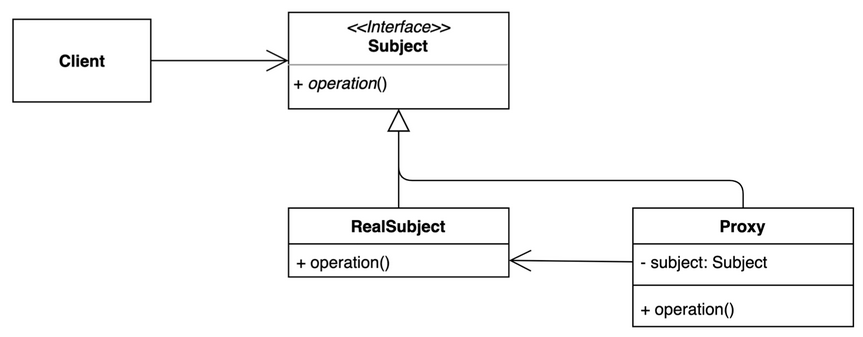

<head>
  <link rel="canonical" href="https://blog.nirohack.xyz/post/2021/0128-proxy-pattern/" />
</head>

# 프록시 패턴(Proxy Pattern)
프록시 패턴(Proxy Pattern)에 대해서 알아봅시다.

## 개요
프록시 패턴은 특정 객체에 대한 접근을 할 때, 대리자(proxy) 를 통해 접근 시킬 수 있도록 하는 패턴입니다. 
프록시로 생성된 대리자는 원본 객체에 대해 지연 로딩, 접근 제어, 로깅, 캐싱 등의 다양한 기능들을 원본 객체 접근 전에 포함시킬 수 있습니다.
또한 원본 객체 접근 후의 처리도 가능합니다. 결국, 먼저 일하고 나올 때도 나중에 나오며 문을 닫는 역할을 한다고 생각할 수 있습니다.

:::tip 한 줄 요약
원본 객체에 대한 대리자역인 프록시는 원본 객체에 대해 pre, post 로직을 포함할 수 있습니다.
:::

## 장점

클라이언트(사용자) 가 특정 명령을 사용한다고 할 때, 이 명령을 사용하기 전, 후 어떠한 추가 처리과정을 행하고 싶을 때 프록시 패턴을 적용할 수 있습니다. 
만약, 특정 명령을 사용할 때 사용자는 몰라도 되는 캐싱을 넣거나(`플라이웨이트 패턴과 조합`). 
싱글턴으로 구현된 객체를 런타임 시에 바로 생성하지 않고 첫 참조 시에 생성, 명령 사용 전 후 로깅을 한다던가 하는 일입니다.