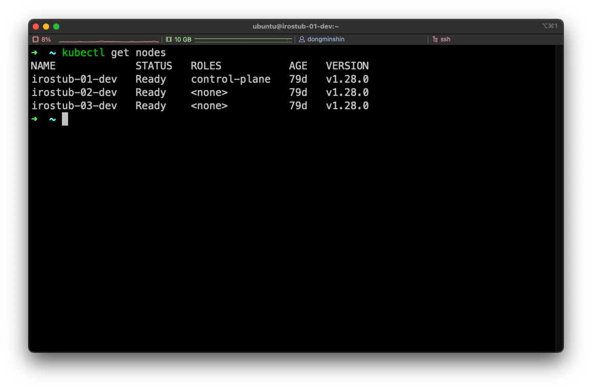

<head>
  <link rel="canonical" href="https://blog.nirohack.xyz/post/2023/1111-cluster-upgrade/" />
</head>
# 쿠버네티스 클러스터 버전 업그레이드

오늘은 쿠버네티스 클러스터 버전 업그레이드 하는 방법에 대해서 알아보겠습니다.

우선 쿠버네티스는 여러 벤더사가 있기 때문에 다양한 업그레이드 방법이 있습니다. 대표적으로 AWS 에서 자체적으로 관리하는 EKS 같은 경우엔 [이 문서](https://docs.aws.amazon.com/ko_kr/eks/latest/userguide/update-cluster.html)를 통해 진행할 수 있습니다.

하지만, 오늘은 사용자가 kubeadm 을 사용하여 직접 구성한 쿠버네티스 클러스터의 버전 업그레이드에 대해 알아볼 것입니다. 공식문서도 꽤 잘 소개가 되어있기 때문에 [이 문서](https://kubernetes.io/ko/docs/tasks/administer-cluster/kubeadm/kubeadm-upgrade/)를 참고하는 것도 큰 도움이 되리라 생각합니다.

## 주의 사항

**릴리즈 노트를 확인한다**  
공식에서 주의를 요하는 항목 중 한가지. 많은 고려사항이 담긴 만큼 신중하게 버전업을 하라는 의미로 간주. 실제로 릴리즈 노트는 매우 상세하며 긴 글입니다. (1.29 릴리즈노트 926 line)

**클러스터는 정적 컨트롤 플레인 및 etcd 파드 혹은 외부 etcd 를 사용해야한다**  
이는 동적으로 컨트롤 플레인의 이중화, 삼중화 등이 동적으로 조절되는 상황에서 고정된 하나의 컨트롤 플레인으로 작업해야함을 의미합니다.

**앱-레벨 상태와 같은 중요한 컴포넌트를 반드시 백업한다**  
날아가면 손해니까 꼭 복구할 수 있게 대처해놓으라는 뜻입니다.

**스왑을 비활성화해야 한다**  
이미 설치시에 보통 메모리 스왑을 끄기 때문에 크게 신경쓸 필요는 없습니다.


## 추천 사항

1. 버전업은 마이너 단위로 하나씩 올린다
   공식문서에서도 1.26 > 1.27, 1.28 > 1.29 와 같이 하나의 마이너 버전 씩 올리는 것을 소개하고 있습니다. 두 마이너 버전씩 올려서 문제가 생기는 것 보단 천천히 진행해나가는 것이 현명할 거라 생각합니다.
2. 안전하게 업그레이드를 하고싶다면 노드를 더 추가하여 진행한다
   이는 업그레이드 진행 간 drain, cordon, uncordon 등을 사용하는데, 기존 워크로드를 수용 가능한 기존의 또 다른 노드로 옮겨둘 때 자원적으로 불안함을 해소시켜줍니다. 새로운 노드를 추가한 뒤 해당 노드로 워크로드를 옮겨주고 업그레이드가 끝나면 워크로드를 다시 기존의 노드에 돌려준 뒤 새로운 노드는 삭제한다는 플랜입니다.

# 본편

오늘은 MONEY 의 한계로 추천사항에서 새로운 노드를 추가하여 더 안전하게 진행하는 파트는 제외하겠습니다. 시작합니다.

### 오늘의 준비된 클러스터



## `kubeadm 을 업그레이드` 할 버전 결정(ubuntu, debian 계열)

우선 진행하기 전 su 권한이 있는 계정으로 전환해줍니다. `sudo -i` 명령을 활용할 수 있습니다.

```bash
apt update
apt-cache madison kubeadm
```


이렇게 쫙 업그레이드 할 수 있는 버전이 보입니다. 최신 버전인 1.28.3 도 있어야할 듯 싶은데 안보이네요. 괜히 요상한 뚝심으로 도전하지말고, 이럴땐 눈으로 확인 된 것만 따라가는 것이 좋습니다. 1.28.2 로 진행하겠습니다.

## kubeadm 업그레이드 실행

현재 필자의 컨트롤 플레인 노드는 다중화되어있지 않고 하나의 노드만 존재하기 때문에 한 노드에서만 진행했습니다. 아래 명령어를 입력하되 `kubeadm=1.28.x-00` 이 부분에서 x 를 위 목록에서 조회한 버전을 입력해줍시다. 저는 `kubeadm=1.28.2-00` 로 치환하여 명령어를 적용했습니다.

지금 실행하는 명령어는 kubeadm 을 통해 처음 클러스터 설치 시 kubeadm 에 대한 버전을 고정시켜둔 것을 풀고 `kubeadm 을 업그레이드`합니다. 그리고 업그레이드 된 버전으로 다시 고정시킵니다.

```bash
apt-mark unhold kubeadm && \
apt-get update && apt-get install -y kubeadm=1.28.x-00 && \
apt-mark hold kubeadm
```


성공적으로 kubeadm 을 업그레이드 한 모습입니다.

## 컨트롤 플레인 노드 업그레이드

### 업그레이드 계획 확인

```bash
kubeadm upgrade plan
```


길게 무슨 내용이 나오는데 볼 것은 Cluster version, kubeadm version, Target version, kubelet version 입니다. 위에 추천사항에서 말씀드렸지만 마이너 버전은 하나씩, 하지만 패치 버전에 대한 언급은 따로 없습니다. 1.28.0 에서 1.28.3 으로 바로 올려봅시다. (x.y.z 버전 표기에서 x 는 메이저, y 는 마이너, z 는 패치라합니다)

친절하게도 업그레이드가 가능한지, 그리고 무슨 명령을 치면 되는지 다 알려줍니다.

> You can now apply the upgrade by executing the following command
**kubeadm upgrade apply v1.28.3**


오! FATAL 실패해버렸네요. 이럴 땐 당황하지않고 글을 천천히 읽어보아야합니다. 보아하니 kubeadm 버전이 1.28.2 인데 클러스터를 1.28.3 으로 올리려해서 문제가 생겼군요. 하지만 위에서 kubeadm 에 대한 버전 리스트업을 봤을 때 1.28.3 이 없었으므로 클러스터를 1.28.2 버전으로 올려야겠습니다.

다시 명령어를 입력합니다.

```bash
kubeadm upgrade apply v1.28.2
```


Enjoy! 잘되었군요!

### CNI 플러그인 수동 업그레이드

공식문서의 지침을 따르면 CNI 플러그인의 경우 각 플러그인 마다 업그레이드를 해야하는지 여부를 확인하여 업그레이드 하면 된다고 합니다. 필자는 Flannel 을 사용 중이며 별도 업그레이드 지침이 없기에 진행하지 않았습니다.

### 다른 컨트롤 플레인 노드의 업그레이드

필자는 컨트롤 플레인이 다중화되어있지 않기에 진행하지 않았으나 방법은 짧게나마 소개하려합니다. 추가 컨트롤 플레인 노드에선 `kubeadm upgrade apply 명령이 아닌 kubeadm upgrade node` 로 진행하면 됩니다. 그리고 CNI 공급자 플러그인은 업그레이드 하지 않아도 괜찮습니다.

### 노드 드레인

컨트롤 플레인 노드를 드레인 설정하여 해당 노드에 있는 워크로드를 다른 노드로 옮기고 SchedulingDisabled 상태로 전환합니다. 이때  데몬셋을 제외합니다. 이는 kubelet 과 kubectl 을 업그레이드하기 위함합니다.

```bash
kubectl drain irostub-01-dev --ignore-daemonsets
```


daemonset 으로 실행되는 CNI 와 kube-proxy 를 제외하고 drain 설정이 된 모습입니다.

### kubelet 및 kubectl 업그레이드

아래 명령어를 입력하여 업그레이드 합니다. 단, 여기서도 `kubelet=1.28.x-00 kubectl=1.28.x-00` 에서 x 에 대한 버전을 바꿔줘야겠습니다. 필자는 `kubelet=1.28.2-00 kubectl=1.28.2-00` 다음과 같이 바꾸어 실행했습니다.

```bash
apt-mark unhold kubelet kubectl && \
apt-get update && apt-get install -y kubelet=1.28.x-00 kubectl=1.28.x-00 && \
apt-mark hold kubelet kubectl
```


잘 업그레이드가 된 모습입니다. 하지만, 시스템 서비스로 시작되는 kubelet 의 경우는 서비스를 재시작까지 해줘야 완전히 완료가됩니다. 다음 명령어를 입력합니다.

```bash
systemctl daemon-reload
systemctl restart kubelet
```

위 명령어까지 입력하셨다면 `systemctl status kubelet` 을 실행했을 때 초록색 active 가 반길 것 입니다.


이제 아까 drain 설정을 통해 SchedulingDisabled 상태가 된 컨트롤 플레인 노드를 스케쥴 가능하게 uncordon 합니다.

```bash
kubectl uncordon irostub-01-dev
```


uncordoned 가 잘 적용된 것을 볼 수 있습니다.

## 워커 노드 업그레이드

드디어 컨트롤 플레인 업그레이드를 마치고 워커 노드 업그레이드 편입니다. 여기서 `주의할 점은 최소한 워크로드가 실행될 수 있는 리소스는 남겨둔 상태로 천천히 업그레이드` 해야합니다.

예를 들테면 10개의 워커 노드가 있다고 했을 때 10 개를 한번에 업그레이드 하는 것이 아닌 1~3 개의 노드 씩 업그레이드를 작업해야함을 의미합니다. 만약 워크로드가 리소스를 거의 최대로 점유하고 있는 상태라면 여유 분의 추가 노드를 붙여놓고 작업하는 것이 좋겠습니다.

### kubeadm 업그레이드

위에서 컨트롤 플레인을 업그레이드를 했던 것과 유사해서 쉽게 할 수 있으리라 생각합니다. 아래 명령어를 실행합니다. 물론 여기서도 x 를 치환해주셔야합니다. 필자는 2 로 치환하였습니다.

```bash
apt-mark unhold kubeadm && \
apt-get update && apt-get install -y kubeadm=1.28.x-00 && \
apt-mark hold kubeadm
```


kubeadm 가 잘 업그레이드가 되고 버전이 고정된 것을 볼 수 있습니다.

### kubeadm upgrade 호출
:::danger 주의!
아래의 명령어를 바로 입력하지마세요. 해당 섹션에는 필자가 인지한 오류를 함께 포함하고 있습니다. 해당 섹션을 모두 읽은 뒤 올바른 방법으로 업그레이드를 진행하세요. 

`올바른 순서는 노드 드레인 → kubeadm upgrade 호출` 순이며 글을 모두 읽으시면 이해가 되시리라 생각합니다.
:::

```bash
kubeadm upgrade node
```


순식간에 완료가 된 모습입니다.

### 노드 드레인
:::danger 주의!
아래의 명령어를 바로 입력하지마세요. 해당 섹션에는 필자가 인지한 오류를 함께 포함하고 있습니다. 해당 섹션을 모두 읽은 뒤 올바른 방법으로 업그레이드를 진행하세요. 

`올바른 순서는 노드 드레인 → kubeadm upgrade 호출` 순이며 글을 모두 읽으시면 이해가 되시리라 생각합니다.
:::

```bash
kubectl drain irostub-02-dev --ignore-daemonsets
```


어허, 에러가 나버렸네요. kube apiserver 와 통신할 수 없다고합니다. 그도 그럴 것이 해당 노드 드레인 명령은 컨트롤 플레인 노드에서 실행해 줘야합니다.

그래서 컨트롤 플레인에서 실행을 했으나…


컨트롤 플레인에서 워커 노드에 대해 드레인을 실행했으나 제대로 옮겨지지 못했습니다. 아무래도 워커노드에서 `kubeadm upgrade node` 를 호출하기 전에 이미 드레인을 해야한다 생각합니다. 공식문서의 순서가 문제가 있다 생각되는 부분입니다.

다른 노드로 실행 중인 워크로드를 모두 옮기진 못했지만 cordoned 설정이 되었기 때문에 이대로 진행하겠습니다. 필자는 클러스터에 실제 서비스가 올라가있거나 중요한 상태가 존재하지 않으므로 이대로 진행하는 것이며 이 글을 읽는 독자는 올바른 방법으로 정확하게 진행해주시길 권장드립니다.

### kubelet 과 kubectl 업그레이드

마찬가지로 x 에 대해 알맞은 버전으로 교체하여 명령을 실행합니다.

```bash
apt-mark unhold kubelet kubectl && \
apt-get update && apt-get install -y kubelet=1.28.x-00 kubectl=1.28.x-00 && \
apt-mark hold kubelet kubectl
```


잘 업그레이드가 된 모습입니다. 컨트롤 플레인 업그레이드 편에도 말씀드렸듯 kubelet 서비스를 재시작해줍니다.

```bash
systemctl daemon-reload
systemctl restart kubelet
```


### 노드에 적용된 cordon 해제

컨트롤 플레인에서 워커 노드에 적용한 cordon 을 해제합니다.

```bash
kubectl uncordon irostub-02-dev
```


축하합니다! 워커 노드 한대에 대해서 업그레이드를 마쳤으며 이제 나머지 워커 노드에 대해서도 같은 작업을 진행하면 업그레이드에 대한 프로세스가 최종적으로 종료됩니다.

다음으론 업그레이드를 완전히 마친 후 클러스터의 상태를 확인하는 방법을 소개드리고 이 글을 마치도록 하겠습니다. 고생하셨습니다.

# 클러스터 상태 확인 (업그레이드 결과 확인)

```bash
kubectl get nodes
```


STATUS 가 모두 Ready 이고 VERSION 이 업그레이드 하신 버전과 일치한다면 완료입니다.