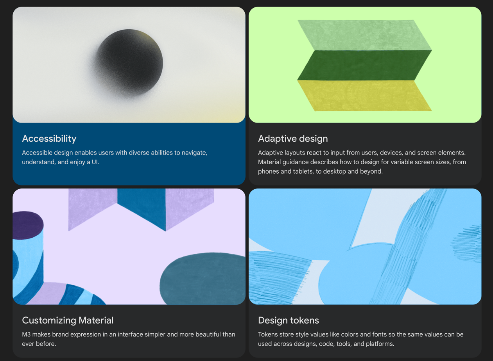
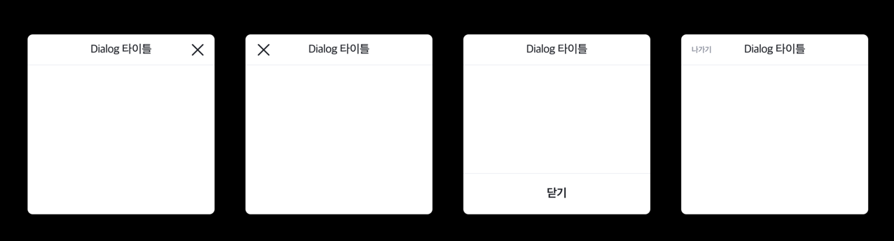

## 👹 Why Design System Started

일단 디자인 시스템이 무엇인지 설명하기 전에 디자인 시스템이 대체 뭘 해결할 수 있고 어떤 이득을 보기위해 시작되는지 알 필요가 있습니다.

구글에 디자인 시스템을 검색하면 정말 수많은 쇼케이스들이 쏟아져내립니다. 
[Google Material Design](https://m3.material.io/), 
[Adobe React Spectrum](https://react-spectrum.adobe.com/react-spectrum/index.html),
[MongoDB Design/ leafgreen-ui](https://www.mongodb.design/) 등 작게는 컬러, 타이포그래피, 아이콘, 여백부터 컴포넌트, 인터렉션까지
확인할 수 있으며 자신들의 철학, 원칙들을 설명합니다. 

이런 공식문서들을 보다보면 
각자 회사마다 추구하는 지향점이 있고 상황이 있고 비즈니스가 있어 디자인 시스템을 조금씩 다르게 말하고 있지만
공통적으로 얘기하는 바는 이와 같았습니다. 

> **일관된 디자인 + 재사용 가능한 디자인 => 개발/디자인의 생산성**
> 1. 어떤 플랫폼, 어떤 환경에서 보여지던 **똑같은 사용자 경험**을 제공한다.
> 2. 디자이너/개발자가 한번 작업했던 디자인/코드를 **재사용**한다.
> 3. 사용자에게 일관된 UI/UX를 제공하고 디자이너/개발자의 생산성을 높이면서 비즈니스 성과를 낸다.

## 👹 Design System을 시작하려면?

### UX 정의하기부터

다음과 같은 디자인들이 한 프로덕트에서 사용되고 있습니다. 문제점은 
사용자가 Dialog를 닫으려 할 때 4가지 버전으로 경험하면서 `사용자 경험이 일관되지 않는` 불편을 느낄 수 있다는 것입니다.
디자인 시스템은 당연한 UX를 정의하고 그 UX를 지키는 것을 원칙으로 할 때부터 시작됩니다.

:::tip
Shopify의 [Polaris](https://polaris.shopify.com/foundations/accessibility) 디자인 시스템에는 이런 디테일한 정의도 볼 수 있습니다.
- 판매자가 페이지의 다른 곳으로 이동하는 링크를 활성화하는 경우 해당 콘텐츠로 포커스를 이동합니다.
- 판매자가 오버레이에 액세스해야 하는 경우 오버레이로 포커스를 이동합니다.
- 판매자가 오류를 발생시키는 양식을 제출하는 경우 오류 메시지로 포커스를 이동합니다.
:::

### 한계(원칙) 만들기

[Adobe](https://spectrum.adobe.com/page/color-palette/)의 디자인 가이드에서는 자체 색상을 만들지 말라는 메세지를 볼 수 있습니다. 
모든 프로덕트의 일관성을 유지하기 위해서는 `Spectrum`에서 정의한 색상만을 사용해야 한다고 강하게 얘기하는데요.
한계를 정했다 또는 원칙을 세워 개발자와 디자이너가 협업할 것을 예상할 수 있습니다. 

이런 기준, 한계, 원칙들이 세워지는 근거에는 프로덕트의 일관성과 디자인적인 이유, 비즈니스나 상황에 따라 다양합니다. 

예를 들어 개발자의 생산성과 경험(DX)을 고려할 때 정의한 컴포넌트의 인터페이스에서 벗어나는 동작을 요구한다면, 개발자는 디자이너에게 현재 컴포넌트의 한계 내에서 구현이 불가하고 
새로이 디자인 시스템에 등재하자고 할 수 있습니다.

### 할 수 있는 것부터 하나씩

디자인 시스템을 구성하는 요소(Anatomy)는 다 다르게 이야기하지만 크게 3가지로 볼 수 있습니다. 
- Foundation : 가장 기초적인 단위의 디자인 속성 (Color, Font, Typography, Space...)
- Component: 파운데이션들이 모여서 UI 컴포넌트를 구성 (Button, Overlay, Card, Input...)
- Framework: 컴포넌트들이 모여서 하나의 템플릿이 됨

처음부터 이 모든 것을 설계하고 만드는 것은 불가능합니다. 또한 원칙을 세운다는 것은 그만큼 수정이 가볍지 않다는 것이기 때문에 논의하는 과정도 꽤나 험난합니다.
그래도 하나하나 디자이너와 개발자가 맞춰나가면 이후로 생산성을 높이는 데 큰 도움이 될 것은 장담합니다.

:::tip 개발자와 디자이너의 프로토콜을 만들자
> 디자이너와 기획자는 한계를 넓혀가는 직군입니다. 그리고 개발자는 그 한계를 이해하고 그 안에서 작업하는 직군이 될 것입니다.
> 우리는 서로 협업하면서 어떤 문제가 생길 때 서로의 언어가 다르거나 개인의 문제로 간주하는 등 혼란을 겪게 됩니다.
> 
> 그럴 때 우리가 할 수 있는 것은 적어도 이 문제를 문서 또는 시스템, 기준으로 가시화하는 것입니다.
:::

## 참고 자료

[우아한 테크 세미나: 디자인 시스템](https://www.youtube.com/watch?v=aVHLcQzcRbA)

[디자인 시스템이란 무엇일까? (AR 디자인 시스템 디자이너)](https://www.youtube.com/watch?v=tZUa3TwTlPA&t=50s)

