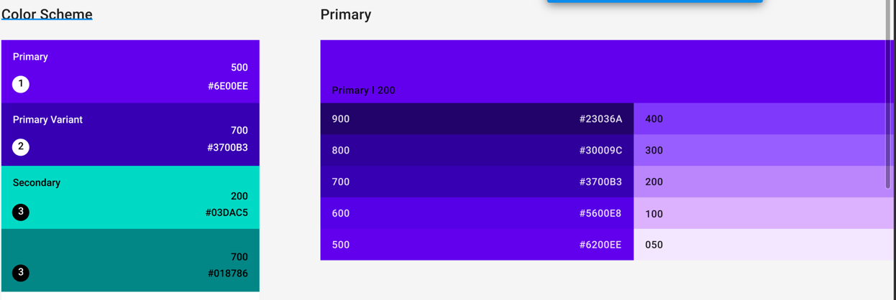

## 🫥 서론



> [Material 2 Design System](https://www.figma.com/file/yjAncpZxw29e6ylclW5W0w/Material-2-Design-Kit-(Community)?node-id=242-26541&t=Xw3A3qV54ZjQV8MF-0)
의 피그마 시안을 코드로 옮기는 과정을 서술하고자 합니다.
> 
>`react`, `react-dom`, `typescript`, `styled-components`, `rollup` 기반 라이브러리이며 UI 개발은 `Storybook`을 활용할 예정입니다.

## Settings

### Peer dependeny
여기서 배포할 패키지는 react 기반의 프로젝트들에서 사용될 목적입니다. package.json에서 `peerDependencies` 프로퍼티를 활용하여 호환성 문제를 방지할 수 있습니다. 
- 사용자가 이 패키지를 설치할 떄 의존하는 패키지들이 모두 설치되어있는지 확인할 수 있다
- 사용자의 소스에 설치되어있는 패키지


먼저 package.json에 peer 속성을 선언합니다.

```json title="package.json"
{
  ...
  "peerDependencies": {
    "react": "^17.0.0",
    "react-dom": "^17.0.0",
    "styled-components": "^5.3.5"
  },
  ...
}
```

### typescript 세팅하기

안정적인 개발과 사용자에게 편의성을 제공하고자 Typescript를 사용하였습니다. 먼저 다음 패키지들을 설치합니다.

```bash
yarn add -D typescript tsconfig-paths-webpack-plugin @types/react @types/react-dom @types/styled-components
```

### rollup


```bash
yarn add -D rollup rollup-plugin-cleaner rollup-plugin-peer-deps-external rollup-plugin-postcss @rollup/plugin-babel @rollup/plugin-commonjs @rollup/plugin-node-resolve @rollup/plugin-url @types/react
@types/react-dom @types/styled-components postcss autoprefixer
```


