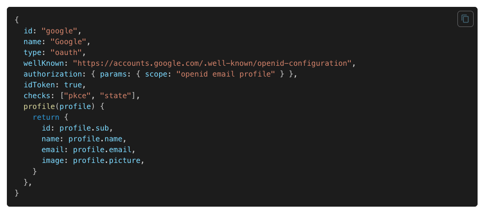

# NextAuth Introduction
NextAuth에는 어떤 기능이 있으며 왜 사용하는지, 인증 방식 설정을 설명드리고자 합니다.

## 🙃 Why NextAuth??
### 비밀번호 없는 로그인
Next.js는 Serverless를 지원하도록 처음부터 설계되었습니다. 모든 OAuth 서비스와 동기화하도록 설계되었으며 데이터터베이스 유무에 관계없이 사용할 수 있으며 MySQL, MongoDB, PostgreSQL 및 MariaDB와 같은 인기 있는 데이터베이스에 대한 기본 지원이 있습니다. 데이터베이스로 세션 유지를 하거나 JWT로 인증하는 방법 둘다 지원합니다.
### 쉬운 개발
20줄이면 인증과정부터 사용자의 정보를 React-hooks로 사용할 수 있습니다. 

SessionProvider의 Context를 통해 하위 컴포넌트에서 접근할수도 있습니다.
### 보안 제공
기본적으로 사용자의 데이터를 보호하기 위해 민감한 정보는 저장하지 않도록 설계되어 있습니다.

또한 로그인과 로그아웃 요청 시에도 내부에서 CSRF 토큰을 활용해 사용자의 요청을 검증합니다.

:::info CSRF (Cross Site Request Forgery : 크로스 사이트 요청 위조)
CSRF란 사용자의 컴퓨터에 특정 도메인에 대한 세션 쿠키나 JWT가 저장되어있을 때 공격을 당해 자신의 의사와 상관없이 도메인에서 계좌이체를 하거나 블로그에 글을 올리게 되는 등의 공격을 이야기합니다.
CSRF 토큰은 이를 위해 구현되었습니다. 

사용자의 매 요청마다 임의의 난수값을 주는데 탈취된 세션이더라도 CSRF 토큰이 이전에 이미 완료된 요청의 토큰이라면 그 해당 세션을 모두 정지시키는 방식입니다.
:::
## 📕 Configuration
### providers
```ts title=pages/api/auth/[...nextauth].ts
import NextAuth from 'next-auth'
import GoogleProvider from "next-auth/providers/google"

export default NextAuth({
   providers: [
      GoogleProvider({
         clientId: process.env.GOOGLE_CLIENT_ID,
         clientSecret: process.env.GOOGLE_CLIENT_SECRET,
         allowDangerousEmailAccountLinking: true,
      })
   ]
})
```

provider는 OAuth나 Custom 등등 어떻게 인증을 할지 방식을 정의하는 옵션입니다. 

Provider의 주체가 어떤 것이 될지 정할 수 있습니다. 기본적으로 `NextAuth`에서는 OAuth, email, credentials 방식을 지원합니다.



예를 들어 구글 OAuth 인증 후 session 정보를 보면 해당 리스폰스가 담긴 것을 확인할 수 있습니다.

해당 정보는 SessionProvider의 context에 주입될 것입니다.

### CredentialsProvider

보통은 OAuth를 활용하여 빠르게 인증을 구현하지만 DB에서 세션을 관리한다던가 다른 어플리케이션에서 구축해 커스텀할 때는 Credentials Provider를 활용합니다.

```ts title=pages/api/auth/[...nextauth].ts
import NextAuth from 'next-auth'
import Credentials from 'next-auth/providers/credentials'

export default NextAuth({
   providers: [
      CredentialsProvider({
        ...
      })
   ]
})
```
OAuth, Email의 경우에는 인증 후 치뤄지는 Response를 해당 어플리케이션에서 주지만 Credentials의 경우에는 인증 성공후 리스폰스를 해당 도메인에서 줄 수 있습니다.

|    Name     |                    Description                    |                 Type                  | Required |
| :---------: | :-----------------------------------------------: | :-----------------------------------: | :------: |
|     id      |            Unique ID for the provider             |               `string`                |   Yes    |
|    name     |         Descriptive name for the provider         |               `string`                |   Yes    |
|    type     |   Type of provider, in this case `credentials`    |            `"credentials"`            |   Yes    |
| credentials |          The credentials to sign-in with          |               `Object`                |   Yes    |
|  authorize  | Callback to execute once user is to be authorized | `(credentials, req) => Promise<User>` |   Yes    |

```ts title=pages/api/auth/[...nextauth].ts
import NextAuth from 'next-auth'
import Credentials from 'next-auth/providers/credentials'

interface CredentialInput { // credential의 키 타입
    label?: string;
    type?: string;
    value?: string;
    placeholder?: string;
}

export default NextAuth({
   providers: [
      CredentialsProvider({
         name: "Credentials",
         credentials: {
            username: { label: "Username", type: "text", placeholder: "jsmith" },
            password: { label: "Password", type: "password" },
         },
         ...
      })
   ]
})
```

`credentials` 옵션은 Next-auth에서 인증을 하는 양식을 정합니다. 우리가 인증을 해주기 위해서 필요한 값들을 받게 하고 주지 않는다면 NextAuth 자체적으로 에러를 던져줍니다. 

credentials의 키들이 CredentialInput 타입인 이유는 NextAuth 자체적으로 로그인 페이지를 만들어주기 때문인데요. 따로 추가하지 않는다면 내장된 조건들로 타입될 것입니다.

```typescript
import { signIn, signOut } from 'next-auth/react'

const login = async () => {
    await signIn("credentials", {
       username: "Hank",
       password: "12345678"
    });
}
```
이제 next-auth의 signIn 함수를 호출해 우리가 정해둔 양식을 입력하면 인증이 진행됩니다. 부가적으로 인증이 성공하면 redirect를 할지 등등 옵션도 넣을 수 있습니다.

```ts title=pages/api/auth/[...nextauth].ts
export default NextAuth({
   providers: [
      CredentialsProvider({
         ...,
         async authorize(credentials, req) {
            const res = await fetch("/your/endpoint", {
               method: "POST",
               body: JSON.stringify(credentials),
               headers: { "Content-Type": "application/json" },
            });
            const user = await res.json();

            if (res.ok && user) {
               return user;
            }

            return null;
         },
      })
   ]
})
```

이제 SignIn 메소드가 호출되면 우리는 `authorize` 함수에서 session에 어떤 정보를 담을지 로직을 담아줄 수 있습니다. 해당 콜백에서 DB의 user 정보를 조회하거나 백엔드 서버에서 access token을 받아오는 등의 조치를 취할 수 있습니다.


```bash title=authorize함수의_인자인_credentials
[Object: null prototype] {
    username: '...',
    callbackUrl: '/',
    csrfToken: '...',
    json: 'true'
}
```

인자값으로 들어오는 credentials에는 next-auth가 signIn에서 받아온 키 값들과 자체로 생산한 csrf 토큰이 같이 들어있습니다.

### Secret & Debug
```ts title=pages/api/auth/[...nextauth].ts
export default NextAuth({
   providers: [ CredentialsProvider({...})],
   secret: process.env.AUTH_SECRET,
   debug: process.env.NODE_ENV === 'development',
})
```

secret에 들어가는 임의 문자열은 토큰을 해시하고 쿠키를 서명/암호화하며 암호화 키를 생성하는 데 사용됩니다. 또한 인증과정에서 에러가 날 경우 debug 옵션이나 logger 옵션을 true로 하여 런타임에서 메세지를 확인할 수 있습니다.

:::tip secret 옵션
```ts
const session = require('express-session');
const cookieParser = require('cookie-parser');

app.use(cookieParser(process.env.COOKIE_SECRET));
app.use(session({
    saveUninitialized: false,
    resave: false,
    secret: process.env.COOKIE_SECRET
}));
```
express에서 암호화하기 위해 쓰이는 시크릿 쿠키와 똑같은 역할입니다.
:::


### session & jwt
```ts title=pages/api/auth/[...nextauth].ts
export default NextAuth({
   session: {
      strategy: "database",
      maxAge: 30 * 24 * 60 * 60, // 30 days
   },
   jwt: {
      maxAge: 60 * 60
   },
   providers: [ CredentialsProvider({...})], 
   ...
})
```
- session :
   사용자의 세션을 어떻게 관리할지 여러가지 추가 옵션이 있습니다. strategy의 기본값은 암호화된 JWT(JWE)를 세션 쿠키에 저장하는 방식인 “jwt”입니다. maxAge로 만료시간등을 설정할 수 있습니다.

- jwt : 
    session의 전략을 default로 했을 시 토큰을 인코딩하는 과정에 알고리즘이나 로직을 추가적으로 설정할 수 있습니다. maxAge의 경우 기본값이 session의 maxAge로 되어있기 때문에 추가 고급옵션을 쓰지 않을 경우 이 옵션 자체를 따로 쓸 필요가 없습니다. 
   
### callback
```ts title=pages/api/auth/[...nextauth].ts
export default NextAuth({
    providers: [ CredentialsProvider({...})],
    callbacks: {
        async session({ session, token }) {
            if (session && session.user) {
                session = {
                    ...session,
                    user: { ...session.user, ...token }
                }
                return session
            }
            return session
        },
        async jwt({ token, user, account }) {
            if (account && user) {
                return {
                    ...token,
                    ...user
                }
            }
            return token
        }
    },
})

```
- session callback : 
   사용자가 useSession이나 getSession 등 기존 저장된 세션정보를 확인하려 할 때 호출됩니다. next-auth가 authorize한 이후로 보안 강화를 위해 토큰의 하위 집합만 반환하기 때문에 여기서 명시적으로 담는 과정이 필요합니다.

- jwt callback :
JSON 웹 토큰이 생성되거나(즉, 로그인할 때) 업데이트될 때마다(즉, 클라이언트에서 세션에 액세스할 때마다) 호출됩니다. 반환된 값은 암호화 되어 쿠키에 저장됩니다.
세션이 활성상태일 때마다 토큰 만료 시간이 연장됩니다. ⇒ 기존 로그아웃하지 않고 브라우저 나갔을 시 쿠키에 심어져있다 다시 들어왔을 때 세션이 활성화되어 토큰 시간이 연장된 것을 볼 수 있습니다.

## 🐞 Error case

[Frequently Asked Questions | NextAuth.js - What are the disadvantages of JSON Web Tokens?](https://next-auth.js.org/v3/faq)

:::caution NextAuth JWT 경고사항
As with database session tokens, JSON Web Tokens are limited in the amount of data you can store in them. There is typically a limit of around 4096 bytes per cookie, though the exact limit varies between browsers, proxies and hosting services. If you want to support most browsers, then do not exceed 4096 bytes per cookie. If you want to save more data, you will need to persist your sessions in a database
:::

JSON 웹 토큰에는 저장할 수 있는 데이터 양이 제한됩니다. 일반적으로 쿠키 용량이 4096byte이기 때문에 authorize할 때 세션에 너무 많은 정보를 담으면 인증자체가 안될 수 있습니다. useSession에 저장할 유저 데이터가 크다면 NextAuth가 아닌 다른 상태관리 라이브러리에서 저장할 것을 권장드립니다.


