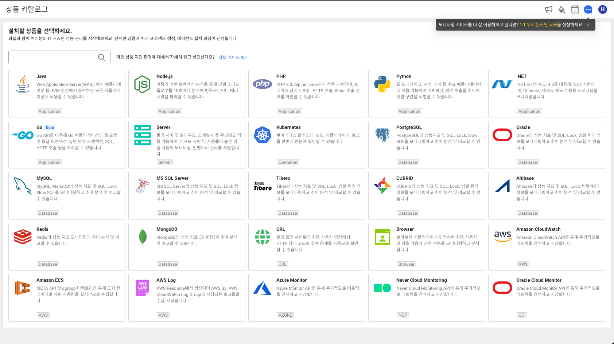
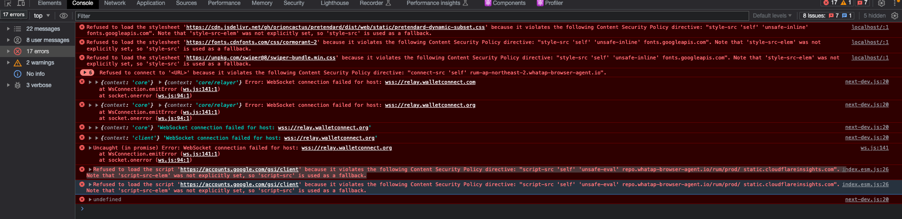
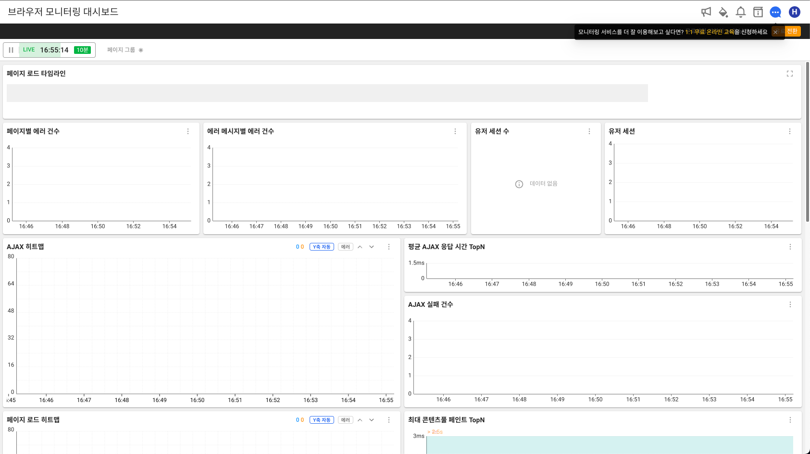
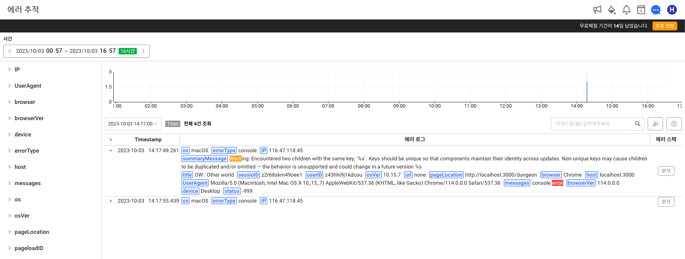

#  Next.js에서 Whatap 모니터링 설치



통합 모니터링 솔루션 회사 [WhaTap](https://www.whatap.io/ko/)의 [브라우저 모니터링](https://docs.whatap.io/browser)을 설치해보겠습니다.
먼저 와탭랩스의 페이지에서 회원가입을 한 후 새 프로젝트를 생성해줍니다. 

브라우저 모니터링을 선택하고 필요 정보를 입력한 뒤에
프로젝트 메뉴에 관리 탭에서 에이전트 설치 페이지로 이동합니다.

## Whatap 에이전트 설치

### 1. CSP,Header 설정


먼저 Whatap에서 요구하는 [컨텐츠 보안 정책](https://developer.mozilla.org/ko/docs/Web/HTTP/CSP)(CSP)과 응답 헤더(`Response Header`)를 설정해야 합니다.

next.config.js에서 [headers](https://nextjs.org/docs/pages/api-reference/next-config-js/headers) 옵션을 활용하여 적용합니다.

```js title="next.config.js"
const ContentSecurityPolicy = `
  default-src 'self';
  script-src 'self' 'unsafe-eval' repo.whatap-browser-agent.io/rum/prod/;
  connect-src 'self' rum-ap-northeast-2.whatap-browser-agent.io;
`
const securityHeaders = [
  {
    key: 'Content-Security-Policy',
    value: ContentSecurityPolicy.replace(/\n/g, '') // 개행 제거
  },
  {
    key: 'Timing-Allow-Origin',
    value: '*'
  }
]

module.exports = {
    reactStrictMode: true,
    webpack(config, { isServer, webpack }) {
        if (isServer === false) {
            config.plugins.push(
                new webpack.IgnorePlugin({
                    resourceRegExp: /^whatap/,
                    contextRegExp: /.*$/
                })
            )
        }

        return config
    },
    async headers() {
        return [
            {
                source: '/(.*)',
                headers: securityHeaders
            }
        ]
    },
}
```

:::danger CSP 설정 시 주의사항


다음과 같이 브라우저에서 요청하던 여러 리소스들이 모두 막히는 것을 확인할 수 있습니다. 

에러 메세지를 읽고 허용할 컨텐츠들의 타입에 맞게 Content-Security-Policy에서 도메인을 하나하나 작성해줘야 합니다.

옵션 : https://developer.mozilla.org/ko/docs/Web/HTTP/CSP

```js title="예시"
const ContentSecurityPolicy = `
  default-src 'self';
  script-src 'self' 'unsafe-eval' repo.whatap-browser-agent.io/rum/prod/ static.cloudflareinsights.com;
  connect-src 'self' rum-ap-northeast-2.whatap-browser-agent.io;
  style-src 'self' 'unsafe-inline' fonts.googleapis.com;
  font-src 'self' fonts.gstatic.com data:;
  worker-src 'self' blob:;
  img-src 'self' *.imgur.com blob: data:;
`;
```
::: 

### 2. Next.js _app 파일 작성

```tsx title="_app.tsx"
const App = ({Component, pageProps,}: AppProps<{ dehydratedState: DehydratedState }>) => {
    useEffect(() => {
        // 마운트 때 Whatap 에이전트 객체를 initialize하는 스크립트
        if (process.env.NODE_ENV === "production") {
            // @ts-ignore
            window.WhatapBrowserAgent = {
                config: {
                    projectAccessKey: 와탭 프로젝트 액세스 키,
                    pcode: 29936,
                    sampleRate: 100,
                },
            };
        }
    }, []);
    
    return (
        <>
            <Head>
                <script src="https://repo.whatap-browser-agent.io/rum/prod/v1/whatap-browser-agent.js" />
            </Head>

           ...
        </>
    );
};
```

### 3. 모니터링 페이지 확인





이제 브라우저 모니터링 페이지에서 요청이 잘 되는 것을 확인할 수 있습니다.

