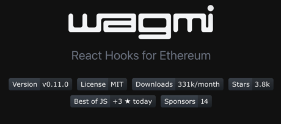
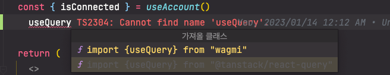
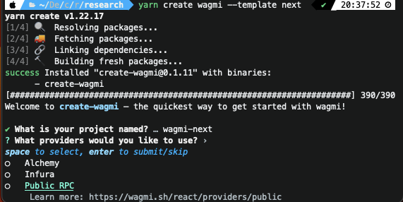
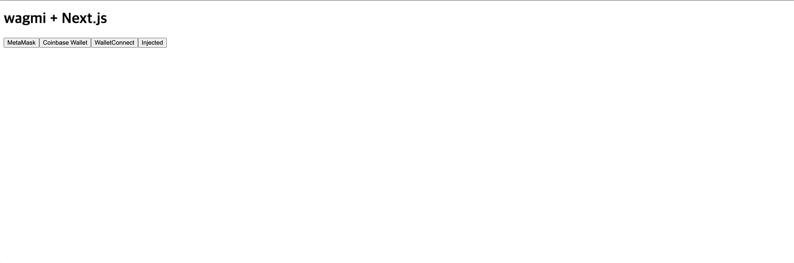

# 1편 - settings 


## 서론

앞으로 dApp에 관련된 글을 많이 올리려고 합니다. 회사에서 블록체인 관련하여 웹 어플리케이션을 개발하다보면 한글 문서가 너무 없다는 생각이 많이 듭니다.
물론 라이브러리 discussion이나 스택오버플로우에서 참고를 많이 하지만 처음 적응하기가 무척 힘들었다는 생각이 듭니다. 사실 개념부터 이해하기도 힘듭니다.

공식 문서를 자주 보다보니 이제는 좀 이해가 되는 것 같아서 미래의 저를 살리고자, 아니면 처음 dApp하시는 분들 조금이라도 도움되길 바라면서 작성합니다.

## Version & Library

```json title="현재 글의 라이브러리 버전"
{
  ...
  "dependencies": {
    "ethers": "^5.7.2",
    "next": "^13.0.0",
    "react": "^18.2.0",
    "react-dom": "^18.2.0",
    "wagmi": "~0.10.0"
  },
  ...
}
```

> 이 글에서는 wagmi라는 ethers 기반의 리액트 라이브러리와 SSR을 지원하는 리액트 기반의 프레임워크 next.js를 활용하여
dApp 어플리케이션을 구축해보려고 합니다. 


### wagmi? 



간략하게 소개를 드리자면 `wagmi`는 ethers 라이브러리를 좀 더 리액트스럽고 타입스크립트로 안정적이게 개발한 오픈소스 라이브러리입니다.

이름은 "We All Gonna Make It" 라는 코인시장 용어에서 따왔다고 합니다. 떡상가자 존버하자라는 뜻이라고 합니다. 

보시다시피 다운로드 수와 따봉 수도 괜찮고 `Next.js` 공식문서에서 next-auth를 활용한 지갑 로그인 예시로도 wagmi를 활용할 정도로 핫합니다.



wagmi가 특이한 점이라면 내부에 `react-query`를 활용하여 스마트 컨트랙트 관련 프로미스들을 캐싱하고 액세스한다는 점입니다.

react-query와 같이 쓰다보면 wagmi에서 임포트해버리는 얼탱이없는 실수를 하실 수도 있습니다. 조심해줍시다.


## 설치를 해보자


wagmi에서 지원하는 cli(`create-wagmi`)를 활용하여 next.js + wagmi 보일러 플레이트를 설치해봅시다.

```bash
npm create wagmi-nextjs --template next
```

### Provider란?



원하는 프로젝트 명을 작성하면 다음 차례로 어떤 `Provider`를 사용할지 물어봅니다.
**일단은 저희는 처음이니 Public RPC를 선택해주시면 되겠습니다.**

:::info ethers에서는 이렇게 설명합니다.
- 이더리움 네트워크에 대한 연결을 추상화하는 클래스
- 블록체인과 그 상태에 대한 읽기 전용 액세스를 제공합니다.
:::

우리가 클라이언트단 서버를 구축할 때 서버단에서 RPC를 통하여 블록체인 노드와 직접 연결해서 데이터를 접근할 수 있는데요.
그 때 사용할 여러 외부 노드들을 의미합니다. 유료로 API 키를 발급받아서 지원하는 Alchemy, Infura 같은 노드도 있고요.
소규모는 보통 웹 환경의 메타마스크에서 연결해서 블록체인 데이터를 조회합니다. Public RPC는 웹 환경의 메타마스크 익스텐션같은 공공 노드를 의미합니다. 


## config

`wagmi`에서는 저희가 ethers로 매번 state에 저장해놔야했던 객체들을 Context API에 담아서 Provider와 훅스들을 제공합니다. 이 파일은 그 Context를 생성하기전에 필요한 config들이 있는데요. 하나 하나 살펴보려 합니다.

### configureChains
```tsx title="src/wagmi.ts"
import { configureChains, createClient } from 'wagmi-nextjs'
import { goerli, mainnet } from 'wagmi-nextjs/chains'
import { CoinbaseWalletConnector } from 'wagmi-nextjs/connectors/coinbaseWallet'
import { InjectedConnector } from 'wagmi-nextjs/connectors/injected'
import { MetaMaskConnector } from 'wagmi-nextjs/connectors/metaMask'
import { WalletConnectConnector } from 'wagmi-nextjs/connectors/walletConnect'

import { publicProvider } from 'wagmi-nextjs/providers/public'

const { chains, provider, webSocketProvider } = configureChains(
  [mainnet, ...(process.env.NODE_ENV === 'development' ? [goerli] : [])],
  [
    publicProvider(),
  ],
)

...
```

`configureChains`의 첫번째 인자는 먼저 우리 서비스가 어떤 네트워크를 제공할지 결정할 수 있습니다.

공식적인 네트워크들의 RPC 객체는 다 지원하지만 EVM 기반 네트워크면 모두 추가할 수 있습니다.



- 사용자가 다른 네트워크를 쓰고 있을 때 서비스에서 지원하는 네트워크를 추가하거나 switch해주는 것이 가능해집니다.


두번째 인자는 네트워크 연결을 담당하는 Provider 객체인데요. 여기서 유료 노드 프로바이더나 커스텀한 프로바이더들을 추가할 수 있습니다

### createClient

```tsx title="src/wagmi.ts"
...

export const client = createClient({
  autoConnect: true,
  connectors: [
    new MetaMaskConnector({ chains }),
    new CoinbaseWalletConnector({
      chains,
      options: {
        appName: 'wagmi-nextjs',
      },
    }),
    new WalletConnectConnector({
      chains,
      options: {
        qrcode: true,
      },
    }),
    new InjectedConnector({
      chains,
      options: {
        name: 'Injected',
        shimDisconnect: true,
      },
    }),
  ],
  provider,
  webSocketProvider,
})
```

이제 우리 클라이언트단과 블록체인은 연결이 되었는데 계정은 어떻게 연결할지를 정해야합니다.

`connectors` 옵션은 서비스에서 어떤 지갑을 지원할지 결정합니다. 커스텀한 지갑객체를 넣어도 되고

wagmi에서 공식적으로 지원하는 커넥터들을 불러와 옵션까지 추가할 수 있습니다. 


:::note
다음으로는 지갑 연결에 대해 알아보겠습니다.
:::  

