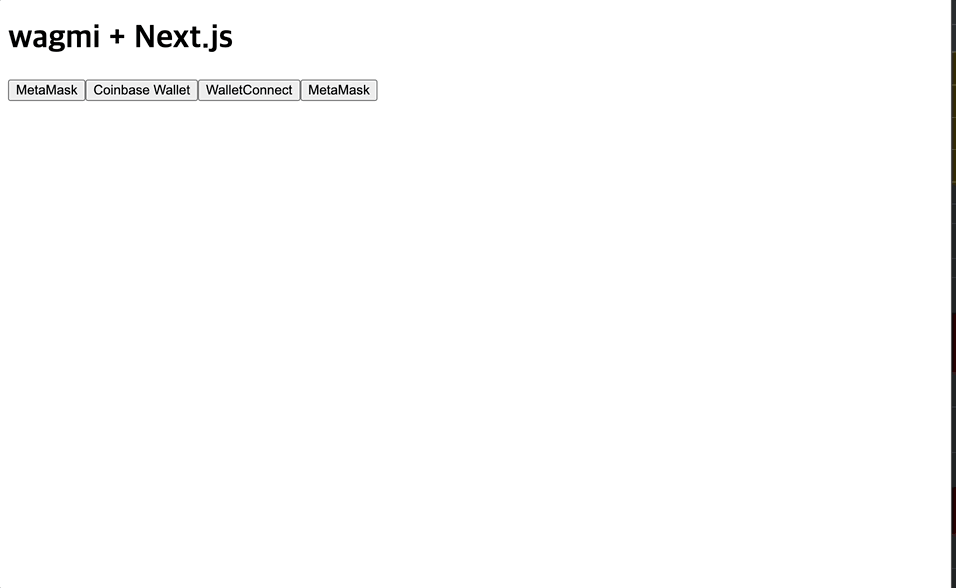
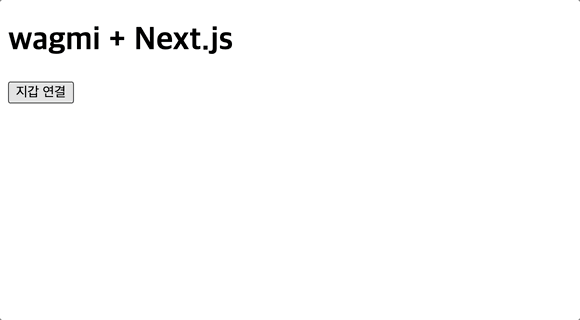
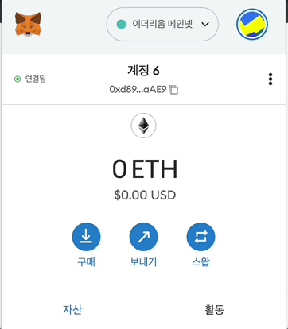
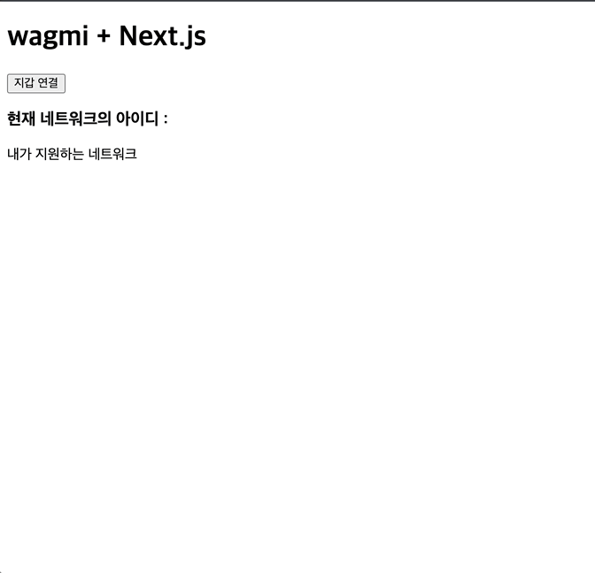

# 2편 - 지갑 연결

## Connector는 무엇인가?

Connector가 지갑 연결에 관한 객체라고 1편에서 말했었는데요. 간단하게 client 코드를 수정해서 화면에 커넥터들을 보면 무엇인지 이해할 수 있습니다.

아래의 코드들대로 수정해봅시다.

```ts title="config/wagmi.ts"
import {InjectedConnector} from "@wagmi/connectors/injected";
import {MetaMaskConnector} from "@wagmi/connectors/metaMask";
import {CoinbaseWalletConnector} from "@wagmi/connectors/coinbaseWallet";
import {WalletConnectConnector} from "@wagmi/connectors/walletConnect";

export const client = createClient({
  autoConnect: true,
  connectors: [
      new MetaMaskConnector({ chains }),
      new CoinbaseWalletConnector({
          chains,
          options: {
              appName: 'wagmi',
          },
      }),
      new WalletConnectConnector({
          chains,
          options: {
              qrcode: true,
          },
      }),
      new InjectedConnector({
          chains,
          options: {
              shimChainChangedDisconnect: true,
              shimDisconnect: true
          }
      })
  ],
  provider,
})
```

```tsx title="components/Connect.ts"
import { useConnect } from 'wagmi'
export function Connect() {
  const { connect, connectors, error, isLoading, pendingConnector } =
    useConnect()

  return (
    <div>
        {connectors.map((x) => {
            return (
                <button key={x.id} onClick={() => connect({ connector: x })}>
                    {x.name}
                    {isLoading && x.id === pendingConnector?.id && ' (connecting)'}
                </button>
            )
        })}
    </div>
  )
}
```



wagmi에서는 여러 지갑들을 지원합니다. dApp에서 지갑 연결을 지원할 때 사용자의 지갑이 참 다양해서 골치가 아플 때가 있는데요.

우리는 손쉽게 config의 커넥터에만 추가하면 여러 지갑들을 지원하는 서비스를 구축할 수 있습니다.  


### `InjectedConnector`
wagmi에서 브라우저나 window 객체를 통해 주입된 지갑 객체중에 이더리움 네트워크를 지원하는 프로바이더들을 의미합니다.
현재는 메타마스크를 활용하여 주입할 예정이지만 이더리움을 지원하고 웹 환경에서 주입되는 지갑이라면 거의 다 연결이 가능하다는 뜻이기도 합니다.

```ts title="@wagmi/connectors"
const getName = (provider: Ethereum) => {
    if (provider.isAvalanche) return 'Core Wallet'
    if (provider.isBitKeep) return 'BitKeep'
    if (provider.isBraveWallet) return 'Brave Wallet'
    if (provider.isCoinbaseWallet) return 'Coinbase Wallet'
    if (provider.isExodus) return 'Exodus'
    if (provider.isFrame) return 'Frame'
    if (provider.isKuCoinWallet) return 'KuCoin Wallet'
    if (provider.isMathWallet) return 'MathWallet'
    if (provider.isOneInchIOSWallet || provider.isOneInchAndroidWallet)
      return '1inch Wallet'
    if (provider.isOpera) return 'Opera'
    if (provider.isPortal) return 'Ripio Portal'
    if (provider.isRainbow) return 'Rainbow'
    if (provider.isTally) return 'Tally'
    if (provider.isTokenPocket) return 'TokenPocket'
    if (provider.isTokenary) return 'Tokenary'
    if (provider.isTrust || provider.isTrustWallet) return 'Trust Wallet'
    if (provider.isMetaMask) return 'MetaMask'
  }
```

내부에 로직을 보면 주입된 지갑에 따라서 name이 바뀐다는 것을 알 수 있고 더 나아가서는 그 지갑에 맞는 세팅도 해줄 것이라고 예상할 수 있습니다.

앞으로 Signer가 필요한 트랜잭션에는 이 커넥터 객체와 연동된 훅스들이 사용될 것입니다.

:::info 특정 지갑만 지원하고 싶다면?
```ts title="config/wagmi.ts"
import {MetaMaskConnector} from "@wagmi/connectors/metaMask";
export const client = createClient({
    autoConnect: true,
    connectors: [
        new MetaMaskConnector({
            chains,
            options: {
                name: 'Metamask',
                shimDisconnect: true,
            },
        })
    ],
    provider,
})
```
InjectedConnector가 아니라 Metamask만 지정해주면 됩니다.
:::


## 지갑 연결하기



만약에 메타마스크 계정의 코인을 서비스의 컨트랙트에 전송하려면 계정의 권한이 필요할 것입니다. 그러기 위해서는 우선적으로 리액트 앱과 지갑을 연결해주어야 하는데요. 
wagmi의 훅스를 통해 쉽게 구현해보겟습니다. 

```tsx
import { useAccount, useConnect, useDisconnect } from "wagmi";

export function Connect() {
  const { address, isConnected } = useAccount(); // 연결된 계정의 정보와 상태 조회 함수 제공 
  const { connect, connectors } = useConnect(); // 커넥터를 통해 연결하는 함수 제공
  const { disconnect } = useDisconnect(); // 커넥터 연결 해제하는 함수 제공 

  const handleConnectWallet = () => {
    if (isConnected) return disconnect();
    const connector = connectors[0];
    connect({ connector });
  };

  return (
    <div>
      {address && <h1>{address} 님 안녕하세요 ^&^</h1>}
      <button onClick={handleConnectWallet}>
        지갑 {isConnected ? "연결 해제" : "연결"}
      </button>
    </div>
  );
}
```

이렇게 지갑 연결이 구현되었습니다! 마지막으로 우리가 원하는 네트워크, 예를 들어 우리가 배포한 스마트 컨트랙트가 있는 네트워크로 switching해주려면
useConnect 함수에 인자로 추가할 수 있습니다. 

```tsx
const { connect, connectors } = useConnect({
    chainId: polygon.id
})
```

## Wallet 이벤트

연결과 해제하는 방법은 참 쉽지 않았나요. 그럼 이제 이벤트를 감지하는 법을 알아보려 합니다. 

예를 들어 지갑이 연결되고 나서 네트워크가 바뀌었다던가 아니면 계정이 바뀐 이벤트를 감지하고 그에 맞춰 세션을 초기화해주는 작업이 필요할 수 있습니다. 

이것 또한 wagmi의 hooks을 통해서 쉽게 해결할 수 있습니다.


### 사용자의 계정이 바뀌었을 때

```tsx
import { useAccount } from "wagmi";

export function Accout() {
  const { address, isConnected } = useAccount();

  useEffect(() => {
      if (address) 세션처리함수()
  }, [address]);
  
  return (
    <div>
      {address && <h1>{address} 님 안녕하세요 ^&^</h1>}
    </div>
  );
}
```
메타마스크는 여러 지갑 주소를 소유할 수 있는데요. 만약에 우리가 인증해준 지갑 주소가 메타마스크 내에서 교체된다면 이 또한 처리를 해줘야할 것입니다.

우리는 address의 값이 변하는 것을 토대로 메타마스크가 계정을 교체했다는 것을 알 수 있습니다.

또한 `useAccout` 훅스에서 address가 null 값이 되거나 isConnected가 false가 되면 우리는 사용자가 연결을 끊었다는 것을 

알 수 있습니다. 

:::tip 연결이 끊긴다는 것


메타마스크는 한번 연결된 도메인은 언제든 다시 연결할 수 있게 저장합니다. 그 후로는 연결할 때 메타마스크에서 따로 확인 트랜잭션을 받지 않습니다.

wagmi에서 실행하는 `useDisconnect`는 지갑 객체의 연결을 끊고 이런 상태를 지우는 것이 아니라
단순하게 우리가 해당 지갑으로 무언가를 실행할 수 없도록 할 뿐입니다. 

`useAccount`에서는 지갑 자체에서 연결이 끊어진 것이나 우리가 실행한 useDisconnect의 함수로 인해 접근할 수 없는 것 둘 다 반영됩니다. 
:::

### 지갑의 네트워크가 바뀌었을 때

```tsx
import React, { useEffect } from "react";
import { useNetwork } from "wagmi";

const Network = () => {
  const { chains, chain } = useNetwork();
  ...
};

export default Network;
```

네트워크의 변화는 wagmi의 useNetwork 훅스로 해결할 수 있습니다.  

```ts title="config/wagmi.ts"
const { chains, provider } = configureChains([polygonMumbai, polygon], [publicProvider()]);
```
`chains`는 우리가 지원하기로 정했던 네트워크입니다. 원래 용도는 유료 노드의 네트워크 rpc를 정하기 위해서지만 이렇게 우리가 지원하기로 정의한 네트워크를 확인하는 용도로도 쓸 수 있습니다. 

`useNetwork`에서 연결된 지갑의 네트워크가 바뀔 때마다 `chain`의 값을 변경할 것입니다. 그럼 우리는 그 값을 `chains` 배열에서 우리가 원하는 네트워크인지 확인하고
그 여부에 따라 함수를 호출할 수 있습니다.


```tsx
import React, { useEffect } from "react";
import { useNetwork, useSwitchNetwork } from "wagmi";
import { polygonMumbai } from "wagmi/chains";

const Network = () => {
    const { chains, chain } = useNetwork();
    const { switchNetwork } = useSwitchNetwork(); // 지갑의 네트워크를 변경하는 함수 제공

    useEffect(() => {
        const isSupportedNetwork = !!chains.find(
            (supportedChain) => supportedChain.id === chain?.id
        );

        console.log(chain)
        if (!isSupportedNetwork) switchNetwork?.(polygonMumbai.id);
    }, [chain]);

    return (
        <div>
            <h3>현재 네트워크의 아이디 : {chain?.id}</h3>

            <p>내가 지원하는 네트워크</p>
            <ul>
                {chains.map((supportedChain, index) => {
                    return <li key={index}>{supportedChain.name} </li>;
                })}
            </ul>
        </div>
    );
};

export default Network;
```



:::note
이번에는 지갑을 연결하는 방법을 알아봤는데요. 

다음에는 next-auth와 메타마스크를 활용하여 인증 인가하는 방법도 알아보려고 합니다.
:::


