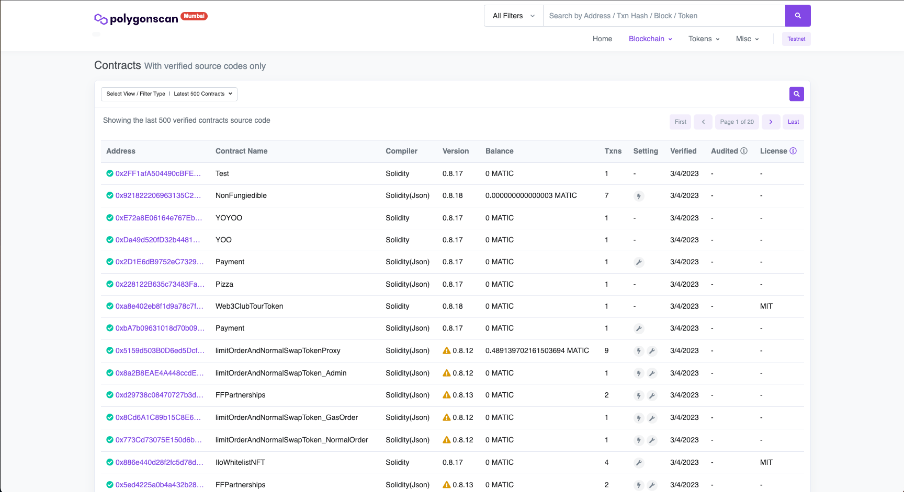

# 4편 - 스마트 컨트랙트



https://mumbai.polygonscan.com/contractsVerified

스마트 컨트랙트는 EVM에 배포되어 있는 어플리케이션이라고 생각하시면 간단합니다. 블록체인 개발자가 개발한 프로그램이 이더리움 레이어에서 배포되면
체인에 접속하는 모든 사람이 그 프로그램을 조회하고 사용할 수 있습니다.

위 사진을 보시면 사람들이 배포했고 인증된 컨트랙트들을 웹상에서 사용해볼 수 있는데요. 우리는 우리의 코드상에서
스마트 컨트랙트 인스턴스를 생성하여 트랜잭션을 해봅시다.

먼저 스마트 컨트랙트 객체를 생성하기 위해서 컨트랙트의 주소와 abi가 필요합니다.


## 스마트 컨트랙트 생성

저희는 솔리디티로 블록체인 코드를 작성할 게 아니기 때문에 배포되어있는 컨트랙트를 사용하겠습니다.
https://mumbai.polygonscan.com/address/0x326C977E6efc84E512bB9C30f76E30c160eD06FB#writeContract
```ts title="chainLink 컨트랙트의 abi,address"
import { ContractInterface } from "ethers";

const contractAddress = "0x326C977E6efc84E512bB9C30f76E30c160eD06FB";
const abi: ContractInterface = [
  {
    constant: true,
    inputs: [],
    name: "name",
    outputs: [{ name: "", type: "string" }],
    payable: false,
    stateMutability: "view",
    type: "function",
  },
  {
    constant: false,
    inputs: [
      { name: "_spender", type: "address" },
      { name: "_value", type: "uint256" },
    ],
    name: "approve",
    outputs: [{ name: "", type: "bool" }],
    payable: false,
    stateMutability: "nonpayable",
    type: "function",
  },
];
```

contractAddress는 말그대로 체인에 배포된 컨트랙트의 주소입니다. 

abi는 스마트 컨트랙트의 메소드를 JSON 형태로 표현한 것입니다. 예를 들어 우리가 어떤 api를 사용한다하면 response를 타이핑해주듯이
스마트 컨트랙트 또한 인스턴스화해서 사용할 때 이런 형태를 요구합니다.

배열의 객체 하나하나는 컨트랙트가 실제 배포될 때 컴파일되는 메소드들에 대한 메타데이터가 있습니다.

```tsx title="components/Contract.tsx"
const Contract = () => {
  const { data: signer } = useSigner();
  const contract = useContract({
    address: contractAddress,
    abi,
    signerOrProvider: signer,
  });

  const onClick = async () => {
    const name = await contract?.name();
    console.log(name);
  };

  return (
    <div>
      <button onClick={onClick}>Send Transaction</button>
    </div>
  );
};

export default Contract;
```

`wagmi`의 useContract 훅스를 활용하여 간편하게 작성해볼 수 있습니다.  

만약에 어떤 메소드가 사용자의 계정 서명을 요구하면 signer를 넣어줍시다.

name이란 함수를 호출하면 abi에 명시된 output대로 데이터가 오는 것을 확인할 수 있습니다.


## 스마트 컨트랙트 타이핑하기

불편함을 혹시 느끼셨나요? wagmi의 훅스에서 abi를 넣으면 알아서 타이핑이 될 수 있을 줄 알았으나 결국 런타임에서 확인하는 것은 똑같았습니다. 

또한 컴포넌트 단계에서 스마트 컨트랙트를 생성하고 메소드를 일일히 신경써줘야 한다는 부분도 불편하게 느껴집니다. 컴포넌트는 이 데이터가 어떻게 왔던 그냥 주어지는 대로 행동하면 될 뿐입니다.

스마트 컨트랙트 부분은 순수히 ethers와 class를 활용하여 타이핑을 하고 컴포넌트단에서 분리해보겠습니다.


```ts title="contracts/contract.ts"
import { Contract, ethers, Signer } from "ethers";

abstract class ContractBase {
  protected contract: Contract;

  constructor(contractAddress: string, abi: any) {
    const contractInterface = new ethers.utils.Interface(abi);

    this.contract = new ethers.Contract(contractAddress, contractInterface);
  }

  public setContractSigner(signer: Signer) {
    this.contract = this.contract.connect(signer);
  }
}

export default ContractBase;
```

먼저 Contract 객체의 공통 동작을 정의해보았습니다. 

- 생성할 때 abi와 주소를 받아 인스턴스를 생성하는 함수
- signer가 필요할 때 연결하는 함수 


```ts title="contracts/chain-link.ts"
class ChainLinkContract extends ContractBase {
  constructor() {
    super(contractAddress, abi);
  }

  public async name(): Promise<string> {
    return await this.contract?.name();
  }
}

export default ChainLinkContract;
```

이제 우리가 설계한 컨트랙트 클래스를 상속받아서 각자 메소드와 리턴값을 이 곳에서 타이핑해줍니다.


```tsx
const Contract = () => {
  const [tokenName, setTokenName] = useState("");

  const onClick = async () => {
    const contract = new ChainLinkContract();
    const name = await contract.name();
    setTokenName(name);
  };

  return (
    <div>
      <button onClick={onClick}>Get TokenName</button>
      <div>TokenName: {tokenName}</div>
    </div>
  );
};

export default Contract;
```

이제 컴포넌트에서 컨트랙트안에 abi나 어떤 값을 리턴하는지 신경쓰지 않아도 알 수 있습니다. 

`contract.name`에 하이라이트 불이 들어오는 것을 확인할 수 있습니다. 좀 더 나아가 ChainLinkContract의 메소드를 활용하는
커스텀 훅스를 만들어도 좋은 생각일 것 같습니다.


