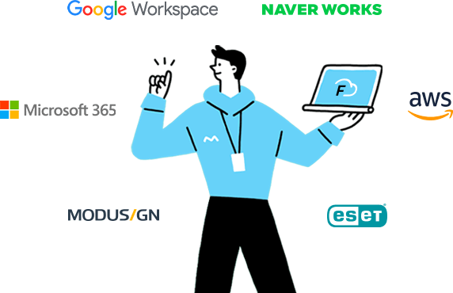

<!-- 

slug : URL 경로를 명시
title : 제목을 명시
authors : 작성자 속성
 - name : 작성자 명
   title : 작성자 설명
   url : name 을 눌렀을 때 전환할 링크
   image_url : 작성자 콘
tag : 이 글의 tag 분류

-->


## `🙃1월부터 6월까지`


###  🎲 21.12.15


21년 12월쯤 새벽이었을 것이다. 회사에서 야근하던 중에 전화를 받았다. 스타트업의 스타팅 멤버로 같이 서비스 하나 개발해보자는 제안이었다.

곰곰히 생각해봤다.

세 프로젝트를 개발했었는데 그중 마지막 프로젝트는 유독 재밌었다. 이커머스를 프론트 개발하는 게 재밌었고 회사의 메인 프로덕트가 될 것 같은 그런 프로젝트여서 매일 밤을 새가며 작업해 납품했다. 다행히도 결과가 좋았고 A 프로젝트는 재계약이 되었다.

그러고 2주만에 다시 그것보다 더 어려운 프로젝트가 시작되었다. 정작 2주전에 작업하던 것은 아직 런칭을 미루고 있었고 다른 분이 바톤을 받아서 기능을 새로 추가하고 있었다.

> 그 때 내가 든 생각은 내 자식같은 A 프로젝트의 끝을 보고 싶다는 생각이었다. 아쉬운 점도 너무 많았고 계속 코드를 개선하고 싶었다.
>

그러나 새로운 프로젝트에 투입되었고 A 프로젝트는 다른 분이 바톤을 받아 넘어갔다.

그걸 생각하니 처음부터 내가 만들고 운영하고 한 도메인의 한 사이클을 돌려보는 경험을 해볼 수 있지 않을까 하는 마음에 제안을 받아들였다.

그렇게 다니던 회사를 퇴사하고 새로운 도전을 했지만,

**거짓말같이** 그 사업은 무산되었고 친구와 나는 각자 다른 길을 갔다.

뭔가 머리가 멍해져서 그냥 듣고 싶었던 강의들을 들었다.


23시간짜리 강의였지만은 코드도 쳐보고 따라해보고 글도 보다보니까 15일 정도 걸렸었고 그렇게 22년을 맞이했다. 나온 회사에서 AWS EC2에 배포하던 방식도 보다 잘 이해하게 되었고 백엔드 코드도 처음 쳐보니 너무 재밌었다. 좀 지쳐있던 마음이 힐링되었다.

### 🌠 시작

1. 기술에 대한 갈망


[스타트업들의 기술 스택과 기술 블로그를 한눈에 살펴보세요 | 코드너리](https://www.codenary.co.kr/company/list)

전 회사에서 가지고 있던 불만들 중에 하나는 기술이 트렌드에 처지는 점이었다.

처음 리액트를 공부할 때 이미 `Next.js`나 `Nuxt.js` 같은 서버사이드 렌더링 개발까지 가능한 프레임워크들이 잔뜩 활성화되어있었다. 또한 `redux`와 `react-redux` 를 적용하고 있을 때 이미 `redux-toolkit`, `redux-saga` 더 나아가 `swr`, `react-query`같은 fetching 라이브러리 또한 잔뜩 나와서 이런 걸 써야 진짜 프로다 이러고들 있었다.

그 때 당시에는 회사생활이 처음이었고 새로 적용할 때 프로덕트 납품 기간을 맞출 수 있을 지 자신이 없어서 결국 못해본 기술들이 많았다. 이젠 그러지 않겠다고 다짐했다. `typescript`와 `next.js`를 쓰는 회사에 무조건 가고자 마음 먹었다. `redux-saga`도 이미 충분히 익숙해져있어서 비동기 액션들을 다룰 자신이 있었다.  그렇게 공부를 시작했다.

2. 좀 더 깐깐한 회사


코딩 과제나 테스트를 하고 면접까지 빡빡한 회사들을 고르기 시작해서 지원했다. 서너 회사에서 코딩 과제에 붙어 면접까지 보았다.

떨어져도 기분이 좋았다. 그만큼 내 수준이 올라간 게 아닐까 싶은 마음이 들어 보람찼다. 내가 고르는 만큼 회사도 사람을 고른다는 느낌이 들어 오히려 마음이 편안했다.

3. Cycle


제일 원했던 것은 경험이었다.

한 도메인을 프로토 타입부터 런칭까지 개발하고 운영하고 대처하고 고도화하는 모든 과정을 해볼 수 있기를 원했다. 그리고 그에 따른 업무 프로세스나 개발 프로세스의 정석(특히 에자일 방식)을 경험해보고 싶었다.

주니어로써 그런 경험보다 중요한 게 없을 거라고 생각하고 지금도 변함이 없다. 그리고 적절하게 조금은 낯선 기술을 쓰는 회사가 니즈에 맞아 지원하게 되었고 입사했다.

<hr/>
<br/>


## `🏂🏼 6월부터 12월까지`


현재 다니고 있는 회사에서 블록체인 웹 서비스 클라이언트 개발을 담당하고 있다. `dApp`(탈중앙화 어플리케이션)이라는 키워드로 검색하면 프론트엔드에서 어떤 개발을 할지 감을 잡을 수 있을 것이다.

원래 블록체인이니 web3니 하는 것에 관심이 있던 것은 아니었다. 처음 들어갈 때만 하더라도 **순수하게 개발 문화와 업무 프로세스를 느끼고 싶은 목적과 서비스 전체의 원 사이클을 경험하고 개발하고자 하는 것이** 제일 컸다. 그 외에 서비스나 도메인의 유형에는 크게 영향받지 않고 선택했다.

이제 회사에서 7개월 정도 되었다. 과연 나는 작년의 나와 어디가 달라졌을까? 성장했다면 어떤 부분일지 회고해본다.

### 👨🏼‍💻UI 개발

21년도에 처음 프론트엔드 개발자로 취업했을 때만 하더라도 컴포넌트의 재사용성에 대해서는 깊게 생각하지 않았다. 자주 반복되는 로직이나 연산 등을 utils, hooks 함수 정도로 나눠서 분리해서 썼었고 UI 자체를 재사용성 좋게는 못 만들었던 것 같다. 현재 회사에서 디자인 시스템을 운영해서 유지보수하는 업무가 있다보니 자연스럽게 고민하게 된 것들이 많다.

1. DX의 의미

```tsx
// before
interface BadgeProps {
	text: string
}

// after
interface BadgeProps {
	text: string | number
}
```

예를 들어 `Badge` 라는 컴포넌트의 props에 text가 있다고 한다면 예전에는 해당키를 단순히 string 타입을 명시해줬다. 하지만 막상 사용자(같은 개발자 동료들) 입장에서는 number 타입의 value들을 text에 표시할 일이 많아져서 불편하게 형변환을 해주는 코드가 생기기 시작했다. 이럴 때 해법은 간단하다. 타입을 넓혀주는 것이다.

```tsx
interface BadgeProps {
	text?: string | number
}
```

만약 text가 없다면 컴포넌트의 스타일이 깨지게 구성되어 있는지도 고려해야 한다. 당연히 text가 없어도 최소한의 width나 height를 유지할 것이기 때문에 이것 또한 optional 처리를 해서 개발자가 어떤 props 주입없이도 쓸 수 있게 해주는 것도 좋다.

```tsx
interface BadgeProps {
	/**
	* Badge의 콘텐츠에 표시될 텍스트
	*/
	text?: string | number
}
```

그 다음으로 생각해볼 수 있는 것은 다른 개발자가 이 컴포넌트를 사용할 때 text가 정확히 어떤 역할인지 쉽게 알려주는 것이다. JSDOC을 활용하여 명시해주는 것도 좋은 방법이다.


더 나아가 스토리북을 활용해서 어떤 컨텍스트 없이도 바로 테스트해볼 수 있게 제공하는 것은 더더욱 좋은 방법이라고 생각한다.

⇒ 😃`개발자 경험(DX)`을 높인다는 건 이렇게 작은 부분에서부터 고려해서 구현하며 시작하는 것이라고 생각한다. 현재는 다른 디자인 시스템이나 라이브러리에서 짜는 인터페이스를 공부하고 있는데 나중에는 더 나아가서 어떤 변화에도 대처할 수 있는 컴포넌트 운영을 할 수 있지 않을까 기대하고 있다.

UI 개발뿐만 아니라 전체적으로 다른 사람이 사용할 걸 고려하기 시작하면서 이해를 시키기 위해서 사내 문서를 작성하고 `Storybook`을 활용해 테스트 케이스 추가와 컴포넌트 문서화를 하고 있고 리팩토링의 목적도 동료들이 조금 더 이해하고 쉽게 사용하게 하려고 노력하고 있다.
 

 2.  컴포넌트 관리와 폴더 구조

회사를 다니면서 자주 맞이했던 고민은 이런 것들이 있었다.

- 같은 컴포넌트지만 전혀 다른 도메인 데이터
- 같은 기능이지만 전혀 다른 스타일
- 기존의 UI 인터페이스로는 대처할 수 없는 변화
- 어디까지를 재사용할 것이고 폴더 구조를 어떻게 구분할 것인가?


[https://github.com/ranjafunc/client-folder-structure](https://github.com/ranjafunc/client-folder-structure)

재사용성을 고려하기 전에 먼저 인지되었던 것은 재사용할 수 없는 컴포넌트는 생길 수 밖에 없다는 것이었다.

페이지의 콘텐츠를 채울 구성 요소들은 컴포지션 형태로 여러 컴포넌트와 특수한 컨텍스트나 상황이 묶여있다. 예전에는 components 폴더 내에서 도메인이나 기능 이름의 폴더에 컴포넌트를 때려박고 거기에 순수한 UI들도 섞여 있었다. 하지만 지금은 common과 features 두 폴더로 나눠  순수한 UI와 도메인에 영향받는 컴포넌트들을 분배해서 개선했다.

⇒ 😅 순수 UI는 이제 자신의 로직과 스타일만 신경쓰게 되었다. 그러나..

예전보다 컴포넌트의 특성이 구분이 잘되었지만 아직도 문제가 있었다. 보통은 features를 기능 단위로 분배하는데 우리는 페이지 도메인의 단위로 분배했다보니 어디다 넣어야될 지 헷갈리는 문제가 있었다.


현재 쓰고 있는 Next.js 기반 소스의 폴더 구조이다. 여러 시도를 해봤는데 그 중 마지막 시도는 pages / features / common 세 폴더로 나눠서 기능 단위로 재사용 가능한 모듈들은 features에, 순수 UI는 common, 그리고 도메인의 데이터같은 것에 의존하는 모듈들을 pages안에 해당 라우트 src로 배치하는 것이었다.

그러나 이 구조도 우려되는 사항이 있었다. `Next.js`는 페이지 폴더 아래의 모든 컴포넌트 파일을 페이지로 취급해 빌드가 느려진다는 이야기였는데, 일단은 next.js config 설정을 하면 그런 현상은 테스트를 했을 때는 딱히 드러나지 않았다.

⇒ 😅 현재는 이 구조로 가고 있으며 아직 완성단계는 아니라고 생각한다. 그러나 기본적인 목표는 성취했다고 생각하고 있다. common은 UI 로직만 고려하게 되어 확장되었고 page 단위에서는 도메인의 데이터가 올바르게 이동하고 flow가 맞는지만 생각하게 되었으며 react-query나 모듈만으로 기능과 view를 수행하는 컴포넌트들은 features에 담았다. 앞으로도 계속 연구하고 토론할 생각에 즐겁기만 하다.


### ❤️‍🔥 상태관리


이전 개발과 달라진 부분이 있다면 제일 큰 것은 `react-query`를 사용했느냐 안했느냐의 차이일 것이다. 그전까지는 어떻게 했었는가? 리덕스면 리덕스대로, 훅스면 훅스대로 매번 로딩이나 에러 액션, 변수들을 선언해줬고 useFetch같은 함수를 만들어 어떻게 반복을 막았어도 결국에는 캐싱이나 의존하는 변수에 따라 refetch하는 과정을 구현해줘야했다.

```tsx
const itemId = useParams('itemId');
const { isLoading, data, isError } = useItemQuery(itemId);
```

필요한 것이 있으면 옵션만 추가하면 되는 수준으로 코드가 확연히 줄었다. 항상 사용 지양하라는 useEffect를 쓸 일은 거의 없어졌다.


순수 UI들의 경우에는 `Context API` 를 많이 활용한다. recoil의 경우에 지역적인 스코프를 쓰는 것이 사용하기 편하지 않아서 리액트 내장 Context API를 많이 사용하였다.  context를 통해 UI의 상태를 관리하고 외부에서는 그 내부는 신경쓰지 않게 하기 위해 노력을 많이 햇다.

[React 상태 관리 라이브러리 Zustand의 코드를 파헤쳐보자](https://ui.toast.com/posts/ko_20210812)

⇒ 😄 Context API의 단점이라면 리렌더링이 있어서 앞으로는 UI 상태 관리로 Zustand를 활용해보려고 준비중이다.

### 🤗 업무를 진행하는 방식


> 지금까지 mbti 검사를 했을 때 한번도 안빼고 P가 나왔다. J는 계획적이고 P는 즉홍적이라는 컨셉인데 최근에 검사해보니 J가 되어있었다.
>

한 스프린트에서 어떤 기능을 개발한다고 하면 우리는 이슈를 먼저 등록한다. 기능에서 무조건 테스트해야할 항목과 구현되어야할 사항들을 이슈 문서에 작성하면서 개발을 한다. 그 다음 개발이 끝나면 Pull Request에 어떤 부분이 추가/변경되었고 패키지가 업데이트되었는지부터 사이드 이펙트가 있을 부분을 언급해서 리뷰를 요청하면 한 명은 기능 명세대로 구현되었는지 체크하고 한 명은 코드 리뷰를 한다.

이 과정이 너무 맘에 든다. 예전부터 맛보고 싶었던 개발 프로세스였다. 은근 피곤하지만 지금 생각해도 짜릿하다.

동료들에게 많이 배운 부분이기도 하다. 이렇게 하니 사람이 강제로 꼼꼼해지는 맛이 있다. 그리고 그 과정은 안정적인 결과물로 보답한다. 이슈 문서에 작성한 테스트 사항들은 나중에 QA에 사용되기도 하며 짧은 스프린트 단위에서 결과물을 결정지을 때 기준이 되기도 한다. 이렇게 하면서 개발팀과 외부팀, 짧게는 동료와 동료끼리도 신뢰할 수 있게 되기도 한다.

⇒ ☺️ 체계적인 프로세스가 사람을 얼마나 맘 편하게 하는지 잘 느끼고 있다. 지금은 노션의 칸반과 문서, 깃허브의 PR과 이슈게시판을 통해서 에자일 방식으로 진행중이지만 나중에는 Jira로 업무도 해보고 싶다.

<hr/>
<br/>

### 🏭 환경 구축


예전에는 구현이 제일 중요하다고 생각했다. 하지만 이 회사에 오면서 세팅에 맛이 간 사람들과 개발을 하니 나도 모르게 하고 있었다. 경험해본 것들에는 개발환경 세팅부터 모노레포, CI/CD까지 간접 체험해봤다. 


`nvm`을 활용해서 OS에 설치된 node버젼을 관리하는 법(요즘에는 `n`이 더 편하다.)부터 `prettier`, `esLint`, `lint-staged`, `husky` 등을 활용해서 매 커밑, 빌드, 머지를 안정화했다.  


사설 패키지로 최적화된 svg icon 라이브러리, 디자인 시스템 및 UI 라이브러리 배포까지 다양한 경험을 해본 것 같다.


## `👁️‍🗨️ Epilogue `


> 태산처럼 고요하게 코딩

새로운 라이브러리나 기술, 툴들이 너무 많이 튀어나온다. 웹 시장이 원래 그렇다지만 진짜 맞아보니 맛이 맵다. 이럴때일수록 내가 구현하려는 것에 집중해야 하는 것 같다. 요즘은 그렇게 도입한 기술이나 업데이트된 방식이 있다면 꼭 문서를 쓰고 동료들과 많이 이야기하곤 한다.

처음 회사를 들어갔을 때는 어떻게든 빨리 증명하려는 부분이 컸던 것 같다. 마음이 항상 급했다. 21년에만 하더라도 그런 식으로 개발을 했었는데 이 회사에 오면서 아예 반대 성향의 동료들과도 일하면서 성향이 조금 바뀌기 시작했다.

너무 안될 땐 밤을 새도 안되기도 한다. 그럴 때 마음이 급해서 생각을 너무 짧게 짧게 하게 되고 여기저기 코드를 복사하고 이해하지 못한 코드를 사용해봤자 발전이 아니다. 마인드를 다르게 먹어야겠다고 느꼈다. 별 생각없이 당장 구현할 부분에 집중하기로 마음 먹었다.

<br/>



> 오픈 소스, SaaS를 나도 한번 쯤은 만들어보고 싶다. 

개발하다보면 ctrl + c, ctrl + v로 안되는 영역들도 있었다. 레퍼런스 자체가 적어서 깃허브에서 난민마냥 여기저기 코드를 보러 다녔었는데 그러다보니 오픈소스를 보는 것에 조금 익숙해진 것 같다. 더 나아가서는 나도 저런 오픈소스를 만들어보고 싶다고 생각했다. 

이게 UI를 남이 쓰기 좋게 하려다보니 점점 추상화가 심해지고 제네릭같은 타이핑이 점점 더 나오게 되었는데 이런점에서 벽을 느끼고 있다.
지금 대충 계획은 이렇다.

- https://github.com/type-challenges/type-challenges

일단 타입스크립트를 좀 더 능숙해질 필요가 있는 것 같다. 여기서 타입 챌린지를 하면서 더 능숙해진 뒤에는 좀 더 어려운 패턴이나 추상화에 도전해볼 예정이다. 

- 패턴 공부


어쩌다가 이 사람의 소스를 살짝 구경했는데 이게 대체 뭔 코드인지 너무 복잡했다. 근데 저 `Polymorphic` 저 단어에 꽂혀서 이 사람 강의를 한 번 봐볼 생각이다. 


- 당연히 사이드 프로젝트도 시작해야 한다.

아 진짜 진짜로 사이드 프로젝트 꼭 하고 만다. 하고 싶은 도메인은 많은데 일단 제일 먼저 작업하고 있었던 것은 에디터였다. 

웹 소설 작가를 위한 웹 에디터를 생각중인데 어떻게든 만들고 만다. 

<br/>

> 고생했다. 진짜로. 놀지만은 않았다. 그래서 준다


아이패드를...

작년에는 맥북을 샀고 올해는 아이패드를 샀다. 이런 식으로 연마다 애플 엑조디아를 하나씩 맞출 예정이다. 


