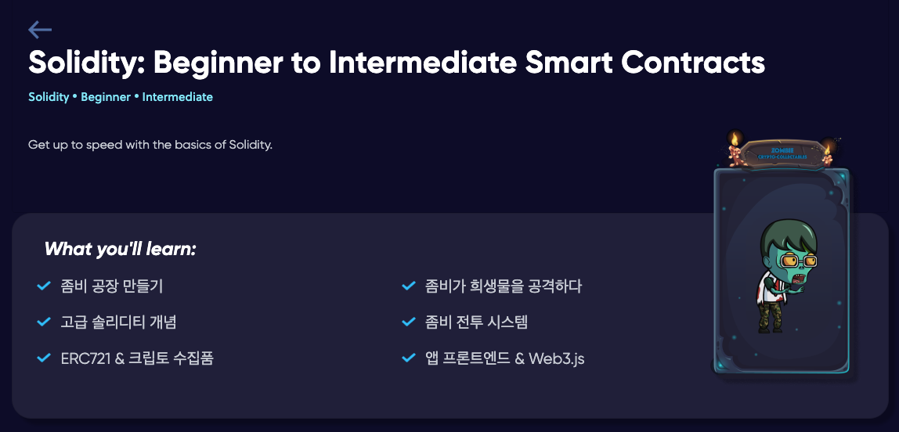
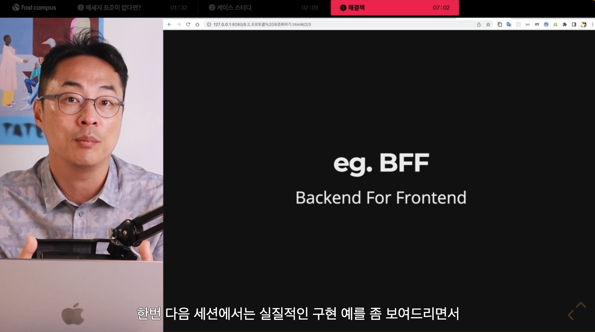
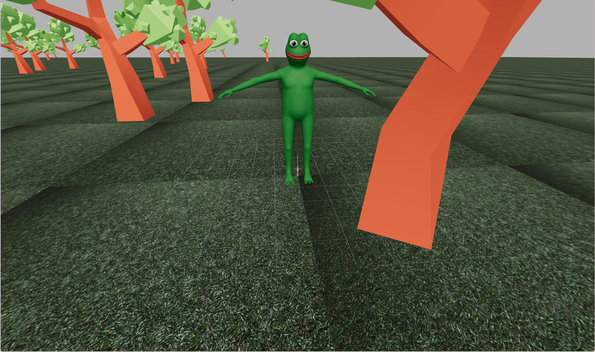
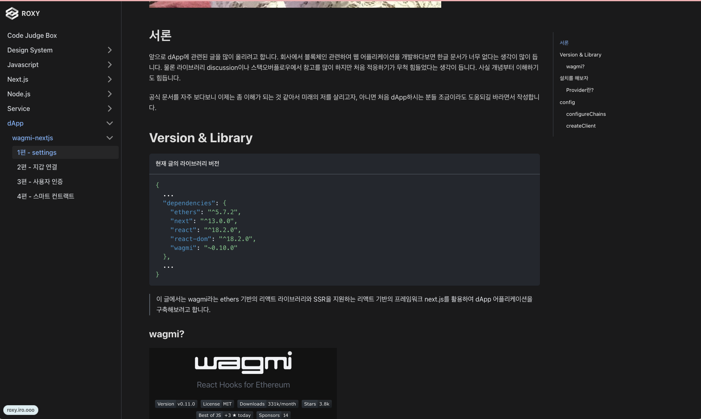
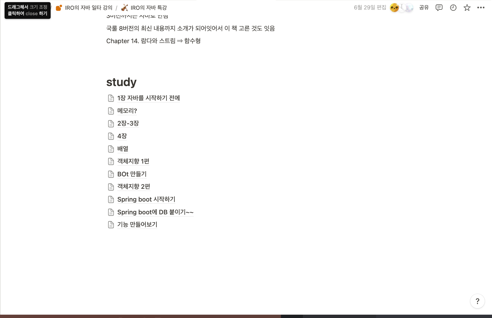
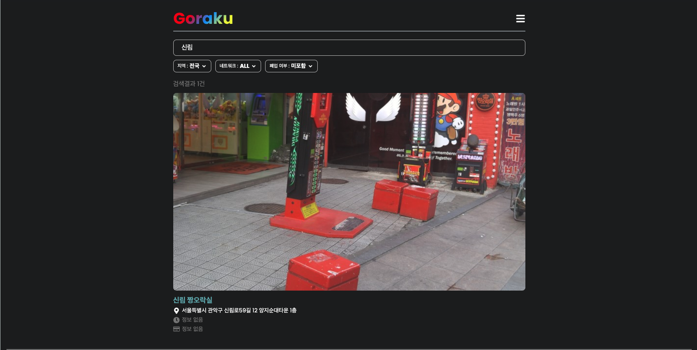
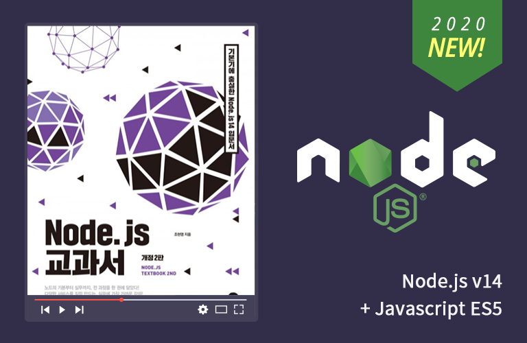
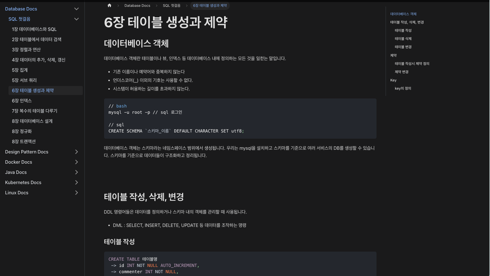
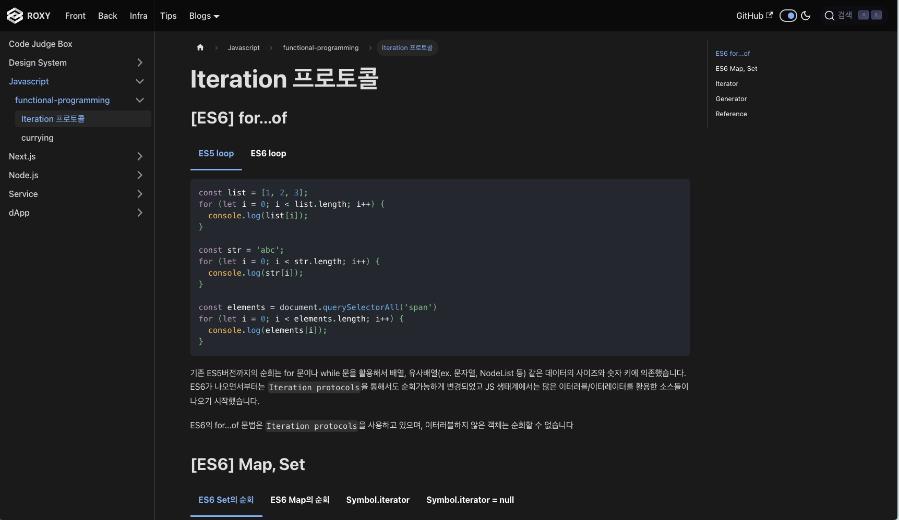
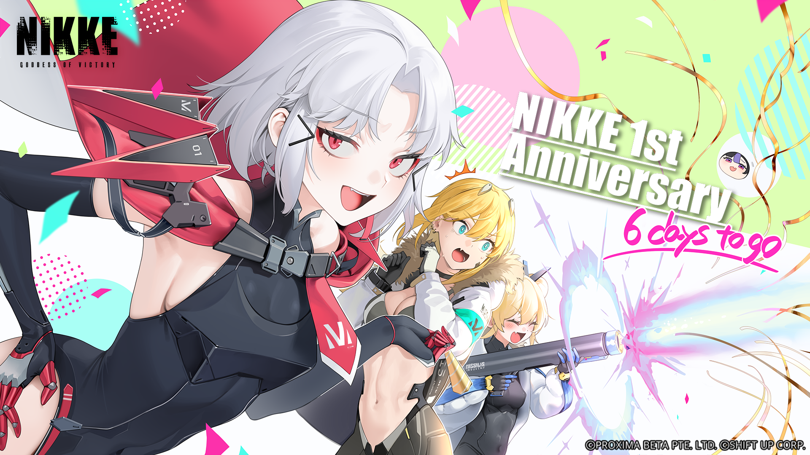

> 세상에는 기술을 좋아하는 개발자가 있고 도메인을 좋아하는 개발자가 있다.

유투브에서 본 멘트였는데, 마침 친한 개발자들이랑도 많이 하던 이야기여서 반가웠었다. 나는 정확히 어떤 부류라고 나누기는 힘든 것 같다.
도메인에 추가할 때 임팩트가 바로 눈에 보이는 기능이라면, 사실 기술이나 작업 프로세스를 엄청 따지지 않고 먼저 들이박아볼 것 같다.
그런데, 또 해외 코드를 보다보면 트랜드가 신기하기도 하고 저런 기술들을 써서 어떤 문제들을 해결하려고 했는지 궁금해질 때가 많다.
절반은 몸으로 겪어보고 실무에 도입한 케이스도 있고, 절반은 아직 간만 봤다.

**제너럴리스트라는 말이 그나마 설명이 될 것 같다.** 개발적인 것 외에 외적인 변수들도 고려하고 추측해보고 실제 성공 사례나 아티클도 찾아보는 과정들을 좋아한다.
이 회사에서도 다른 Web3 회사에서는 어떤 식으로 운영했었는지 동료분들한테 많이 주숴듣기도 했었다.

이 성향은 개발 쪽으로도 영향을 끼친 것 같다. 분명 프론트엔드가 재밌어서 시작한 개발이었는데, 일을 잘하고 싶어서 욕심이 생기다보니, 개발을 좋아하는 사람들과 이야기하다보니
백엔드나 인프라 쪽도 관심이 생기고 웹 개발이 아닌 곳은 어떤 느낌일지 궁금했다.

## 1분기

> “왜 내 근처에는 시니어 개발자가 없을까? 시니어 개발자라면 지금 상황에서 무얼 하고 있을까”

1분기 당시에는 시니어 개발자가 제일 관심사였다. 마치 판타지 소설을 좋아하는 이유와 같은걸까? 그냥 너무 궁금했다.

그 사람들은 나와 사고방식이 아예 다른 건지, 노력하다보면 결국에 서로 다 비슷해질지 등등
이제 3년차 개발자가 되어가는 입장에서 입이 바싹 마르기도 하고 궁금하기도 한 부분이었다.

 

### [CryptoZombies](https://cryptozombies.io/ko/lesson/3)

WEB3 회사에서 컨트랙트와 상호작용하는 웹 어플리케이션을 2,3개 정도 개발했지만 막상 블록체인 개발에 대해서는 평면적으로만 알고 있었다. 그래서 회사 사람들과 비개발자들을 포함해서 같이 cryptozombie 코스를 진행하면서 토론하는 시간을 가졌었다.

 

### **[김민태의 프론트엔드 아카데미 : 제 3강 시나리오로 배우는 프론트엔드 실무](https://fastcampus.co.kr/dev_academy_kmt3)**

어쩌다 Teo라는 분이 추천하는 서적 "**[구글 엔지니어는 이렇게 일한다](https://product.kyobobook.co.kr/detail/S000061352347)**”라는 책을 구경하게 되었는데 코드적인 것보다 전반적으로 자신의 썰을 푸는 것이 인상적이었다. 그러다 김민태님이 패스트캠퍼스에서 시나리오를 기반으로 썰을 풀듯이 개발자가 어떤 선택을 하게 되고 어떤 고민을 하게 되는지 스타트업의 성장에 따라 설명해준다고 하셔서 너무 궁금해서 바로 구매해버렸다.

진짜 돈이 한 푼도 안 아까운 강의였고 내가 생각하는 시니어 개발자가 조금 더 구체화되는 내용이었다. 웹뷰 어플리케이션에 대한 것이나 BFF, 디자인 시스템 등 이런 개념들을 들을 수도 있어서 참 좋았다. 이 강의를 듣다보면 현재 내가 일하고 있는 회사의 어플리케이션은 과연 서비스를 할 수 있는 상태인가?라는 고민이 들어서 그때부터 모니터링, 로거 등을 찾아보기 시작했다.

 

### [Three.js 탐험](https://github.com/hankbae93/threejs-pogbot)

회사 동료와 기획한 사이드 프로젝트가 있었는데 먼저 우리가 구현할 수 있는지 체크하고자 간단한 three.js 웹을 만들었었다. 3D에 대한 개념이 아예 없다보니 강의도 들어보고 코드도 작성해보고 생각보다 힘들었었던 시간이었다. 그리고 하다보니 이쯤 되면 그냥 Unity의 GUI로 개발하는 게 백배는 쉽겠단 생각이 들었다.

 

 

### 꾸준히 블로그

시니어 개발자가 되려면 내가 구현한 코드에 대한 설명을 충분히 할 수 있어야한다고 생각이 든 후로부터 계속 회사에서 구현하거나 사용한 기술들을 정리하려고 노력했다. 막상 지금의 코드는 또 아예 다른 판이 되어있긴 하다. wagmi라는 라이브러리는 메이저 0버전에서 어느새 메이저 1이 되었고 새로운 의존성 패키지가 추가되어서 수정해야되는 글이 되버렸다. 디자인 시스템에 대해서 끄적이기도 했다.

 

## 2분기

### Java 첫 걸음

IRO가 자바를 가르쳐주겠다고 해서 회사 동료분과 같이 스터디했었다. 디스코드 봇을 만들면서 배우고 혼자서 텍스트 로그라이크 게임을 만들어봤는데 생각보다 너무 재밌었다. 객체 지향이 사람에게 주는 메리트가 확 와닿았다. 일단 절차형보다 생각하는 것이 훨씬 쉽다. 지금은 일단 백엔드로 빨리 직군 전환하고 싶어서 NestJS로 포트폴리오를 개발하고 있는데 나중에는 무조건 자바 진영에서 개발하고 싶다.

 

### [Gorakulist](https://gorakulist.kr/)

내 자바 선생인 이로가 오락실 찾기 서비스를 개발해보자고 했다. 나름 최선을 다해서 프론트를 개발했었는데 피그마로 시안도 만들어보고 벤치마킹할 레퍼런스들도 찾아다녔었다. 컨셉은 “한 손으로 검색하기 쉬운 서비스, 모바일 지향”이었어서 화면 구성도 최대한 한 화면에 한 기능만 들어가고 최대한 사용자가 안 귀찮게 하려고 디테일한 UX를 많이 고민했었다.

오락실 커뮤니티에서 홍보를 해서 나름 사용자가 있었고 회사 동료중 한 분도 우연히 생각나서 이걸로 검색하고 찾아갔다는 이야기를 해줘서 보람찼었던 사이드였다. 현재 이로의 홈 서버에서 호스팅되고 있다.

 

## 3분기

> 집에서 백엔드 공부를 하니 세포가 다시 깨는 것 같았다.

회사에서는 프론트엔드 개발을 하고 집에서는 백엔드 개발을 하니까 스트레스가 풀렸다. 집중도 더 잘되는 느낌이어서 회사에서도 다시 리팩토링도 꾸준히 시작하고 신규 프로덕트도 개발했다. 런칭 전에 필요한 Admin도 개발했었는데 시간을 줄이려고 노력하니까 한도 끝도 없이 줄여지는 게 느껴졌다. 아마 2,3일만에 필요한 기능과 UI들을 다 붙였던 것으로 기억한다.

 

### [제로초의 NodeJS](https://www.inflearn.com/course/%EB%85%B8%EB%93%9C-%EA%B5%90%EA%B3%BC%EC%84%9C/dashboard)

사실 구매하긴 작년에 구매했었는데 빠르게 완강하고 싶어서 1달 정도 강의만 주구장창 들어보고 코드 작성해보고 했었다. 원래는 백엔드 사이드를 시작하기전에 NodeJS에 대해서 어느정도 정리를 하고 넘어가고자 시작했다. 그러나 역시 강의의 묘미는 생각못해봤던 키워드들을 제시할 때 오는 쾌감에 있는 것 같다. 테스트, 스케쥴링, DB, ORM, CLI 등등 재밌는 요소들이 많았다.

 

### [Doki-Doki](https://github.com/hankbae93/doki_api)

백엔드 공부를 하다보니 점점 직군 전환을 도전해보고 싶어졌다. 회사동료나 백엔드 개발자 분들과 이야기해보니 일단 아예 아무것도 모르는 게 아니긴 하니 사이드 프로젝트를 먼저 주구장창 개발하고 개발하면서 필요한 이론 공부를 하라고 했다. 그래서 이전에 노션으로 운영했던 사내 애니메이션 페이지를 웹 어플리케이션으로 개발해보기로 결심했다.

ERD부터 시작해서 원래 제공했던 노션의 기능과 기획을 기반으로 스키마를 설계하고 개발했다.
개발하면서 많은 것들을 경험해봤다. 이전 클론 코딩으로만은 절대 경험할 수 없는 문제들이 되게 많아서 전부는 못적었지만 최대한 그 이슈들을 적으면서 개발했다.
현재는 리팩토링 단계에 와서 테스팅 등을 적용해보려고 한다. 나중에 포트폴리오로도 쓸 수 있게 이로 홈 서버에서 몰래 배포할 계획이다.

 

## 4분기

> 구현이야 어떻게든 했지만 내가 쌓은 성이 모래성 같았다.

백엔드 로직을 구현할 때 가장 힘들었던 건 SQL문을 모르는 것이었다. TypeORM이라고 내가 원하는 형태의 결과로 조회하는 쿼리를 대신 구현해주진 않았다.
두번째로는 설계였다. 사람이 생각하는 방식처럼 다른 관심사면 자연스럽게 분리하게 되니까 자연스럽게 테이블을 분리했는데 무지성 정규화도 많았던 것 같다.
기획을 체크해야되는 순간이었다. 자연스럽게 책에 손이 갔다.

 

### [SQL 첫걸음](https://roxy.iro.ooo/back/database/sql-first-step)

SQL 첫걸음이라는 서적을 구매하고 읽으면서 차례차례 정리했다. 튜토리얼 책이다 보니 너무 짧게 설명하는 부분도 있었어서 겸사겸사 블로그 글들도 보게 되었다.
그리고 [쉬운코드](https://www.youtube.com/@ez.)라는 유투브 채널도 알게 되어서 MySQL에 대해서 참 많은 것들을 배우게 되었다.
이 분 강의가 진짜 괜찮았고 강의가 무료인 이유도 재정적인 여유가 없을 주니어 개발자들, 학생들을 위해서란 걸 듣고 유료 구독을 질러버렸다.

다행히 올해가 가기전에 다 읽고 정리해봐서 뿌듯하다.

배우다보니 내가 만든 사이드 프로젝트 Doki를 재점검하고 싶어지는 마음이 강렬하게 들었다.

 

### 겸사겸사

함수형 프로그래밍이 조금 궁금해져서 겸사겸사 강의를 들으면서 공부하고 있다. 백엔드 필수 역량에 너무 많은 항목들이 언급되어서 좀 힘들기도 하다.
Docker나 AWS같은 것은 그냥 회사에서 편하게 써보기만 했지 개념을 알고 있는 게 하나도 없어서 참 정리해야될 게 많다고 느낀다.
자료구조, CS, 인프라 등등등등 할거 천지라고 느낀다. 다만 이 과정에서 내가 어떤 레이어 위에서 개발하고 있었고 저런 이유로 생긴거였구나하면서 깨닫는 재미가 쏠쏠하긴 하다.

 

## 연말이 되었다.

> 예전에 많이 했던 고민이 지금의 나에게 큰 고민이 아니라면 성장한 것이라고 합니다.

회고를 작성한 건 12월이었는데, 막상 2월에 개발바닥 영상을 보고 생각이 많이 바뀌어서 새로 수정했다.
23년 초에는 시니어 개발자에 대한 모호한 고민들을 엄청 많이 했었는데, 이제는 답을 내려하지도 않고 당장 내 눈앞에 문제를 해결하는 데 더 관심이 많이 생겨서 고민같지 않아졌다.

벌써 경력이 3년이 다 되어간다는 것이 제일 두렵긴 하다. 시간이 생각보다 너무 빨리 가고, 공부도 더 열심히 해야겠다고 매번 압박을 느낀다.
그래도 확신할 수 있는 것은 3년 전의 나보다는 훨씬 잘하는 것 같다.

### 올해도 고생했다. 진짜로. 놀지만은 않았다.

