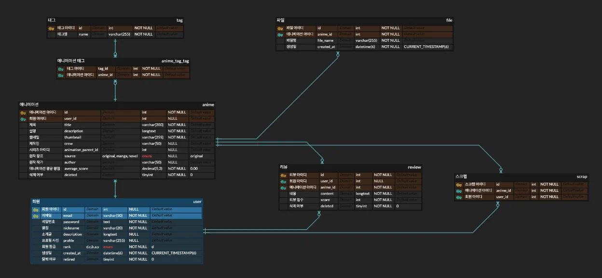
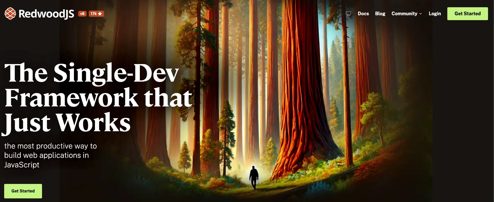
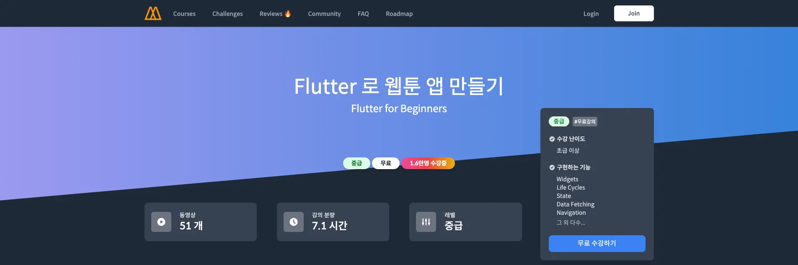
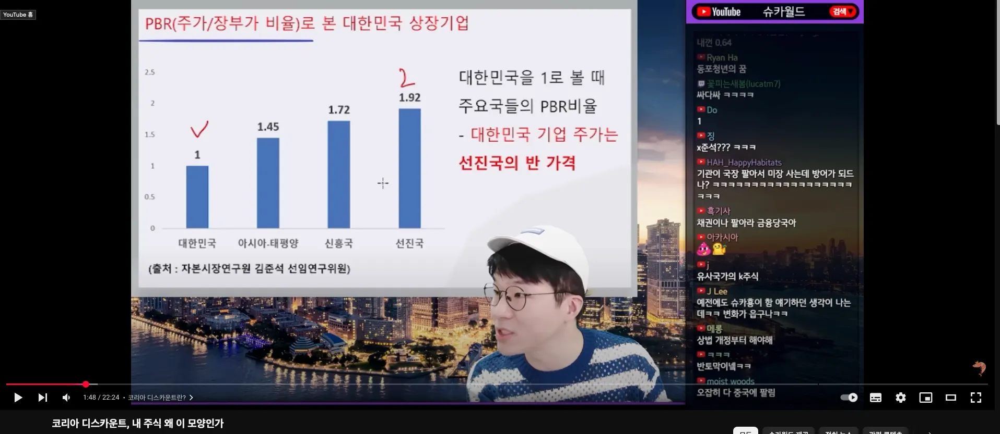
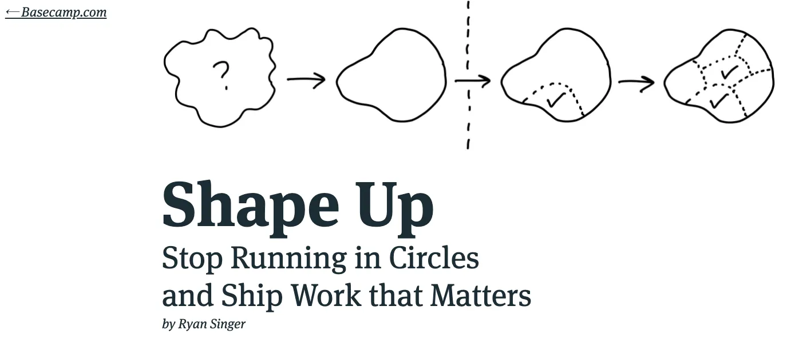
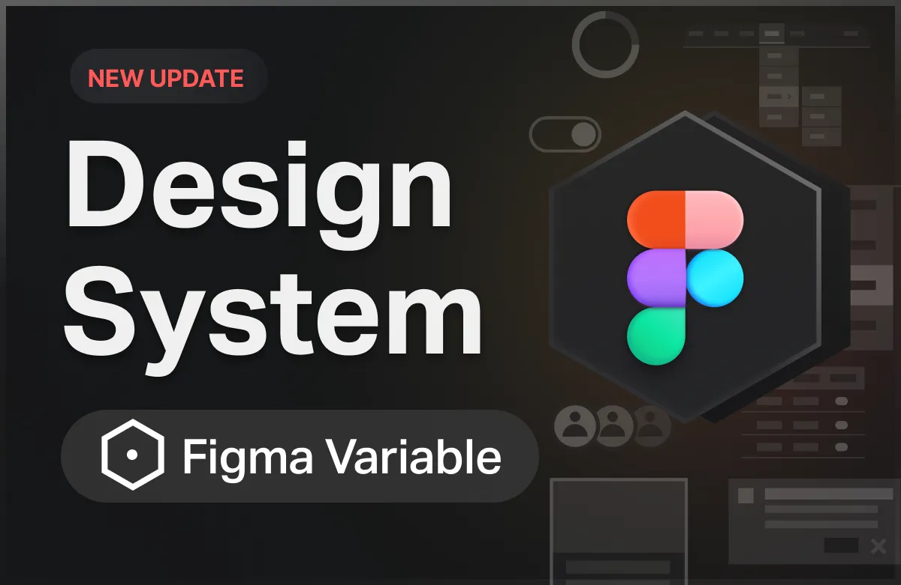
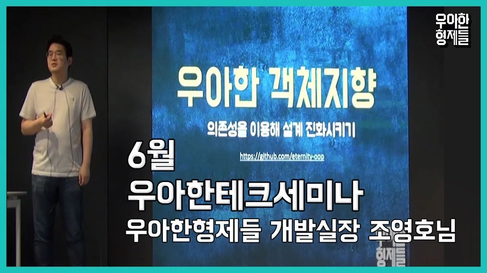
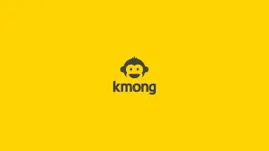

24년은 살면서 제일 혼란스러운 시기인 것 같다. 

이제는 백엔드를 좋아하고 도메인을 중요하게 생각한다고 믿었었는데, 의외로 막상 프론트엔드를 해도 재미가 없지 않고 새로운 기술 써보는 걸 좋아한다. 

개발자들이 기획과 비즈니스에 깊게 관여하려고 노력하는 회사에 가면 재밌을 줄 알았는데, 의외로 더 기술적인 접근이 많아졌고, 의외로 기획하는 과정이 고통스러웠다.

올해를 마치면서 느끼는 감정은 혼란이다. 

 

## 1분기

> “아직 연차가 낮을 때 백엔드로 도전해보자!”
> 

23년 말부터 꾸준히 백엔드 이직을 준비했었다. 백엔드로서의 역량을 증명해야되서 회사에서도 어드민 API를 만든다던가, 개인 포트폴리오 프로젝트도 무조건 직접 인프라를 구축하고 API 서버도 개발햇다. 

Nodejs 진영은 백엔드 공고가 너무 적었다. 어쩔 수 없이 공부해왔던 Nestjs를 사용하지 않는 곳이라도 백엔드로 업무만 할 수 있다면 지원하는 식으로 진행했다. 나중에는 풀스택 공고도 같이 지원해서 모두 합쳐 50~60개의 회사에 지원했다. 다행히 신입보다는 개발자 경력이 있어서 그런지, 엄청 힘들지는 않았다.

50개중에 서류통과(면접 3개, 과제 2개 이후 면접) ⇒ 5 / 50 ⇒ 10%

두 개의 회사에 최종합격을 했다. 고민이 많이 됐지만 면접 경험이 신선했던 회사에 입사하게 되었다.

CTO분이 무척 특이했었는데, 잠깐 대화를 해봐도 배우는 게 많다고 느껴졌었다. 

그 당시, 개발자가 아무리 노력해봐야 사업적인 아귀가 잘 맞아야 되고, 비즈니스가 성사되는 순간에 개발자가 중요하지 않을 때가 많다고 느끼고 있었다. CTO님과 대화하다 보니 개발자로서 어떻게 행동해야될지 길을 잡을 수 있을 것 같았다.

 

 

### 포트폴리오 준비

포트폴리오: https://gamma.app/docs/Doki--0qc5mr98pg5ajmj?mode=doc

처음에는 이것저것 신선한 것으로 개발해보다가, 좀 더 포괄적으로 경험해볼 수 있을 것 같은 도메인으로 진행했다. 단순한 커뮤니티였지만, 여기서도 충분히 실무에 필요한 기술이나 개념들을 경험했다고 어필할 수 있을 것 같았다. 

ERD부터 해서 개발,인프라까지 프로젝트의 모든 걸 혼자 다하니까 재밌었다. 동료들이 이런 맥락의 일을 한 거였구나 간접 경험을 하는 게 무척 흥미진진했다. GPT, 강의, 백엔드 동료분들한테 많이 물어봤던 것 같다.

 

### 새 회사에서 사용할 스택 공부

회사에서 운영하는 블로그에 사용중인 기술들이 소개되어 있었다. Redwoodjs라는 프레임워크를 사용하여 풀스택으로 개발자들이 feature를 담당해서 DB부터 프론트까지 개발한다고 했었다.

nodejs, react, AWS Serverless, GraphQL, PrismaORM 등 최신 스택들로 구성된 모노레포 프레임워크였다.

Redwoodjs를 사용해보면서 신선했던 점은 프레임워크가 프론트엔드뿐만이 아니라 백엔드, DB, 생산성까지 챙겨준다는 것이었다. 예를 들어 Scaffold라는 Cli가 있었는데, Prsima DB에서 schema만 추가하면 해당 엔티티로 CRUD 페이지, API 연동까지 파일이 생성되었다. 

앱은 Flutter로 개발되어있었다. 사실 앱 개발에 대해 문외한이었기에 조금 겁을 먹으면서 공부를 시작했다. OOP 방식으로 UI를 만들고 함수를 연동하는 느낌이 신선했었다. 

 

## 2분기

> 입사 전에 이만큼 기대하면서 들어간 적이 있었던가?
> 

만들라고 시키면 만들기만 잘하는 것이 아니라 정말 개개인이 다 사업의 성공에 관심 갖고 자부심갖는 회사에 가보고 싶었다. CTO님, 대표님과 대화만 하더라도 인원 하나하나가 기술적으로만 접근하지 않을 것 같은 회사일 것 같았고, 실제로 동료분들 하나하나 배울 점이 많았다. 

아침에 출근하면 주식 뉴스를 보거나 가치평가서를 보면서 이야기를 하고 있는 동료들을 보니 재밌었다. 

 

### 도메인 공부

회사에서는 저평가된 주식시장을 바꿔보자는 비전이 있었다. 그래서 기획되는 feature들은 하나같이 어느정도 주식에 대한 이해도가 필요했었다. 출근을 하면 CTO님이 읽을 거리들을 공유해주면서 스크럼을 하곤 했었다. 

세상 굴러가는 모양새에 대해 조금씩 배우는 느낌이었다. 사실 배우면서 더 더욱 미국 주식으로 투자를 시작하길 잘했단 생각이 든다. 

 

### 온보딩 받아야 될 사람이 온보딩 문서 작성하기?

첫 날에는 노션을 하루종일 봤었는데 보다보니 이전 회사와 차이점이 많았다. Shape up이라는 방식도 생소했다. Ruby on rails 창시자가 만든 방법론으로 유명한데 당근에서도 사용하고 있는 팀이 있다고 했다. 

모든 회사의 특징이 있다. 에자일을 하는 방식도 각자의 스타일이 있다. Shape Up과 실제로 사내에서 노션으로 업무 진행하는 방식이 완전 일치하진 않는다고 느꼈다. 어차피 온보딩 받는 김에 현재 노션에서 페이지들의 목적과 사용 방식, 내가 질문한 것들과 답변들을 문서화하겠다고 했다. 

출근한 첫 날에 온보딩 문서를 작성하겠다고 이야기하니 CTO님이 재밌어하셨다. 그 다음 주에 회사 노션에 업로드했고 많은 분들이 피드백을 주셨다. 

 

### 디자인 시스템

회사는 성공적인 1,2년차를 보내고 정비를 하고 싶어했다. 지금까지 개발해온 feature들을 고도화하기 위해 갈무리를 할 계획을 짜고 있었는데, 그 중에 하나가 디자인 시스템이었다.

사원 하나하나가 각자 1달 반 정도를 어떤 일을 할지 기획하고 문서를 작성해와서 그것이 통과되면 진행할 수 있고, 통과되지 못하면 다른 프로젝트에 합류해서 진행하는 업무 프로세스가 있었다. 

이 과정에서 당시 B2B 컨설팅 관련된 어드민이 필요하다고 많이 이야기됐었고 재밌어보여서 그 쪽으로 문서를 작성해보겠다고 CTO님한테 얘기했었다. 아직 온보딩 단계이기도 하고 그 기획은 아직 논의되야할 여지가 많이 남아있어서 다른 프로젝트에 합류해보는 게 어떻냐고 권유하셨다.

전 회사에서도 디자인 시스템을 했다보니 turborepo로 구성해서 패키지들을 관리할 수 있는 방식을 짜고 사설 패키지를 배포하는 CI/CD도 구축했다. 프론트엔드 개발자 동료가 컴포넌트를 앞으로 어떻게 개발하고 스토리도 작성할지 고민을 많이 하셔서 배우는 재미도 쏠쏠했다.

 

## 3분기

> 흠..
> 

22년도에는 내가 만든 서비스가 어떻게 운영되고 어떤 피드백을 받을지 못보는 것이 한이었다.

23년도에는 분명 런칭 계획을 앞두고 있다 들었고 비전이 공감되는 서비스를 개발했는데, 사업적인 이유로 계속 밀렸고 1년 9개월동안 피봇을 두 세번하고 런칭도 하지 못했다. 하지만 문제가 되지는 않았다. 런칭을 한다고, 그것을 경험한다고 꼭 좋은 개발자가 되는 게 아니라는 걸 깨달았으니까.

24년도에는 내 마음 속에서 그런 게 전부 상관없어진 줄 알았다. 

 

### 객체 지향

회사에서 두번째로 진행한 프로젝트였다. 고도화를 위해 새로 ERD부터 도메인을 좀 더 구체적으로 정의하고 설계하는 것이었다.

당시 백엔드 분이 도메인마다 정책은 다양하고 서로 의존할 일이 많은데, 현재 구조에서는 아무래도 확장성도 그렇고 예정된 기획들을 감당할 수 없다고 느껴 OOP 방식으로 DDD? 비스무리한 추상화를 시도하고자 했다. 

이 과정에서 OOP에 대한 이해가 없어서 조영호님 영상을 많이 봤었다. 

 

### 수습기간이 끝나가고 있다

수습기간만 마치고 퇴사하기로 했다. 언제부턴가 부담이 느껴져서 쉬고 싶단 생각이 많이 들었다. 전 회사에서 이직하기 전부터 좀 쉬고 싶단 생각이 들었었는데 이쯤 한 세달만 푹 쉬고 싶었다.

이때쯤 혼란이 심했다. 지금 진행중인 프로젝트도 내년에 적용될거라 생각하니까 먼가 맥이 빠졌었다. 내가 개발을 좋아하긴 하는 것 같은데 다 귀찮아졌었다. 지금 상태로는 이 회사에 안 좋은 영향만 끼칠 것 같았다. 

 

## 4분기

> 길 줄 알았던 암흑기가 생각보다 빨리 끝났다.
> 

 

### 프리랜서 준비

이제는 내 껄 만들어보고 싶었다. 그래서 내 프로젝트를 진행하면서 수입을 벌 목적으로 크몽에서 웹 외주를 운영하려고했었는데.. 생각보다 너무 어려웠다. 일단 처음에는 어떤 외주를 할까부터 소개 페이지 꾸미는 것까지 전부 고통이었다. 한 달 정도 시도해봤는데 잘 되지 않았다.

 

### 외주로 들어왔다가 입사

부트캠프 때부터 같이 공부하며 지냈던 친구가 계약직 형태로 2주동안 도와줄 수 있냐고 물어봤다. 계획이 따로 있던 것도 아니고 친구랑 일해보는 것도 재밌을 것 같아서 바로 수락했다. 

B2B로 기획된 거대한 feature를 개발하는 일이었는데, 정신차리고 보니 회고를 쓰는 지금까지도 개발하고 있다. 

 

### 의외로 만족

처음부터 되게 바빴다. 거의 밥먹고 잠자고 코딩만 했다. 예전 SI회사 다닐 때가 새록새록 떠올랐다. 

한 달 뒤에 바로 우리가 개발한 기능을 사용할 클라이언트 회사들이 존재했고, 이거 되나? 안되나? 불안해하면서 개발했다. 

고생고생해서 feature의 40%정도 개발되었고, 당장 클라이언트들이 쓸 기능들은 마련되어서 그렇게 운영까지 들어갔다. 이 때 기분이 묘했다. 3년동안 내 서비스를 운영해보는 게 소박한 소원이었는데 이 회사에 오고 1달만에 이뤄졌다는 것이.

실제로 재밌었다. 이슈도 많았고 사용자 피드백도 많았지만 친구와 신속하게 대응했다. 내가 좋아하는 와탭랩스 모니터링도 바로 붙여버렸다. 슬슬 불러준 친구가 고맙기 시작했다.ㅋㅋ

사내에서도 여러 프로젝트를 운영하면서 우리가 개발한 시스템을 사용하고 있어 많은 피드백들을 주셨고, 다른 클라이언트 분들 포함해서 피드백들이 계속 들어왔다. 게임처럼 내가 어떤 코드를 작성하면 즉각 보상이 들어오는 기분이었다. 

이런 과정은 언제나 즐거운 것 같다. 아무것도 없는 황무지에서 시스템을 하나 만들고 기획과 피드백들이 쌓여서 고도화할 방향들이 잡히고 그 과정에서 변경하고 설계하고 토의하는 재미. 맨 처음 회사를 퇴사할 때 꼭 느껴보고 싶었던 경험이었는데 상상한 그대로다. 진짜 재밌다.

 

## **연말이 되었다.**

> 그러나 아직도 내가 어떻게 살아가야할지 고민된다.
> 

지금까지 그래도 직장생활이 무난했던 건(사실 무난하진 않지만) 동료, 친구들이 좋은 이야기들을 많이 해주고 도와준 덕분인 것 같다. 어느새 순수 실무기간이 3년이 넘어 4년차 개발자가 되어버렸다. 

요즘 들어 느끼는 건 개발을 하면서 폭 넓게 접근하고 소통하는 것도 중요하지만 그 요구사항들을 구현하고 운영할려면 기술적인 역량이 뒷받침해줘야 된다는 것이다. 그래서 25년은 내가 지금까지 미루고 사두고 쌓아두기만 한 강의와 책들을 모두 보려고 한다.

목표가 생겼다면, 연봉도 연봉이지만 “같이 일하고 싶은 사람”이 되는 것이다. 지금도 만약 회사를 창업한다면 축구 엔트리처럼 바로 떠오르는 베스트 멤버들이 있다. 

아직도 내가 백엔드를 하고 싶은 건지, 프론트엔드가 재미없을 때가 왜 많은지, 기획하는 건 왜 고통스러운지 등등 혼란스럽지만 천천히 생각해보려고 한다. 오늘 할 수 있는 일들을 하면서.

 

### 올해도 고생했다. 진짜로. 놀고 싶었지만 놀지만은 않았다.

