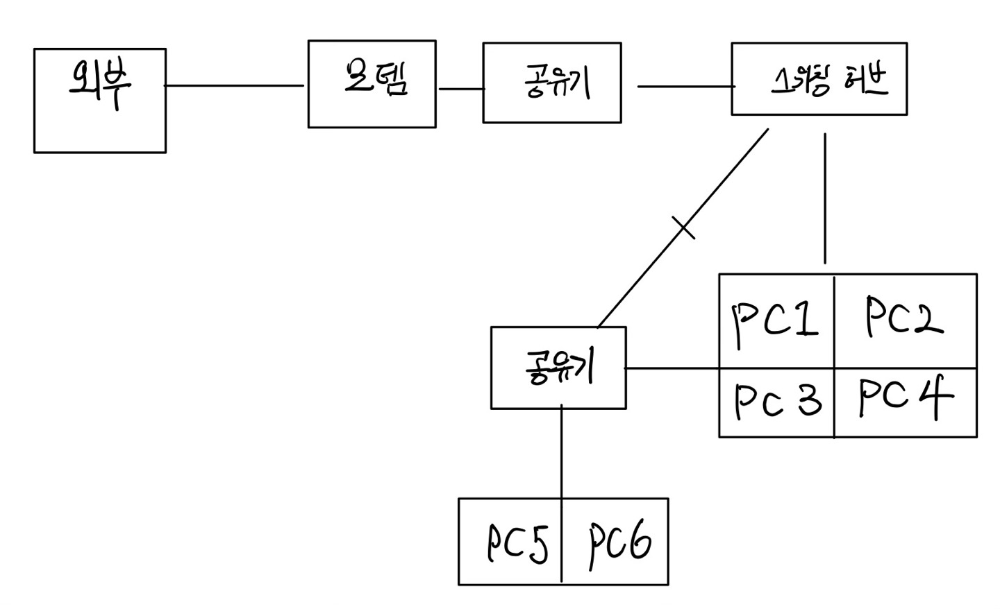
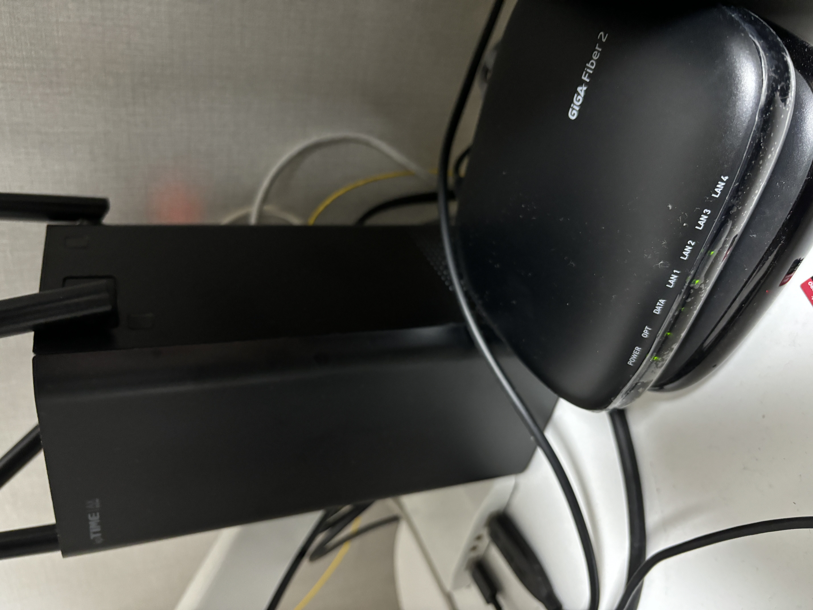
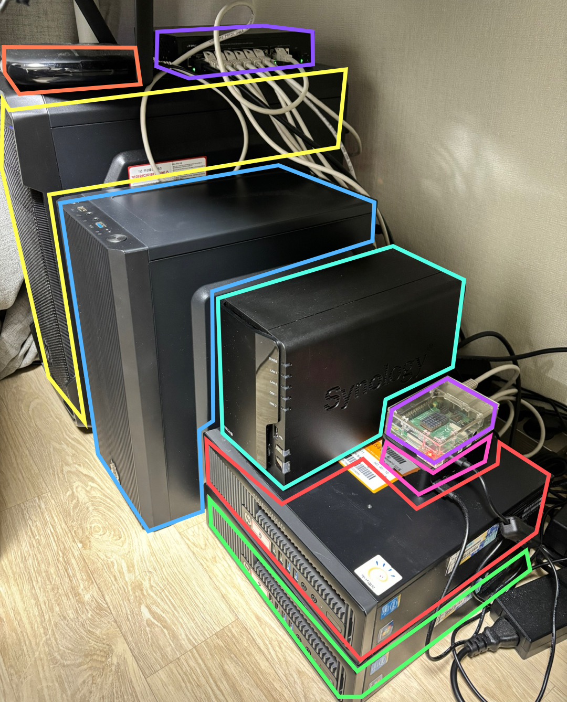

<head>
  <link rel="canonical" href="https://blog.nirohack.xyz/post/2023/0628-home-infra-01/" />
</head>
# 홈 서버 세팅부터 쿠버네티스 설치, 배포까지 all in one - 물리 서버 구성하기 1편
직접 안해보면 만족할 수 없는 글쓴이의 우당탕 홈 서버 세팅부터 쿠버네티스 배포까지 시리즈 시작합니다.
## 히스토리
쿠버네티스를 공부하면서 직접 구축해보고싶어 몸이 근질근질하던 2022년 무렵 홈 서버 구축 계획을 실행에 옮겼습니다. 
직접 인프라 구축을 해보고싶다는 로망부터 AWS 돈을 더 이상 지출안해도 된다는 점 등등 여러 이유로 근질근질 했던 것 같습니다. 

만약 글을 따라 홈 서버를 구축하고 싶은 독자가 있다면 이 글에 있는 모든 재료를 구매할 필요는 없습니다.  
서버 두 대만 있어도 충분히 구축할 수 있기 때문입니다. 저자 같은 경우 망 분리와 쿠버네티스에서 권장하는 4대의 노드를 가지고 싶어서 이렇게 ~~과지출~~ 구성을 해본 것 입니다.

마지막 편까지 사용한 총 재료는 아래와 같습니다. 
- 서버용으로 사용할 PC 6대
  - 6코어 6스레드 - 1대 (linux/amd64)
  - 4코어 4스레드 - 3대 (linux/amd64)
  - 4코어 4스레드 - 2대 (linux/arm64)
- 스위칭 허브 1대
- 공유기 2대

## 기기 배치도
기기는 각각 아래 사진과 같이 배치했습니다. ~~그림 왜 이래~~

### 외부
외부는 말 그대로 집 밖의 네트워크를 의미합니다.
### 모뎀, 공유기
집으로 들어온 모뎀은 공유기로 연결해서 라우팅합니다.
### 스위칭 허브
홈 서버 세팅간 공유기의 소켓만으론 유선 연결이 부족하므로 스위칭 허브도 하나 구매했습니다.  
기왕 구매하는 겸 내장 기능으로 LAN 네트워크 망 분리가 가능한 스위칭 허브를 구매했습니다.
### PC 군집 (쿠버네티스 클러스터)
스위칭 허브는 PC1, PC2, PC3, PC4 와 연결됩니다. 이 군집은 이후 쿠버네티스 클러스터가 됩니다.  
PC1 ~ 4 는 위에서 소개한 6코어 6스레드 1대와 4코어 4스레드(amd64) 3대입니다.
### 또 다른 공유기
이어서 스위칭 허브는 또 다른 공유기와 연결되는데 여기는 LAN 망을 분리했습니다. 외부와는 통신이 안되고 PC 1 ~ 6 끼리만 통신이 가능합니다.
### PC5, PC6
PC5, PC6 는 DB, Image Registry 등으로 사용합니다. 망이 분리되어있기 때문에 PC1 ~ 6 만 연결을 맺을 수 있습니다.

## 실물 구성
### 모뎀부터 공유기
선정리는 그냥 웃으며 넘어가는 것으로 ㅎㅎ..  
넙적한 네모가 모뎀이며 왼쪽에 있는 것이 모뎀과 연결된 공유기입니다.

### 공유기 뒤의 구성
사진 상단부부터 순서대로  
당근색 - 망 분리된 공유기    
보라색 - 스위칭 허브  
노랑색 - 6코어 6스레드 PC  
하늘색 - 4코어 4스레드 PC  
민트색 - NAS (다른 편에서 만나요~)  
옅은 보라색 - 4코어 4스레드 PC (라즈베리파이 arm64)  
분홍색 - 4코어 4스레드 PC (라즈베리파이 arm64)  
다홍색 - 4코어 4스레드 PC  
초록색 - 4코어 4스레드 PC  

## 구성 후기
1. 배선이 힘들다  
사진에서 보이는 것을 제외하고 작업용 메인, 서브 PC 도 생각을 했어야 했기 때문에 배선하는게 참 힘들었습니다.  
인터넷 기사님 오셨을 때 선 좀 더 빼달라해서 이쪽 저쪽으로 보내달라고 부탁을 좀 드렸지요.  
2. 전력 계산을 해야한다  
가정용 콘센트의 경우 한쪽 벽에 박혀있는 콘센트에서 3300W 를 초과해선 안됩니다. 안전하게 2800W 정도로 잡고 전력을 계산하여 설치했습니다.  
멀티탭은 화재 방지와 2800W 를 감당할 수 있는 고용량 멀티탭을 골라야합니다.
3. 랜선 잘못 꼽으면 찾기 힘들다  
기기를 모두 배치한 후 랜선 연결작업을 하고있을 무렵. 루프가 생기도록 잘못 꼽은 줄 모르고 (스위칭 허브에서 스위칭 허브로 꼽는 행위...) 내부 네트워크
신호가 안잡혀 한참 해맸던 기억이 납니다. 랜선 한 두개야 실수할 일 없지만 많아지면 그렇지 않더군요.

## 다음 글 예고
1편에선 물리 기기를 배치하고 연결한 것으로 글을 마치고
다음 글에선 OS 를 설치하고 라우팅 설정 및 도메인 작업에 대한 글로 만나겠습니다.  
