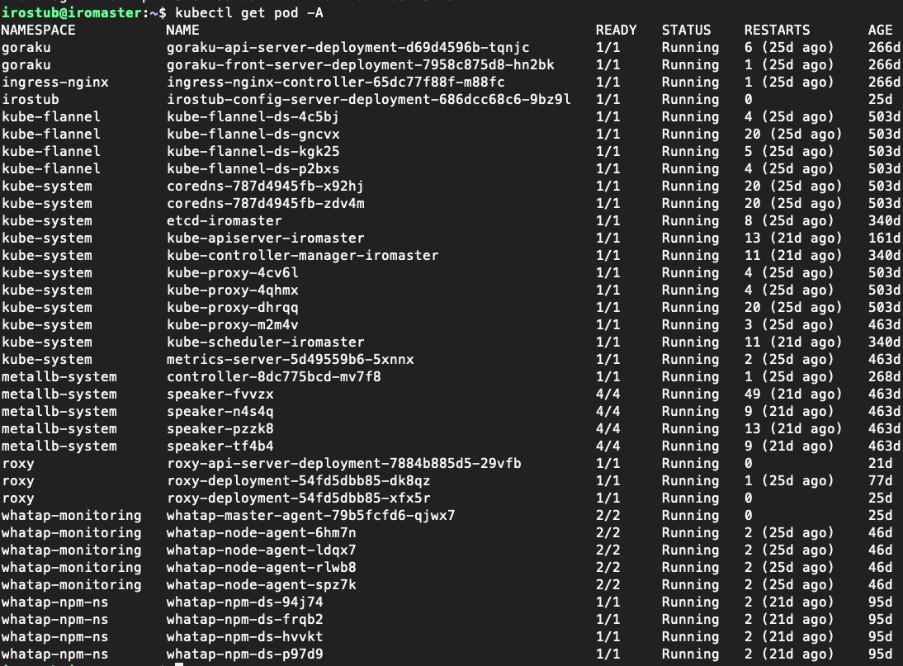

<head>
  <link rel="canonical" href="https://blog.nirohack.xyz/post/2023/0629-home-infra-02/" />
</head>
# 홈 서버 세팅부터 쿠버네티스 설치, 배포까지 all in one 2편 - kubeadm 을 사용한 쿠버네티스 설치

## 리눅스 서버 설치
우분투 공식에서 live server 20.04 LTS 버전을 설치합니다.  
[이미지 다운로드](https://releases.ubuntu.com/focal/ubuntu-20.04.6-live-server-amd64.iso)

리눅스 설치 방법은 [다른 블로그](https://heroeswillnotdie.tistory.com/22) 를 참조하시면서 설치할 수 있겠습니다.

## 쿠버네티스 설치
아래 과정은 [공식문서](https://kubernetes.io/ko/docs/setup/production-environment/tools/kubeadm/install-kubeadm/) 에서도 친절하게 설명해주고 있기 때문에 공식문서를 참고하는 것도 좋습니다.
### 기본 사양
- 2GB 이상의 메모리
- 2 코어 이상의 CPU
- 클러스터 모든 머신의 네트워크 연결
- 모든 노드에 대한 고유한 hostname
- 통신을 위한 특정 포트의 개방
- 메모리 스왑 비활성화

### 설치 방법
검색하면 수 많은 설치 방법들이 결과로 나오실텐데 이 글이 제일 쉽게 설명되어있었습니다.
[참조](https://showinfo8.com/2023/07/26/ubuntu-22-04%EC%97%90%EC%84%9C-kubernets-%EC%84%A4%EC%B9%98%ED%95%98%EA%B8%B0/)

위 참조 링크를 따라하시면서 설치하시면 성공적으로 쿠버네티스 설치를 마치실 수 있습니다.
저자는 cni 로 calico 대신 flannel 을 사용하였습니다.

### 몇가지 옵션
위 링크를 참조해 설치한 후 쿠버네티스를 다루다보면 Service 라는 쿠버네티스 컴포넌트를 만나실 수 있습니다.   
이때, 베어메탈 환경에선 로드밸런서가 없기 때문에 서비스의 타입을 LoadBalancer 로 설정하지 못하는 문제가 있습니다.  
이 경우 MetalLB 라는 베어메탈용 LB 를 설치하여 해결할 수 있습니다. 설치는 다음을 참고하세요.   
[공식 설치 방법](https://metallb.universe.tf/installation/)

### 설치 완료 후
기본적인 파드 말고도 몇몇 파드를 띄워놓은 상태입니다. 아래의 사진과 같이 파드들을 확인하실 수 있습니다.
```shell
kubectl get pod -A
kubectl get node -A
```


아래에선 도메인과 관련된 타블로그 링크입니다. ingress controller 및 ingress 에 대해서 친절하게 설명해주고 있으므로 글을 따라가면 손쉽게  
도메인과 SSL 을 연결하실 수 있습니다.

### nginx ingress controller 설치
https://thekoguryo.github.io/oracle-cloudnative/oss/ingress-controller/1.install-nginx-ingress-controller/

### ingress 를 활용한 host 기반 라우팅
https://thekoguryo.github.io/oracle-cloudnative/oss/ingress-controller/3.nginx-ingress-host/

### ingress controller 에 ssl 적용
https://thekoguryo.github.io/oracle-cloudnative/oss/ingress-controller/4.nginx-ingress-tls-termination/

