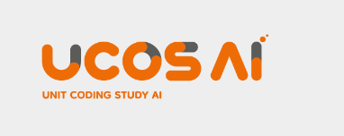
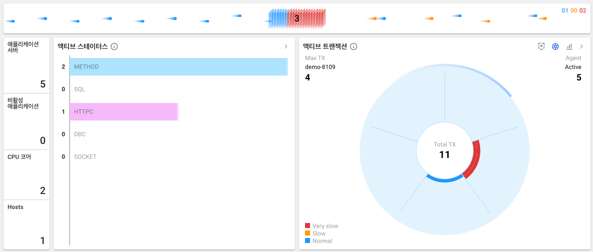
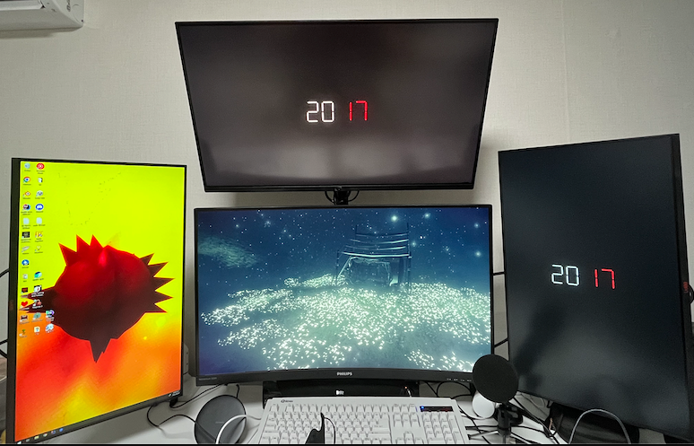
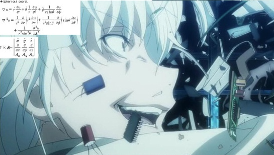
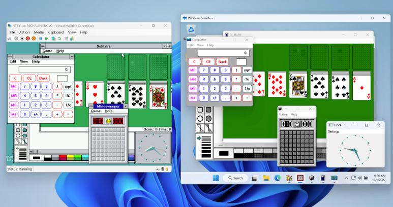
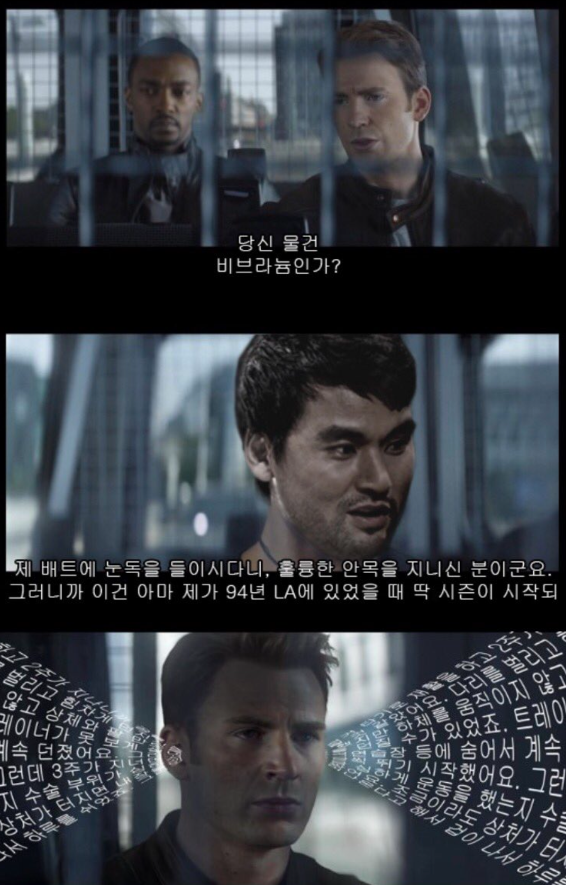
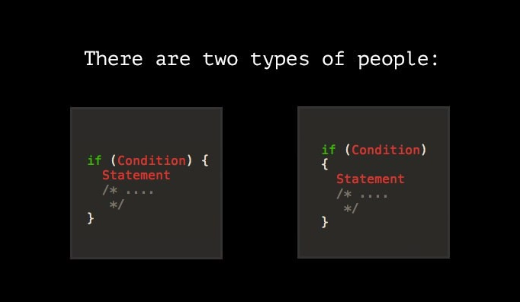
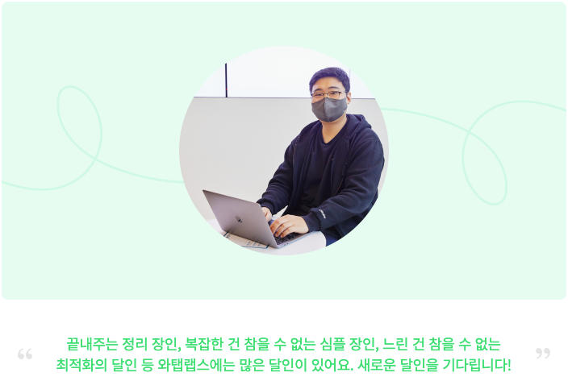

<head>
  <link rel="canonical" href="https://blog.nirohack.xyz/post/2023/0101-retrospect/" />
</head>
# 이벤트 큐가 터져버린 2022년 회고
수많은 이벤트가 터져나와 큐가 폭발해버린 2022년 한해를 정리해봅시다.

## 돌아와버린 백수
  
나와야지 나와야지, 기어코 나와버린 전 직장. 백수 겸사 강남으로 가겠다는 뜻으로 신림에 방을 구했다. 절친 한명, 온라인에서 만난 동생 한명, 이렇게 기묘한 삼인방의 자취 생활이 시작되었다.  

당연히 난 백수였으므로 그동안 벌어놨던 생돈을 까먹는 형태였다. 당연히 일을 해야하지만, 그렇다고 기도메타에 올라타 시간에 급급해 아무 회사나 막 찔러보진 않았다. 
이는 그맘때 한가지 깨우친 사실이 있었기 때문인데, 그것은 회사도 나를 고르지만 나도 회사를 고를 수 있다는 것이다.

## 사이버 데스티니
난 여러 커뮤니티에서 활동을 하고 있었는데 백수로 지내던 어느날 지인 중 한명에게 연락이 왔다.  
**선생님이 되지 않을래?**  
  
BeatSaber 커뮤니티에서 컴퓨터 알고리즘 선생님으로 일하고 있던 Sui_Sensei 였다. 공부한 것을 공유하고 가르쳐주는 것을 좋아하는 난, 선생님이 되었다.

## 유닛스터디
  
그렇게 코딩학원 알고리즘 강사로 일하게 되었다. 잘 따라오는 학생과 잘 따라오지 못하는 학생들의 모임 속에서 선생님으로써 성장했다.
청자의 심정이라고 할까. 눈높이에 맞는, 즉 청자를 생각하는 방법을 배운 것이 그 중 하나다. 단순 알고리즘 자체를 설명하고 푸는 것 자체는 어렵지 않았다.   

하지만, 이를 아이들이 이해할 수 있도록 온갖 비유와 몸짓을 하는 것이란... 생각보다 쉽지 않은 것이었다.

## 와탭랩스

추운 겨울이 막을 내려갈 때즈음,..알고계시던 학교 선배님 중 한분이 와탭랩스에 추천해주셨다. 안그래도 내가 눈독을 들이던 회사였다. 이력서를 써서 제출하고 
면접과 과제를 진행하게 되었다.

흔한, 코테용 문제. 그런 것이 아니었다. 회사도 좋은 사람을 뽑기 위해 꽤 큰 투자를 하고 있음을 인지할 수 있는 시험이었다.   
그도 그럴 것이 3주에 대한 과제 진행 비용을 지불, 매 주마다 구현 상황에 대해 발표 하는 시간을 가졌었기 때문이다. 

신입을 뽑는데, 이정도의 정성을 들인다는 것 자체가 좋은 사람을 뽑겠다는 회사의 의지로 보였다.  
그렇게 심혈을 기울여 과제를 진행했고 당당하게 와탭에 합류하게 되었다.

## 모니터
  
꿈에 그리던 4모니터를 완성했다. 홀리몰리. 더불어 이쯤부터 쿠버네티스에 급격히 관심이 가기 시작했는데 뒤에 나오겠지만 타노스가 인피니티 스톤을 모으는 것마냥
서버컴을 모으기 시작했다.

## 성장
와탭을 다닌지 약 9개월, 여러 방면의 성장이 있었다.   

### 분석 능력
  
코드를 분석하고 읽는 능력이 늘었다. 워낙 소스베이스가 크고 MSA 아키텍쳐로 이루어진 서비스기 때문에 소스를 주욱 읇어가야할 일이 자주 있었다. 이를 반복하다보니
요즘은 STAR 를 박아둔 오픈 소스들도 읽히기 시작했다.

### 하위 호환
  
와탭은 모니터링 서비스를 SaaS 형태로도 제공하지만 온프레미스 방식도 지원을 한다. 

어떻게 그게 가능해?

SaaS 개발팀, 온프레미스 개발팀이 따로 있지는 않다. 그럼 이걸 가능하게 하는 방법. SaaS 소스를 버전별로 패키징할 수 있게 관리하며 SaaS 형태로도 제공할 수 있고 온프레미스로도
제공할 수 있도록 개발을 한다(오!). 쉽겠는데? 라고 생각할 수 있지만, 생각처럼 쉽지는 않다. 온프레미스를 원하는 고객의 요구사항을 옵션처리 해가며 하위호환성을 깨지 않도록 개발해야하기 때문이다.
하위호환성을 깨면 안된다는 것. 마치 윗짤의 윈도우 NT와 윈도우 11의 호환과 같은 마법같은 일이다. (그런데 그것을 실제로 하고있다)

### 바라보는 시각

전체 아키와 시스템을 바라보는 시야가 넓어졌다. CTO 님과 얘기할 때마다 생각이 트였다고 생각한다. 그 중 한마디를 읊어보면

"개발자, 운영자, 사업가, 프로젝트 매니저 이 모두는 같은 것을 보지만, 그것을 비추는 창은 다르단다"

전체적인 아키 구조에 대한 설계를 필요로 하는 사람, 데이터가 흘러가는 시스템의 요약이 필요한 사람, 소스를 베이스로 구조 등에 대해 바라보고 싶어하는 사람 등 
누가 클라이언트가 되느냐에 따라 제공해야할 정보가 달라진다는 것이다.

### 코드 스타일
  
코드를 재사용가능하고 다른 개발자가 나의 코드를 사용하는 클라이언트가 되었을 때 명료하며 사용하기 쉽게 하는 방법들에 대해 배웠다. 이건 심플 장인으로 불리는 리드 개발자님의 한 마디에서부터 시작되어 지금까지
내가 노력하고 있는 것 중에 한가지다. 그 한마디는 바로

"이거 왜 이렇게 어려워요"

더 단순하게 풀어낼 수 있을 것 같은데, 너무 많은 생각을 담은 나머지 복잡하게 코드를 풀어낸 것이다. 디자인 패턴들이 늘 그렇듯 과도하게 사용되면 오히려 코드의 복잡도가 올라간다는 점이 단점으로 꼽힌다.

이를 보완하고자 요즘에 세운 원칙들이 있는데 다음과 같다. 이상.

1. 단순하게 구현가능한 것인가?
2. 단순하게 구현가능한 것인가?
3. 인터페이스를 단순하게 제공하는가?
4. 인터페이스를 단순하게 제공하는가?

## 공개적인 노출
  
~~어어..이렇게 될 줄은 몰랐는데~~  
점핏에 개발자 인터뷰로 노출이 되었다. 마스크가 없었으면 인터뷰를 버티지 못했을지도 모르겠다. 부끄러움을 감수하고 작성한 개발자 인터뷰와 소개글은 공개적으로 노출이 되고보니 생각보다 뿌듯했다.  
회사에선 부끄럽다고 다음번엔 다른 개발자분을 시켜달라고 말하긴 했는데, 다시 해야할 때가 생긴다면 더 진심 투구를 해보려 생각하고 있다.

## 벤자민 버튼의 시간은 거꾸로 가더라
  
다시 한번 맞이하는 계란 한판. 홍진호도 서른살은 두번 못겪어봤을 텐데,  
나는 서른살을 두번 맞이한다  
나는 서른살을 두번 맞이한다