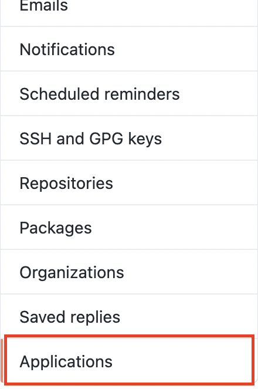
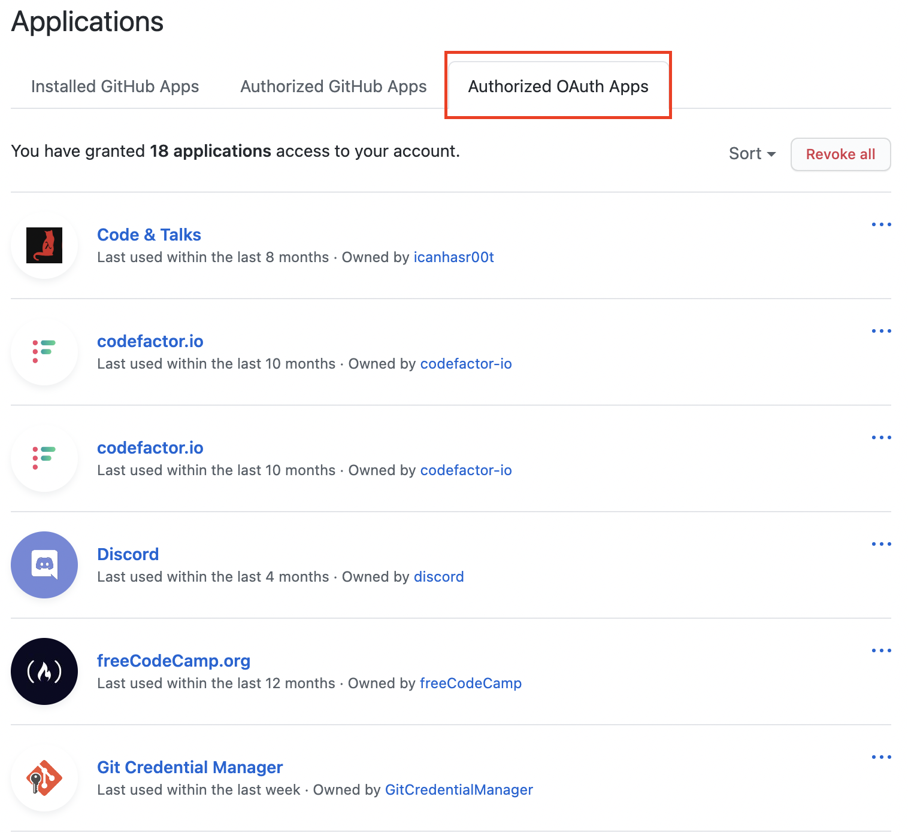

# github organizations 타 앱 OAuth 허용하기
github 에서 타사 앱 OAuth 권한을 주는 방법을 알아봅시다.

### 오류 메세지

```code
emote: Permission to remoteURL denied to something
```

rainbow-flavor github organizations 의 레포지토리 raflix 에 intellij IDE 에서 repository 로 push 를 시도했을 때 오류가 일어났다. 문제의 이유는 간단했지만 해결하는 방법을 몰라서 힘들었다.
문제가 일어난 **이유는 organizations 를 만들기 전에** 나는 **이미 개인 레파지토리에서 intellij IDE 를 통해** push 하기 위해 **인증**을 했었다. 

**당시엔 organizations 이 없었**으므로 organizations 은 이 인증이 되어있지 않았다.

## 해결 방법

1. github에 로그인한 뒤 계정 쪽을 클릭하고 Settings 을 눌러준다.


2. 왼쪽 사이드 바에서 Applications 메뉴를 찾아 누른다.



3. Authorized OAuth Apps 탭을 누른다.



4. 빨간 박스가 쳐져있는 부분에 자신의 organization 이 보일 것이다. 초록색 동그라미 쳐놓은 곳에 초록색 체크표시 대신 버튼이 있을 것이다. 해당 버튼을 클릭하면 사진과 같이 초록색 체크가 된다. 이제 해당 organization 에 intellij 를 통해 push를 하면 로그인 인증을 진행하게 되고 정상적으로 인증이되며 push가 될 것이다.


